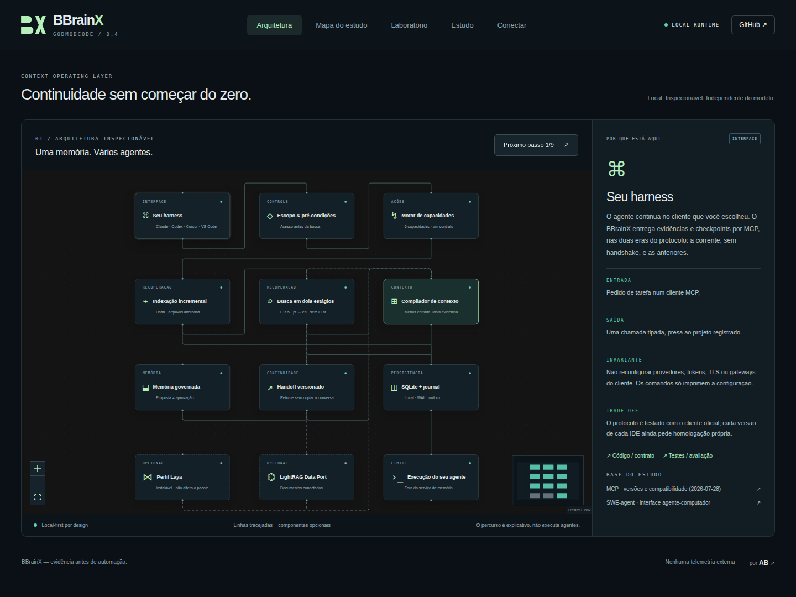

<p align="center"></p>

<p align="center"><strong>Continue o trabalho. Não reconstrua a conversa inteira.</strong><br/>Contexto local, memória governada e handoffs verificáveis entre agentes de programação.</p>

<p align="center"><a href="https://github.com/oalexandrebelo/BBrainX/actions/workflows/verify.yml"></a> · <a href="docs/QUICKSTART.md">Começar</a> · <a href="docs/DOSSIER.md">Dossiê</a> · <a href="docs/SECURITY_MODEL.md">Segurança</a> · <a href="docs/EVALUATION.md">Avaliação</a> · <a href="docs/FEASIBILITY.md">Viabilidade</a></p>

## O que funciona nesta versão

BBrainX **0.3.0 é uma prévia de desenvolvimento** com um núcleo local executável: SQLite/FTS5 persistente, indexação incremental de arquivos textuais, busca que põe a declaração de um nome antes dos usos e dos testes, contexto com fontes e orçamento, memória proposta/aprovada/revogada e checkpoints com concorrência otimista que registram o que foi feito e o estado do Git visto pelo host. O servidor **Invokta MCP stdio** expõe seis capacidades; o painel React Flow explica a arquitetura e inclui um laboratório que consulta os mesmos dados reais.

O projeto não é um novo modelo, não intercepta todas as APIs das IDEs e não compartilha KV cache entre fornecedores. Não substitui seus testes nem concede shell ao serviço de memória. Laya, LightRAG, execução de navegador e OpenHands são expansões documentadas, **não requisitos instalados nem capacidades ativas**.

## Comece no macOS

Requisitos: **Node 24 LTS e Git**. Node 22.20+ atende ao contrato do núcleo, mas a matriz inicial usa Node 24. Nenhum Docker, GPU, chave de API, Python ou conta de IA é necessário para experimentar o fluxo básico.

```sh
git clone https://github.com/oalexandrebelo/BBrainX.git
cd BBrainX
npm run setup
npm run demo
npm start
```

Abra **http://127.0.0.1:4317**. O setup verifica o host, instala exatamente o lockfile sem lifecycle scripts de dependências, executa os testes e compila a interface. Não instala Node via sudo e não altera seus editores. O lockfile é publicado após uma execução de CI bem-sucedida; uma revisão ainda sem lockfile falha explicitamente no setup.

No Mac, `Start-BBrainX.command` também inicia a experiência depois que Node/Git estiverem disponíveis. Consulte o quickstart para ambientes sem essas dependências e caminhos com espaços.

## Use com seu projeto

```sh
node bin/bbrainx.mjs init --project meu-app --root /caminho/absoluto/meu-app
node bin/bbrainx.mjs index --project meu-app
node bin/bbrainx.mjs context --project meu-app --query "validação de sessão" --budget 4000
node bin/bbrainx.mjs config --project meu-app --client codex
node bin/bbrainx.mjs config --project meu-app --client claude
```

`config` **imprime** um fragmento para revisão. Não sobrescreve `config.toml`, `.mcp.json`, `CLAUDE.md`, credenciais ou gates de aprovação. Para clientes com formato diferente, use comando/argumentos/ambiente fornecidos e a documentação da versão instalada.

### Seis ferramentas, um escopo

| MCP | Responsabilidade |
|---|---|
| `context_index` | Atualizar o índice da raiz já autorizada. |
| `context_search` | Recuperar evidências pelo índice lexical. |
| `context_bootstrap` | Montar um pacote com orçamento e verificar os arquivos selecionados. |
| `session_get` | Recuperar o checkpoint portável de uma tarefa. |
| `session_checkpoint` | Salvar versão esperada + chave de idempotência. |
| `memory_propose` | Propor aprendizado com origem; não aprovar automaticamente. |

Um cliente MCP de teste real grava e encerra a sessão; outro processo inicia e recupera o mesmo checkpoint. Isso valida o protocolo e a persistência. **Não equivale a homologação de cada versão de Codex, Claude Code ou Antigravity.**

## Explore a arquitetura

No painel, clique em qualquer nó para ver: propósito, entradas, saídas, invariantes, trade-offs, código, testes e fontes do estudo. O percurso guiado é uma explicação, não uma simulação apresentada como execução. O Laboratório indexa, busca, compila contexto e salva checkpoints de revisão. Eventos locais exibidos são persistidos pelo domínio.

Screenshots e vídeo, quando a execução correspondente terminar, ficam nos artefatos do GitHub Actions. A composição Remotion é opcional e tem licença própria: [media/README.md](media/README.md).

## Decisões que evitam desperdício

**Lexical antes de generativo.** FTS5 permanece em disco; não há LLM na indexação básica. Arquivos inalterados reutilizam seus chunks. **Contexto é seleção, não despejo.** Trechos têm hash e localização; restrições obrigatórias não são cortadas para caber. **Memória não é verdade automática.** O agente propõe, o usuário aprova. **Continuidade não é transcript infinito.** Checkpoints carregam o que foi feito, o que falta e qual revisão sustenta o estado.

`payloadTokens` usa **o200k_base** somente sobre o pacote textual. Tokens totais do cliente, tokenizer de outro modelo, cache do provedor e economia financeira não são inferidos. Esses valores aparecem como desconhecidos, não como zero.

## Dependências e origem

As dependências de runtime são instaladas pelo npm e fixadas no lockfile. O script abaixo baixa cópias separadas dos upstreams **para estudo**, sem executar instaladores, treinar modelos ou copiar licenças para o código MIT:

```sh
npm run sources -- --download
```

A saída inclui commits observados e hashes de licenças em `artifacts/upstream-inventory.json`; fontes ficam em `vendor/`, ignorado pelo Git. Modelos e todos os frameworks Python não são baixados compulsoriamente: isso aumentaria risco, disco e consumo sem benefício demonstrado. Veja [perfis opcionais](docs/OPTIONAL_PROFILES.md).

## Qualidade e limites

```sh
npm test
npm run build
npm run test:e2e
node scripts/benchmark.mjs
```

Os testes cobrem escopo, arquivo alterado depois do índice, ordenação, limites, migração de schema, idempotência, versão conflitante, aprovação, backup, HTTP e MCP real. A matriz inclui macOS, Linux e Windows; **o resultado autoritativo é a execução vinculada à revisão**, não o número de testes de uma versão anterior. Evidências geradas pela CI ficam em `docs/validation/` quando publicadas.

A recuperação é medida com casos rotulados (`node scripts/eval-retrieval.mjs`, ver [avaliação](docs/EVALUATION.md)); ela mede a posição do trecho esperado, não tarefa aceita. Consulta em linguagem natural ainda é o ponto fraco de uma busca lexical.

Sem watcher contínuo, LSP semântico, sincronização multi-host, criptografia própria, autenticação multi-tenant, captura de tela ou execução de shell. Não use o banco ativo em iCloud/NFS. Revogar memória evita recuperação futura, mas não apaga cópias históricas e backups. Consulte [modelo de segurança](docs/SECURITY_MODEL.md).

## Comunidade

Projeto de Alexandre Belo (**AB**), desenvolvido com assistência de IA e revisão orientada a evidências. Não implica endosso de OpenAI, Anthropic, Google ou dos upstreams. Queremos contribuições reproduzíveis, não promessas de ranking: [CONTRIBUTING.md](CONTRIBUTING.md).

O código original BBrainX é MIT. Nomes, marcas, bibliotecas e referências mantêm seus respectivos direitos. [THIRD_PARTY_NOTICES.md](THIRD_PARTY_NOTICES.md).

<!-- verified-preview -->
## Interface verificada na CI



[Relatório por revisão](docs/validation/ci-report.json) · [Vídeo explicativo](public/demo/bbrainx-intro.mp4)
