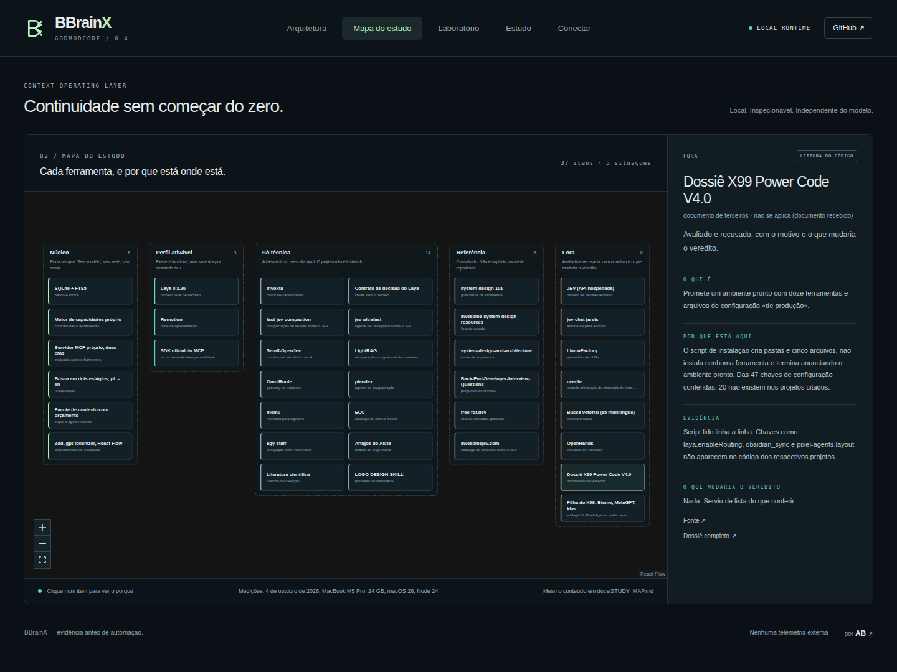

<p align="center"></p>

<p align="center"><strong>Continue o trabalho. Não reconstrua a conversa inteira.</strong><br/>Contexto local, memória governada e handoffs verificáveis entre agentes de programação.</p>

<p align="center"><a href="https://github.com/oalexandrebelo/BBrainX/actions/workflows/verify.yml"></a> · <a href="docs/QUICKSTART.md">Começar</a> · <a href="docs/STUDY_MAP.md">Mapa do estudo</a> · <a href="docs/DOSSIER.md">Dossiê</a> · <a href="docs/SECURITY_MODEL.md">Segurança</a> · <a href="docs/EVALUATION.md">Avaliação</a> · <a href="README.en.md">English</a></p>

## O que é

O BBrainX roda na sua máquina e entrega ao agente de programação o que ele precisa para continuar uma tarefa: os trechos certos do repositório, o checkpoint da sessão anterior e as memórias que você aprovou. Fala MCP com Claude Code, Codex, Cursor, VS Code e Gemini CLI. Não usa modelo, rede, conta, Docker nem Python no núcleo.

A versão **0.4.0 é uma prévia de desenvolvimento**. Tudo o que está descrito aqui roda e é testado a cada revisão; o que não foi medido está dito como não medido.

## Comece em três comandos

Requisitos: **Node 24 LTS e Git** (Node 22.20 ou mais novo também atende). O foco desta fase é o macOS; Linux e Windows passam na mesma suíte de testes.

```sh
git clone https://github.com/oalexandrebelo/BBrainX.git && cd BBrainX
npm run setup
node bin/bbrainx.mjs up --root /caminho/do/seu/projeto
```

- `npm run setup` confere a máquina, instala exatamente o que está no lockfile (sem scripts de pós-instalação), roda os testes e compila o painel.
- `up` registra a pasta, indexa e mostra o próximo passo para cada harness. Rodar de novo só atualiza o que mudou.
- `node bin/bbrainx.mjs doctor` diz qual é o melhor cenário para esta máquina e o comando de cada passo. Ele só observa: não instala nada e não executa as ferramentas que encontra.

Para ligar ao seu harness:

```sh
node bin/bbrainx.mjs integrate --root /caminho/do/seu/projeto
node bin/bbrainx.mjs integrate --root /caminho/do/seu/projeto --apply
```

Sem `--apply`, `integrate` mostra destinos, hashes e pendências. Com `--apply`, registra a raiz, aplica a entrada MCP do projeto com backups privados e indexa os arquivos; preserva credenciais, provedores, trust e aprovações. Descobre Codex, Claude Code, VS Code, Kilo e Antigravity IDE por metadados locais, sem executar clientes. Codex/Claude/VS Code/Kilo têm configuração automática; Antigravity IDE exige etapa manual e não recebe cadastro global de todos os projetos. `--clients codex,claude,vscode,kilo` permite selecionar os destinos, inclusive preparar cliente ainda não instalado. Instalações antigas só podem ser migradas com `--adopt-existing` quando coincidem exatamente com o gerador anterior. Rollback: `node bin/bbrainx.mjs integrations rollback --id ID_DO_RECIBO`; uma edição posterior impede sobrescrita. [Contrato do instalador](docs/integrations/INSTALLER.md).

`config --project meu-projeto --client cursor` continua imprimindo fragmentos para integração manual (também aceita claude, codex, vscode e gemini). Configuração presente não prova conexão nativa. `npm start` serve o painel em **http://127.0.0.1:4317**; no Mac, `Start-BBrainX.command` faz o mesmo com dois cliques.

O [plugin próprio BBrainX](extensions/vscode/README.md) oferece marca, árvore de pastas abertas e comandos Detectar/Conectar no VS Code e um VSIX para avaliação no Antigravity IDE. Use `node scripts/package-extension.mjs` (Python 3 apenas para empacotar), instale o VSIX pelo editor e configure o executável em settings de usuário. Pastas confiáveis geram heartbeats de metadados a cada 30 s; expiram em 90 s e não registram nem indexam projetos sozinhas. `node bin/bbrainx.mjs discover --root /caminho/do/projeto` distingue pastas abertas reportadas, projetos registrados e históricos com raiz validada; não captura qualquer sessão ativa de qualquer IDE.

```sh
node bin/bbrainx.mjs test --project meu-projeto --file test/auth.test.mjs --timeout 300000
node bin/bbrainx.mjs control --project meu-projeto
node bin/bbrainx.mjs import-context --project meu-projeto --harness claude --file /caminho/absoluto/sessao.jsonl
```

`test` executa arquivos concretos de `node:test` dentro da raiz registrada, com progresso e diagnóstico limitados; roda com permissões locais e não é sandbox. `import-context` exige escolha explícita de arquivo nativo de Claude, Codex ou Cursor e gera checkpoint `review_needed` com trechos não confiáveis; não concede acesso nem aprova memória. Fontes privadas ficam no estado local. Outros formatos históricos são recusados. Cursor sem cwd exige `--confirm-workspace /raiz/canonica`, continua marcado como não verificado pela fonte e recusa nomes ambíguos. [Passos e limites](docs/QUICKSTART.md#4-conectar-harnesses).

Se preferir que o próprio agente faça a ligação, cole na sessão dele o prompt de [docs/prompts/ACTIVATE.md](docs/prompts/ACTIVATE.md). Quem assume o projeto começa por [docs/HANDOFF.md](docs/HANDOFF.md).

## O que foi medido

| Medida | 0.3 | 0.4 | Como foi medido |
|---|---|---|---|
| Arquivo certo entre os 10 primeiros, pergunta em linguagem natural | 54 % | **84 %** | 79 perguntas cegas, escritas por outro autor que não viu o buscador, sobre dois repositórios de terceiros |
| Arquivo certo em 1.º lugar, mesmas perguntas | 33 % | **46 %** | Os intervalos de 95 % se cruzam (24–44 % e 35–57 %); na comparação caso a caso a posição melhorou em 40 e piorou em 7 |
| Definição de um identificador em 1.º lugar | 12 de 12 | 12 de 12 | Casos rotulados sobre este repositório, usados como portão de regressão |
| Pacotes de produção no lockfile | 121 | **25** | Motor de capacidades e servidor MCP próprios |

Esses números medem a posição do arquivo esperado, não tarefa concluída nem economia de tokens faturada. O método, os intervalos e os comandos para repetir estão em [docs/EVALUATION.md](docs/EVALUATION.md).

## Seis ferramentas, um escopo

| MCP | Responsabilidade |
|---|---|
| `context_bootstrap` | Montar um pacote com orçamento de tokens, com caminho, linhas e hash de cada trecho. |
| `context_search` | Buscar no índice; a declaração de um nome vem antes dos usos e dos testes. |
| `context_index` | Atualizar o índice da pasta registrada. |
| `session_checkpoint` | Salvar o estado da tarefa: o que foi feito, decisões, arquivos tocados, evidências. |
| `session_get` | Recuperar o checkpoint, em outro harness ou em outra sessão. |
| `memory_propose` | Propor um aprendizado. Só você aprova, pelo terminal. |

O servidor é próprio e fala as **duas eras do protocolo MCP** no mesmo processo: a revisão corrente (2026-07-28, sem handshake) e as anteriores (com `initialize`). O cliente oficial do protocolo conversa com ele nos testes. Isso valida o protocolo; **não é homologação de cada versão de cada IDE**.

O servidor só enxerga o projeto com que foi iniciado, não executa comandos e não aprova memória. Texto recuperado é evidência, nunca instrução.

## Perfil opcional: Laya

O [Laya](https://github.com/NandhaKishorM/laya) é um modelo local de decisão: escolhe entre opções, dá nota ou responde sim/não, sem gerar texto. O BBrainX o instala **só por comando seu**, num ambiente Python isolado, com os pesos conferidos por SHA-256:

```sh
node bin/bbrainx.mjs laya install     # cerca de 0,7 GB de ambiente e 0,68 GB de pesos
node bin/bbrainx.mjs laya ask --state "O login quebrou em produção." --file perguntas.json
node bin/bbrainx.mjs laya remove
```

O perfil também oferece decisões locais no painel (`serve --laya`), no CLI (`laya decide --project ...`) e no MCP (`mcp --project ... --laya`, ferramenta `decision_evaluate`). Inclui cache exato por projeto/processo, cancelamento, limites de recursos e abstenção quando texto, pergunta ou opções são truncados. A confiança retornada não é calibrada. [Ativação, contrato e evidência](docs/integrations/LAYA.md).

Os ensaios históricos de busca e relevância de memória não demonstraram benefício sobre a baseline lexical. O modelo **não altera o pacote de contexto**. A nova integração comprova execução local e isolamento; não comprova superioridade sobre JEV, economia de API ou qualidade universal.

## Mapa do estudo

Trinta e sete ferramentas foram estudadas. Cada uma está numa de cinco situações: **núcleo**, **perfil ativável**, **só técnica**, **referência** ou **fora**, com o porquê, a evidência e o que mudaria o veredito. O mapa é interativo no painel (aba **Mapa do estudo**) e está por extenso em [docs/STUDY_MAP.md](docs/STUDY_MAP.md).



## Decisões que evitam desperdício

**Lexical antes de generativo.** O índice é o FTS5 do SQLite; não há LLM na indexação. A busca roda em dois estágios: termos exatos, depois radicais e um glossário de programação português → inglês. **Contexto é seleção, não despejo.** Cada trecho tem hash e localização; arquivo alterado é relido antes de ser servido; restrição obrigatória não é cortada para caber. **Memória não é verdade automática.** O agente propõe, você aprova. **Continuidade não é transcrição infinita.** O checkpoint carrega o que foi feito, o que falta e qual revisão sustenta o estado.

`payloadTokens` usa **o200k_base** só sobre o pacote. Tokens totais do cliente, tokenizador de outro modelo, cache do provedor e economia financeira não são inferidos: aparecem como desconhecidos, não como zero.

## Qualidade e limites

```sh
npm test            # domínio, protocolo com processos reais, perfis, mapa do estudo
npm run build
npm run test:e2e    # painel no navegador
```

A matriz da CI inclui macOS, Linux e Windows; **o resultado que vale é o da execução ligada à revisão**, em `docs/validation/`. A CI também executa controles negativos de contratos, workstation, observatory e lanes: injeta defeitos em checkout isolado e exige que sejam detectados. Isso não implica cobertura por mutação de todos os testes.

O que não existe: observador contínuo de arquivos, análise semântica por servidor de linguagem, sincronização entre máquinas, criptografia própria, autenticação multiusuário, captura de tela e execução de shell. O prazo de uma chamada não interrompe trabalho síncrono, como a indexação. Não use o banco ativo em iCloud ou em disco de rede. Revogar uma memória impede o uso futuro, mas não apaga cópias históricas nem backups. Veja o [modelo de segurança](docs/SECURITY_MODEL.md).

## Marca

A marca em uso é o **monograma BX**, escolhida de forma provisória entre três opções originais que continuam em estudo. O porquê de cada uma e como trocar estão em [docs/BRAND.md](docs/BRAND.md).

<p align="center"></p>

## Comunidade

Projeto de Alexandre Belo (**AB**), desenvolvido com assistência de IA e revisão orientada a evidências. Não implica endosso de OpenAI, Anthropic, Google ou dos projetos estudados. Queremos contribuições reproduzíveis: [CONTRIBUTING.md](CONTRIBUTING.md).

Para assumir a próxima contribuição, comece pelo [contexto de engenharia](docs/engineering/CONTINUITY.md), execute `npm run project:status` e escolha um item da [fila com critérios de aceite](docs/engineering/ROADMAP.md). O [livro de experimentos](docs/engineering/PERFORMANCE.md) distingue ganhos medidos, custos e tentativas descartadas.

O código original do BBrainX é MIT. O contrato do motor segue o modelo do Invokta, cujo aviso MIT completo está em [THIRD_PARTY_NOTICES.md](THIRD_PARTY_NOTICES.md). Nomes, marcas, bibliotecas e referências mantêm seus direitos.

<!-- verified-preview -->
## Interface verificada na CI


[Relatório por revisão](docs/validation/ci-report.json) · [Vídeo explicativo](public/demo/bbrainx-intro.mp4)
