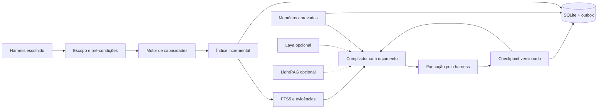

# BBrainX — GODMODCODE
## Dossiê de engenharia, pesquisa aplicada e decisões de produto

**Revisão:** 0.4 · **Pesquisa:** 4 de outubro de 2026 · **Status:** prévia implementada com evidências vinculadas à CI, não certificação de produção.

Este documento distingue quatro categorias: capacidade documentada de upstream, achado de pesquisa em condições específicas, relato de engenharia de um autor e decisão proposta/implementada no BBrainX. Nenhum número de velocidade ou economia de outra ferramenta é atribuído a este produto.

## 1. O problema que escolhemos resolver

Ao alternar entre agentes, o desenvolvedor perde decisões, repete investigação e precisa reconciliar versões diferentes do trabalho. A solução não é enviar todas as conversas, todos os documentos e todo o código a cada chamada. É manter estado verificável fora do modelo, recuperar a evidência pertinente e tornar o handoff explícito.

BBrainX é uma camada local de contexto e continuidade. A entrega não pretende ser mais um editor, modelo de linguagem, roteador universal de endpoints ou sistema operacional com controle irrestrito. O diferencial a demonstrar é a continuidade correta com menos trabalho redundante.

### Resultado mínimo verificável

Um processo A registra o objetivo, snapshot e próximo passo com versão esperada. Ele encerra. Um processo B, usando MCP, recupera o mesmo estado autorizado. Ao buscar código, o serviço informa arquivo, linhas e hash; uma alteração detectada após indexação impede servir o trecho como atual. O painel usa as mesmas capacidades, não respostas simuladas.

## 2. O que a pesquisa de Akita acrescentou

### 2.1. Código para ser pesquisado, não apenas lido

No artigo *Clean Code pra Agentes de IA* (20/04/2026), Akita discute organização e feedback adequados ao uso por agentes. A aplicação que fazemos é prática: nomes relacionados ao domínio (`checkpoint`, `compileContext`, `indexProject`), módulos por responsabilidade, contratos explícitos, erros curtos e testes headless. Isso é orientação do autor, não uma prova de que qualquer divisão em arquivos melhora todos os modelos. [A1]

### 2.2. Memória precisa de durabilidade antes de sofisticação

O relato de criação do ai-memory (23/05/2026) descreve problemas de reindexação, persistência e integração em uma solução anterior. Convertimos o aprendizado em requisitos testáveis: índice lexical persistido; diretório de estado independente de cwd; checkpoint, histórico e evento na mesma transação; leitura entre processos; configuração de cliente gerada explicitamente. Não copiamos o sistema nem adotamos seu benchmark como nosso. [A2]

### 2.3. Atualizar a referência importa

A pesquisa não parou no artigo inicial. Em 20/07/2026 o autor descreve continuidade entre harnesses; em 02/09/2026 apresenta ai-memory 2.0 com formato OKF, embeddings locais e colaboração. Portanto, não tratamos o concorrente como o MVP de maio. A opção estratégica é interoperar por formatos e fontes aprovadas quando o schema for testado, não criar três bancos de memória concorrentes. A integração OKF ainda não está implementada no BBrainX. [A3][A4]

### 2.4. Automação não substitui julgamento de segurança

O post de segurança do ai-jail (25/07/2026) relata uma superfície envolvendo socket Docker. A decisão aqui é não montar sockets, não oferecer shell e não exigir Docker no núcleo. A ausência dessas capacidades não torna o host invulnerável, mas reduz privilégios desnecessários do serviço de memória. [A5]

### 2.5. Comunidade exige evidências

O texto sobre o mínimo de boas práticas em projetos com LLM (30/05/2026) reforça manutenção verificável. Nossa aplicação é separar testes, documentação, limitações, licença, contribuição e resultados por revisão. Uma CI verde não substitui revisão de produto ou validação no Mac do usuário. [A6]

## 3. Base científica: o que sustenta e o que não sustenta

### 3.1. Lost in the Middle

Liu e colaboradores analisam perguntas sobre múltiplos documentos e recuperação chave-valor, observando sensibilidade à posição da informação em modelos avaliados. Isso justifica investigar seleção de contexto e ordenação de evidências. Não prova que todo modelo de 2026 falha da mesma forma nem fornece a economia do BBrainX. Nossa implementação preserva material obrigatório e recupera trechos; a qualidade real exige um benchmark de tarefas. [P1]

### 3.2. SWE-agent

Yang e colaboradores estudam uma interface agente-computador apropriada a operações de engenharia. A inferência de design que adotamos é oferecer poucas capacidades tipadas com resultados previsíveis, em vez de um comando genérico que aceite qualquer shell. Não replicamos a implementação nem transferimos os resultados históricos de SWE-bench para nosso produto. [P2]

### 3.3. MemGPT

Packer e colaboradores exploram hierarquia de memória e movimento entre armazenamento externo e contexto ativo. A aplicação ao BBrainX é separar estado canônico de pacotes efêmeros. O agente vê uma seleção; o histórico permanece externo. Isso não equivale a intercambiar estados internos de inferência entre fornecedores. [P3]

### 3.4. LLMLingua-2

Pan e colaboradores estudam compressão extrativa por classificação de tokens, com avaliações em datasets definidos. Mantivemos uma escolha mais conservadora para a primeira versão: selecionar trechos íntegros, não remover tokens do código ou de contratos críticos. Uma compressão agressiva só entraria depois de demonstrar benefício líquido e preservação de evidências no workload de engenharia. [P4]

### 3.5. Hipóteses próprias

Esperamos que checkpoints reduzam reconstrução e que um índice persistente reduza reprocessamento. Essas são hipóteses a medir, não resultados de papers. O script sintético mede comportamento local; a avaliação com tarefas reais, agentes autenticados e aceitação humana permanece uma etapa distinta. [EVALUATION.md](EVALUATION.md)

## 4. Por que o Invokta é o modelo do motor de ações

A documentação do Invokta separa contrato e execução das dependências de CLI, MCP e aplicação. Até a 0.3 o BBrainX usava os pacotes dele; desde a 0.4 o motor de capacidades e o servidor MCP são código próprio, que segue o mesmo contrato (`defineCapability`, `createEngine`, esquemas pelo protocolo Standard Schema) e acrescenta o que faltava: prazo distinto de cancelamento, as duas eras do protocolo MCP e limite de chamadas. O motor valida fronteiras; o domínio controla persistência, permissões locais, idempotência e significado das ações. [T1][T2]

Um framework de ações não é banco de memória. Um callback de eventos não é outbox transacional. Um timeout não desfaz um efeito externo. Por isso, as ações do BBrainX são estreitas: indexar fontes autorizadas, pesquisar, compilar contexto, ler/gravar checkpoint e propor memória. Não há comando arbitrário de execução.

O host fixa projetos permitidos. Um `project` no argumento da ferramenta identifica o alvo, mas não autoriza esse alvo por si só. A identidade local vem da composição confiável do processo MCP ou painel. O modo inicial não implementa multi-tenancy remoto.

## 5. Fluxo completo e responsabilidade de cada etapa

O React Flow usa dados em `web/architecture.js`. Cada nó liga propósito, entrada, saída, invariante, trade-off, implementação e teste. O grafo é uma interface de inspeção: arrastar nós não altera permissões, cria pipelines reais ou dispara execução.

### 5.1. Harness

Permanece responsável pelo modelo, aprovação e ambiente de execução. BBrainX não altera autenticação e não presume que todo cliente suporte as mesmas configurações. Há saída TOML para Codex, JSON de servidor MCP para revisão e exportação textual para casos sem suporte.

### 5.2. Escopo

Acesso é decidido antes da busca. A allowlist não é carregada de um texto produzido pelo agente. A versão local usa a identidade do usuário do SO, não uma promessa de isolamento contra um processo malicioso com os mesmos privilégios.

### 5.3. Indexação

O sistema lê arquivos textuais elegíveis, calcula hashes e reconcilia adições, remoções e mudanças. Chunks de arquivos inalterados são reutilizados. O índice fica no SQLite; não é reconstruído a cada inicialização. O modo entregue usa acionamento explícito, não watcher.

A snapshot é uma identidade do manifesto textual, não uma assinatura de todo ambiente. Eventos externos, bancos, submódulos e binários podem alterar o resultado de uma tarefa sem mudar esse manifesto.

### 5.4. Recuperação

FTS5 é adequado ao início de consultas por nomes, mensagens e texto. Não oferece sozinho resolução de símbolos, call graph ou entendimento de tipos. Para buscas semânticas reais, a próxima ampliação deveria comparar LSP e recuperação híbrida com um corpus de evidências, não apenas instalar um vetor por tendência.

### 5.5. Contexto

O compilador inclui objetivo, snapshot, checkpoint pertinente e memórias aprovadas; depois seleciona evidências dentro do orçamento. Verifica hashes dos arquivos selecionados, preserva trechos inteiros e recusa um orçamento incapaz de conter material obrigatório. IDs e hashes servem à proveniência, não substituem conteúdo que o modelo nunca viu.

A contagem usa `o200k_base` do gpt-tokenizer para o payload textual. Não representa tokenizer universal, overhead da conversa, ferramentas internas ou valores faturados. Campos de provedor permanecem `null` quando indisponíveis. [T3]

### 5.6. Checkpoints e memória

Checkpoint é estado de uma tarefa: objetivo, pendência, snapshot e versão. Memória é uma afirmação reutilizável com fonte e aprovação. Misturar os dois incentiva manter falhas temporárias como verdades duráveis.

A escrita de checkpoint exige versão esperada. Chave de idempotência evita repetir um efeito; a mesma chave com conteúdo diferente é recusada. Histórico e evento são gravados na mesma transação. A versão inicial usa `review_needed`, não `done`, pois ainda não existe um runner que comprove a aceitação da tarefa.

Memória via MCP é somente proposta. Aprovação e revogação são operações explícitas do CLI do usuário. A validade da fonte depende de revisão; o sistema não transforma uma URL ou texto fornecido em prova automática.

### 5.7. Armazenamento

SQLite/WAL atende processos no mesmo host e simplifica o primeiro uso. A documentação desaconselha o uso de WAL por máquinas diferentes em filesystem de rede; por isso o banco ativo não deve ser sincronizado por pastas. Backup usa uma operação consistente, não cópia parcial de arquivos em uso. [T4]

Um futuro servidor multi-host deve adotar um protocolo de sincronização/autorização ou banco compartilhado apropriado. O store já está separado do transporte, mas uma migração não será automática só porque existe uma interface.

## 6. Cache, memória e compactação são mecanismos diferentes

| Mecanismo | Objeto reutilizado | Situação da entrega |
|---|---|---|
| Estado persistente | Decisões e tarefas | Implementado localmente |
| Índice incremental | Chunks de arquivos iguais | Implementado |
| Single-flight | Leitura idêntica em andamento | Utilitário testado; não anunciado como cache distribuído |
| Recuperação com orçamento | Evidências pertinentes | Implementado lexicalmente |
| Prompt cache do fornecedor | Processamento de prefixos compatíveis | Não manipulado por este servidor |
| Delta entre sessões | Mudanças sobre base retida | Não habilitado; retenção do cliente não é observável universalmente |
| Compactação generativa | Resumos/classificação de descarte | Pesquisa opcional, não núcleo |

Um contexto maior pode ter hit-rate melhor e custo total pior. O objetivo econômico é custo por tarefa aceita, não inflar o prefixo para aumentar a porcentagem em cache. Não há cache de resposta para mutações. Não há transferência de KV entre modelos.

## 7. Relação com os repositórios anteriores

Os repositórios de system design alimentam perguntas de arquitetura, não um prefixo permanente. ByteByteGo ajuda a organizar conceitos; a coleção de ashishps1 ajuda a comparar trade-offs; puncsky ajuda o processo de requisitos/gargalos; as perguntas de arialdomartini ajudam revisão adversarial. Os critérios de teste precisam ser definidos por nós, não tratados como labels verdadeiros de um questionário.

Os projetos JEV oferecem padrões de separação entre decisão e geração, compactação e percepção do desktop. Nesta versão, não foram transformados em dependências obrigatórias. A transferência correta exige versões, schemas, metadados de truncamento, limiares e permissões testados. A pesquisa anterior orienta [OPTIONAL_PROFILES.md](OPTIONAL_PROFILES.md); não é apresentada como integração pronta.

Laya e LightRAG ficam em linhas tracejadas no mapa. O primeiro é candidato a decisões curtas calibradas. O segundo é candidato a recuperar relações documentais sem síntese final intermediária. Nenhum dos dois é necessário para demonstrar o handoff local.

## 8. macOS e plug-and-play sem abuso de permissões

O primeiro cenário é um Mac com Node e Git, um processo local e um banco local. Não são instalados Docker, daemon root, Keychain reader, extensão de IDE ou gateway. O launcher e o setup explicam falhas, respeitam diretórios e não sobrescrevem arquivos do usuário.

O doctor observa arquitetura, RAM e disponibilidade dos requisitos. Ele não pode eleger o melhor backend de inferência com base apenas em RAM/CPU. O perfil mais seguro é o determinístico; Apple Silicon gera uma sugestão de avaliação, não ativação automática de MLX/MPS.

A CI nativa macOS valida instalação/testes/build naquele runner. Suspensão do Mac, versões específicas das IDEs, permissões de desktop, inferência Metal e distribuição notarizada precisam de testes próprios antes de anunciar suporte completo.

## 9. Design, React Flow e identidade

A interface foi organizada em Arquitetura, Laboratório, Estudo e Conectar. A linguagem visual usa superfícies escuras, contraste de texto, destaque verde claro para capacidade ativa e tracejado para expansão experimental. Há foco de teclado, navegação sem cor exclusiva e respeito a `prefers-reduced-motion`.

React Flow foi escolhido por oferecer navegação de grafo e nós customizados. Não representa um motor de execução. O inspetor explica a responsabilidade em vez de mostrar somente caixas com nomes de ferramentas. [T5]

O repositório LOGO-DESIGN-SKILL foi usado como referência de processo: geometria simples, leitura em tamanho pequeno, versão monocromática e evitar cópias de marcas existentes. O símbolo B/X e os assets desta entrega são originais; a biblioteca de logos do upstream não foi copiada. A direção visual é provisória, não resultado de teste de marca com usuários.

O vídeo Remotion é uma peça explicativa com composição original e sem benchmarks inventados. Ele tem dependências/licença separadas e não é instalado pelo setup do núcleo. [T6]

## 10. Decisões de adiamento que preservam qualidade

Adiar não significa abandonar. Significa exigir evidência antes de ampliar a superfície operacional. Não entram por padrão: grafo temporal, múltiplos bancos vetoriais, interceptação universal, automação de desktop, agentes com shell, cache semântico de mutações, LLM em cada salvamento e treinamento antes de dataset/critério de aceitação.

O próximo ganho provável de precisão deve ser comparado entre busca estrutural/LSP e melhorias de recuperação. O próximo ganho de interoperabilidade é homologar configurações de clientes reais e formatos de exportação. Só depois ativar classificação e grafos onde o workload justificar.

## 11. Critérios para uma contribuição de alto nível

Uma feature deve explicar seu problema, reduzir ou justificar dependências, oferecer teste reproduzível, declarar riscos e não anunciar uma capacidade que só existe em mocks. Bugs encontrados em teste são parte da evidência; não apagar logs negativos para manter narrativa de perfeição.

O caminho para ser útil à comunidade é instalação clara, limites honestos, issues reproduzíveis, documentação ligada ao código e manutenção contínua. Ranking no GitHub depende de adoção; não é um resultado técnico garantido pelo uso de mais frameworks ou pela autoria assistida por IA.

## 12. O que mudou na revisão 0.3

A 0.2 foi medida num repositório real de 3.662 arquivos e mostrou quatro fraquezas: a declaração de um nome ficava atrás dos testes que o usam; um único arquivo alterado derrubava o pacote inteiro; o teto de 32 MiB era rígido; e o checkpoint só carregava objetivo e próxima ação. A 0.3 trata as quatro e passa a medir a recuperação com casos rotulados.

As seções 5.3 a 5.6 continuam valendo com estas diferenças: os tetos de indexação são configuráveis pelo host; um arquivo alterado é relido antes de ser servido; a ordenação soma o BM25 por coluna a um reforço para nomes declarados e a um desconto para teste, documentação e código gerado; e o checkpoint separa o que o agente declara do que o host observa.

A análise de viabilidade das integrações externas, com o contrato do Decision Broker e a ordem das próximas entregas, está em [FEASIBILITY.md](FEASIBILITY.md).

## 13. O que mudou na revisão 0.4

A 0.3 achava a definição de um nome, mas errava a pergunta em linguagem natural: em 79 perguntas cegas sobre dois repositórios de terceiros, o arquivo certo só aparecia entre os 10 primeiros em 54 % das vezes. A 0.4 leva esse número a 84 % com três mudanças determinísticas na busca: tirar palavras vazias, casar por radical e usar um glossário de programação português → inglês. Nenhuma usa modelo.

O motor de capacidades e o servidor MCP passaram a ser código próprio, com o Invokta como modelo. O servidor atende a revisão corrente do protocolo, que não tem handshake, e as anteriores no mesmo processo. Uma queda real foi encontrada e corrigida no caminho: chamada e cancelamento no mesmo bloco de leitura derrubavam o processo.

O Laya foi instalado e medido neste Mac. Sem ajuste fino ele acerta menos que o caminho lexical, então virou um perfil instalável que serve para perguntar e medir, sem alterar o pacote. A busca vetorial também foi medida antes de ser construída, e o resultado não fechou.

O estudo das ferramentas externas, 37 ao todo, está em [STUDY_MAP.md](STUDY_MAP.md) e na aba **Mapa do estudo** do painel, gerados da mesma fonte: cada uma numa de cinco situações, com o porquê, a evidência e o que mudaria o veredito. O método de medição, com os casos cegos e os intervalos, está em [EVALUATION.md](EVALUATION.md).

## Referências primárias

[A1]: https://akitaonrails.com/2026/04/20/clean-code-para-agentes-de-ia/
[A2]: https://akitaonrails.com/2026/05/23/criei-sistema-memoria-agentes-codigo-ai-memory/
[A3]: https://akitaonrails.com/2026/07/20/novidades-no-meu-ai-memory-cada-vez-melhor-pra-usar-com-suas-ias/
[A4]: https://akitaonrails.com/2026/09/02/ai-memory-2-0-melhor-sistema-memoria-agentes-e-times/
[A5]: https://akitaonrails.com/2026/07/25/ai-jail-update-seguranca-docker-opt-in/
[A6]: https://akitaonrails.com/2026/05/30/boas-praticas-projetos-codigo-aberto-llm-o-minimo/
[P1]: https://arxiv.org/abs/2307.03172
[P2]: https://arxiv.org/abs/2405.15793
[P3]: https://arxiv.org/abs/2310.08560
[P4]: https://arxiv.org/abs/2403.12968
[T1]: https://docs.invokta.dev/reference/core/
[T2]: https://docs.invokta.dev/reference/mcp/
[T3]: https://github.com/niieani/gpt-tokenizer
[T4]: https://sqlite.org/wal.html
[T5]: https://reactflow.dev/learn
[T6]: https://www.remotion.dev/docs/license/pricing

| ID | Fonte | Natureza |
|---|---|---|
| A1 | [Clean Code pra Agentes de IA][A1] | Prática do autor |
| A2 | [Criação do ai-memory][A2] | Relato de implementação |
| A3 | [Continuidade entre harnesses][A3] | Evolução do produto do autor |
| A4 | [ai-memory 2.0][A4] | Descrição do mantenedor, não benchmark independente |
| A5 | [ai-jail e Docker][A5] | Relato de incidente/mitigação |
| A6 | [Boas práticas OSS com LLM][A6] | Orientação de manutenção |
| P1 | [Lost in the Middle][P1] | Estudo em tarefas/modelos delimitados |
| P2 | [SWE-agent][P2] | Pesquisa de interface agente-computador |
| P3 | [MemGPT][P3] | Pesquisa de hierarquia de memória |
| P4 | [LLMLingua-2][P4] | Pesquisa de compressão extrativa |
| T1–T6 | Documentação técnica dos mantenedores | Contratos e restrições versionáveis |
