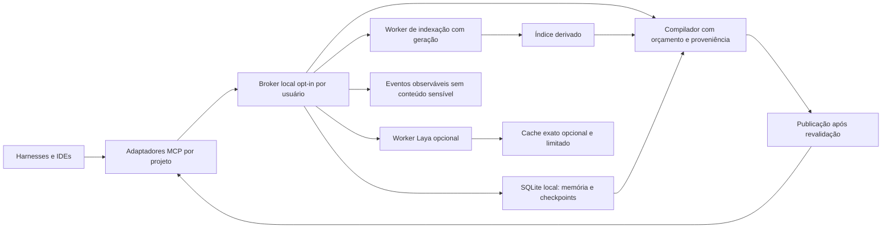

# BBrainX — auditoria técnica integral, arquitetura e programa de evolução

**Data:** 6 de outubro de 2026, America/Sao_Paulo. **Natureza:** investigação de código, leitura documental integral do diretório solicitado, consultas autenticadas somente leitura ao GitHub, medições com runtime real e propostas de engenharia. **Código do produto:** 0.4.0, developer preview. **Revisão principal:** `a9636e9402e3fa673ae05b3489202da1048aef5e`. **PR aberta:** #6, head `2c87f61c3d6355adf61e8675e2f3ee96c5cb2489`.

## 1. Escopo, precisão e procedência

Esta investigação analisa o BBrainX em `/Users/alexandrebelo/Projetos/BBrainX/repo`, os seis documentos de `/Users/alexandrebelo/Projetos/BBrainX/pesquisa/news/`, documentação atual e histórica relacionada, perfil Laya e PR #6. A pasta pai `BBrainX` não é um repositório Git. A versão local da `main` coincide com a versão remota examinada. O hash Git é o vínculo entre código, documentação e evidência; o nome X99 não é versão de runtime.

As afirmações deste documento têm quatro classes: **observação de código**, **reprodução executada**, **hipótese ainda sem reprodução** e **contrato proposto**. O texto das seções anexas usa essas distinções. Uma proposta não passa a ser funcionalidade porque está desenhada no Atlas, possui benchmark Python independente ou apareceu em um dossiê.

A bancada utilizou clones temporários, fixtures próprias em diretórios temporários, SQLite real, filesystem real, processos Node reais, Chromium existente e inferência do modelo Laya já instalado. Os pesos foram copiados antes da inferência. Não foi instalado pacote ou modelo; não foram configurados hooks, habilitados serviços, alteradas aprovações de harness, feitas chamadas a provedores de IA, merges ou publicações. O produto original permaneceu sem alteração de arquivos rastreados. Os testes existentes incluem fixtures controladas de componentes opcionais; seu resultado não é apresentado como inferência neural ou certificação de aplicação nativa. A inferência neural desta auditoria possui registro separado.

Os metadados de GitHub entregues foram reduzidos aos campos necessários. Não distribuir respostas brutas de APIs autenticadas: elas podem conter credenciais transitórias que não fazem parte da evidência técnica.

### 1.1 Inventário verificável do produto

| Propriedade | Observação atual | Consequência |
|---|---|---|
| GitHub | privado; zero estrelas; zero forks; sem descrição e topics no instante consultado | Ainda não há distribuição pública comparável a um lançamento OSS; não mudar visibilidade sem decisão do proprietário. |
| Histórico local | 27 commits; 110 arquivos rastreados; atividade entre 4 e 5 de outubro | Histórico curto não demonstra estabilidade de operação ou manutenção prolongada. |
| Autoria | um autor humano e bot de CI; 21 commits humanos incluindo merges, 6 do bot | Bus factor humano observado é 1. O bot não amplia capacidade de manutenção. |
| Dependências | cinco diretas de produção; 25 pacotes de produção transitivos; 161 pacotes no lock principal | O estudo de 37 itens não significa 37 plataformas instaladas. Remotion e Python têm superfícies separadas. |
| Persistência | SQLite local, schema v2, WAL, synchronous FULL, CAS e histórico | Boa base para uma autoridade local; não é replicação de estado entre máquinas. |
| Recuperação | FTS5, palavras/radicais/glossário, chunks por 60 linhas | O índice não possui a semântica de LSP nem garante localizar todas as dependências dinâmicas. |
| Memória | proposta/aprovação/revogação; `always` e `relevant` | Aprovação é destinada ao humano via CLI confiado; não há atestado criptográfico de presença humana. Revogação impede novas seleções, sem recolher bytes já entregues. |
| Portabilidade | seis ferramentas MCP e geradores de configuração | Compatibilidade de protocolo, configuração e experiência nativa são provas diferentes. |
| Laya | Laya 0.3.26 em Python, pesos multilingual fixados, opt-in | Não reordena o contexto padrão. Não gera código ou texto como um LLM. |
| Watcher/daemon/LSP/sync | ausentes no runtime examinado | Devem permanecer classificados como proposta ou perfil futuro. |

Evidência: `evidence/recon-current.json`, `evidence/github-repository.json`, `evidence/github-main.json`, `evidence/github-pr6.json`; [código principal fixado](https://github.com/oalexandrebelo/BBrainX/tree/a9636e9402e3fa673ae05b3489202da1048aef5e).

## 2. Funcionamento que precisa ser preservado

O harness inicia um processo MCP stdio configurado pelo host com um projeto permitido. O motor valida os argumentos, valida o principal lógico emitido pelo host e consulta a allowlist de projetos. O índice persistido encontra candidatos. O compilador verifica o conteúdo dos arquivos selecionados, incorpora memórias aprovadas e checkpoint e respeita um orçamento textual medido pelo `o200k_base`. O pacote informa caminhos, linhas e hashes, mas não conhece o histórico privado do cliente, o contexto oculto do provedor, seu cache ou a cobrança real.

Um checkpoint usa `expectedVersion` para impedir sobrescrita concorrente. Sua chave de idempotência possui fingerprint do pedido; repetir a mesma operação devolve a resposta persistida, enquanto reutilizar a chave com conteúdo diferente é conflito. Checkpoint, histórico, resposta idempotente e evento são gravados em uma transação. A reindexação preparatória de `saveCheckpoint` é outra transação; não afirmar que indexação, observação do Git e checkpoint formam uma única fotografia atômica.

Há dados autoritativos e dados derivados. Memórias aprovadas, seus estados, checkpoints e eventos críticos devem sobreviver a reinícios. Chunks, FTS, seleções de contexto e caches podem ser reconstruídos. Um resultado do modelo, do índice ou do Atlas não concede permissão. Esta separação evita promover uma conclusão probabilística a regra de segurança e evita transformar um cache em fonte de verdade.

O núcleo atual já tem valor concreto: armazenamento local sem provedor obrigatório, memória com aprovação explícita, transporte MCP delimitado, recuperação lexical rápida e checkpoints duráveis. Sua evolução deve preservar esses contratos antes de adicionar uma camada inteligente ou distribuída.

## 3. Reprodução local dos achados centrais

### 3.1 Substituição da raiz autorizada: P1 de integridade de escopo local

O script `reproduce/audit-runtime.mjs` cria raiz A, registra o projeto e indexa um arquivo. Renomeia A para A-original e coloca um symlink no caminho A apontando para uma raiz B fora do projeto. O bootstrap percebe alteração no arquivo selecionado, atualiza o índice e entrega o marcador de B. O relatório retorna simultaneamente `observed: true` e `selectedFilesVerified: true`.

A verificação atual aplica `lstat` a componentes abaixo da raiz; não revalida a própria raiz armazenada. Um hash correto de conteúdo não prova que o conteúdo veio da raiz originalmente autorizada. A prova usa somente duas pastas artificiais, sem ler outro projeto real. O ataque requer capacidade de modificar o filesystem relevante; não foi demonstrada exploração remota, escalada de UID ou acesso a uma pasta protegida pelo sistema operacional.

**Correção mínima proposta:** rejeitar uma raiz que passou a ser symlink e conferir sua identidade canônica antes de indexar, atualizar e publicar contexto. Se o projeto permite mover a raiz, exigir atualização explícita do registro pelo host. Revalidar o caminho antes/depois da leitura reduz a janela, mas não elimina todo TOCTOU de diretórios concorrentes. Não vender esse patch como sandbox resistente a um processo malicioso com o mesmo UID. Esse objetivo exige handles relativos seguros/isolamento de processo e testes específicos em cada SO.

**Aceite:** raiz estável funciona; rename+symlink e junction/reparse point Windows não são aceitos como o projeto anterior; não há evento de sucesso ou entrega de bytes da raiz substituta; mensagens identificam conflito de raiz sem expor o conteúdo externo. A race de `register` permanece hipótese de interleaving até reprodução adicional, embora o check-then-insert esteja visível no código.

### 3.2 Compactação descarta decisões e bloqueadores: P1 de continuidade

Com um checkpoint contendo 40 itens concluídos, uma decisão e um bloqueador explícitos, o bootstrap de orçamento 1.000 produziu 241 tokens e `checkpointTrimmed: true`. As strings de decisão e bloqueador não estavam no pacote; o banco continuava com ambas. O problema é perda na projeção, não apagamento do checkpoint.

O mecanismo atual preserva objetivo, próxima ação, status, snapshot e carimbo do host; substitui as demais listas por contagens e uma orientação para chamar `session_get`. Essa orientação é útil, mas o próximo agente pode agir antes de consultar a ferramenta. Memórias `always` já têm comportamento mais forte: se não couberem, o compilador recusa o pacote.

**Correção mínima proposta:** tratar decisões e bloqueadores como obrigatórios no contrato de handoff; compactar primeiro itens concluídos, detalhes de evidências e arquivos tocados. Se o conjunto obrigatório não couber, devolver erro explícito ou um bootstrap que exija a recuperação completa antes de agir, sem representar continuidade completa. O agente não deve poder transformar uma instrução arbitrária extraída do repositório em memória aprovada; os campos de checkpoint continuam declarações da sessão, com proveniência e autoridade limitada.

**Aceite:** regressão usa marcador em decisão/bloqueio com listas longas; conteúdo obrigatório é preservado ou a chamada falha explicitamente. Orçamento final é contado sobre o texto completo; contagens de listas não substituem a semântica de segurança. Testar 256, 1.000, 4.000 e 16.000 tokens e checkpoints de outro snapshot.

### 3.3 Concorrência e crash: garantias confirmadas, com escopo limitado

Dois processos reais tentaram criar a mesma tarefa com versão esperada 0 e chaves diferentes: um gravou versão 1, o outro recebeu `VERSION_CONFLICT`; houve um único evento `checkpoint.created`. Repetindo com mesma chave e mesmo conteúdo, ambos receberam versão 1, novamente com um único evento. Esta prova exercita escritores concorrentes em SQLite; os testes MCP anteriores de dois clientes sequenciais provavam retomada entre processos, não simultaneidade.

Outro processo iniciou uma transação, inseriu um evento e foi morto com `SIGKILL` antes de commit. Ao reabrir o banco, o evento inexistia e `PRAGMA integrity_check` retornou `ok`. Isso confirma rollback nesse crash de processo. Não prova integridade sob perda de energia, falha física de armazenamento, disco cheio, erro de I/O, restauração de backup ou corrupção maliciosa. Esses testes permanecem gates distintos.

Evidência conjunta: `evidence/runtime-audit.json` e script completo de reprodução. O `events` atual é um journal transacional local; não há consumer/ACK/retry para justificar entrega exactly-once de efeitos externos.

## 4. Medições de desempenho e suas populações

### 4.1 Compatibilidade e builds

| Execução | Resultado | Limite da prova |
|---|---|---|
| Main, Node 24.18.0, macOS arm64 | 96/96, 2,731 s | Suíte existente; não 96 jornadas nativas ou inferências. |
| Main, Node 22.23.2, macOS arm64 | 93/96, 3,886 s | Três testes de fio falham por `ExperimentalWarning` em stderr; runtime suportado não tem suíte totalmente verde. |
| Main, Vite 8.3.2 | exit 0, 116 ms | Avisos de `@import url('')` e diretiva `use client`; não é render da UI em todas as plataformas. |
| PR #6, unit | 10/10, 35,8 ms | Validação do dataset/exportação documental. |
| PR #6, navegador | 6/6, 3,266 s, Chromium | Desktop/mobile 390 px, filtros, deep link e downloads; não auditoria completa de acessibilidade. |
| PR #6, estático adicional | build/pacote/browser concluídos | Sem request `/api/` e sem page error no percurso observado; Enter do canvas falha. |

O aviso SQLite do Node 22 é descrito na [documentação da versão executada](https://nodejs.org/download/release/v22.23.2/docs/api/sqlite.html). Não houve evidência de contaminação de stdout pelo aviso; a falha vem de tratar stderr como vazio ou como JSON puro. Não suprimir globalmente todos os avisos para fabricar uma suite verde. Ajustar o teste/expectativa ao suporte declarado, preservando detecção de vazamento e de erro operacional.

### 4.2 Escala artificial do motor real

Host observado: `Mac17,9`, macOS 26.6.2, arm64, 24 GiB RAM, 15 CPUs lógicas informadas. O nome comercial do processador não foi inferido. Cem consultas por tamanho, funções curtas distintas e orçamento 1.500. São workloads gerados, com sistema de arquivos e BPE aquecidos e tamanhos executados em ordem. As três conexões SQLite permaneceram abertas até o fim; RSS da tabela não é o custo isolado de um projeto. Amostras de p99 com n=100 são exploratórias.

| Arquivos | Bytes fonte | Índice inicial | Índice sem mudanças | Search p50 / p95 | Bootstrap p50 / p95 | Atualização selecionada | RSS do processo |
|---:|---:|---:|---:|---:|---:|---:|---:|
| 60 | 7.310 | 16,11 ms | 9,76 ms | 0,059 / 0,101 ms | 0,214 / 0,340 ms | 0,780 ms | 130,72 MiB |
| 1.000 | 122.890 | 52,35 ms | 26,40 ms | 0,071 / 0,092 ms | 0,214 / 0,266 ms | 1,551 ms | 150,83 MiB |
| 5.000 | 618.890 | 203,23 ms | 93,63 ms | 0,060 / 0,114 ms | 0,167 / 0,291 ms | 3,933 ms | 157,23 MiB |

Cada tamanho encontrou 100/100 marcadores. Os bancos após checkpoint WAL mediram 208.896, 921.600 e 3.907.584 bytes. Encontrar funções nomeadas nesta amostra não prova cobertura de tarefa em um monorepo de dezenas de MiB. Nenhum ensaio saturou o limite atual de 20.000 arquivos ou 256 MiB; não extrapolar a tabela linearmente até esse limite.

O benchmark existente, separado, indexou 60 documentos de 26.280 tokens: 16,29 ms inicial, 9,99 ms sem mudanças, 9,40 ms para uma alteração, bootstrap p50 0,601 ms e p95 3,842 ms em dez consultas. O `testedRevision` desse script original é null quando não há `GITHUB_SHA`; o manifesto desta auditoria vincula a execução ao clone a9636e9. Não apresentar null como se o script tivesse registrado a SHA internamente.

**Conclusão restrita:** a recuperação lexical em corpus pequeno/curto já é rápida. O trabalho de maior valor é preservar a informação correta, limitar o pior caso e reduzir releitura/alocação. Não foi observado gargalo que justifique trocar todo o núcleo por Rust, um cluster ou um grafo remoto.

### 4.3 Tokenização: pior caso medido

`encode(text).length` cria o vetor final de tokens. `countTokens` existe na dependência instalada e evita esse vetor final, mas continua usando BPE. Houve igualdade em 105 entradas, incluindo Unicode, tokens especiais literais e entradas longas. Em 100 amostras quentes, p50 `encodeLength` 0,2745 ms e `countTokens` 0,2803 ms; p95 0,3040 e 0,2936 ms. A ordem não foi randomizada e o cache já estava aquecido: **não há ganho de velocidade comprovado**. A troca é uma oportunidade de reduzir alocação, condicionada a profiling e paridade mais ampla.

| Um único pretoken alfanumérico | Tempo do contador real | Resultado |
|---:|---:|---|
| 8 KiB | 19,52 ms | Concluído |
| 16 KiB | 52,83 ms | Concluído |
| 32 KiB | 173,90 ms | Concluído |
| 64 KiB | 735,42 ms | Concluído |
| 128 KiB | 2.870,09 ms | Concluído |
| 256 KiB | Tempo total acima do watchdog de 3 s | Processo interrompido externamente; tempo integral não medido |

Cada caso foi processo novo, com old-space V8 limitado a 512 MiB. A forma da entrada é adversarial artificial, mas seu tamanho máximo coincide com o limite default por arquivo. Chunks por 60 linhas não limitam uma linha de 256 KiB. Esse contador é parte do caminho de bootstrap; a reprodução mede o primitivo, não o deadline integral da capability. Não reportar 256 KiB como duração exata de 3 segundos: foi um limite externo do ensaio.

**Contrato proposto:** limitar chunks por bytes e fronteiras válidas de texto além de linhas; manter hashes/proveniência; contar sobre o payload final exato; executar trabalho potencialmente longo fora do event loop que atende MCP; deadline operacional deve interromper/aposentar o worker e proibir publicação tardia. Uma checagem antecipada de orçamento só ajuda após alcançar a próxima fronteira de tokenização; não assumir que `isWithinTokenLimit` preempta a construção interna de um único pretoken enorme. Não somar contagens de seções como se BPE fosse aditivo nas fronteiras.

### 4.4 Laya real: desempenho, memória e erro

O perfil existente foi usado sem instalar ou atualizar bibliotecas. Cinco arquivos tiveram tamanho e SHA-256 conferidos antes da execução; os pesos/copias e o tokenizer estavam em pasta temporária. Modelo `multilingual`, Laya 0.3.26, Torch 2.14.1, MPS; carga 4.155 ms; execução completa medida pelo wrapper 4.976 ms. Peak RSS do Python amostrado a cada 250 ms: 1.925.664 KiB, aproximadamente **1,84 GiB**. Peak RSS do CLI: 54.544 KiB. RSS não mede toda memória de GPU ou energia; o wrapper de hash e a amostragem adicionam custo à bancada.

Os 64 pares existentes são sintéticos, rotulados à mão, com 19 positivos e 45 negativos. Não constituem holdout independente nem comparação de tarefas completas.

| Método | Acurácia | Precisão | Recall | F1 | TP / FP / FN / TN |
|---|---:|---:|---:|---:|---|
| Classe majoritária | 0,703 | — | — | — | Baseline de desbalanceamento |
| Regra lexical | 0,734 | 0,667 | 0,211 | 0,320 | 4 / 2 / 15 / 43 |
| Laya `noul` | 0,563 | 0,333 | 0,474 | 0,391 | 9 / 18 / 10 / 27 |
| Laya `choice` | 0,516 | 0,357 | 0,789 | 0,492 | 15 / 27 / 4 / 18 |

O F1 maior do Laya corresponde a mais verdadeiros positivos acompanhados de muitos falsos positivos. Acurácia isolada favorece negar quase tudo em uma população majoritariamente negativa. Nenhuma das métricas autoriza omitir uma política obrigatória: o lexical deixou escapar 15 de 19 positivos e `noul` deixou 10. A política `always` deve continuar determinística. Classificação só pode selecionar contexto opcional, com fallback, abstenção e critério de risco.

O p50 de 6,2 ms é **por par amortizado em batch de até 16**, não latência de uma requisição isolada. Confidence ≥0,9 cobriu 25% com acurácia 0,688; ≥0,95 cobriu 15,6% com acurácia 0,5. Não foi demonstrada calibração suficiente nem redução confiável de erro por um limiar alto.

**Decisão:** manter o perfil opcional fora do ranking padrão. Um processo residente compartilhado pode amortizar carga e evitar várias cópias do modelo, mas agrega autoridade e superfície operacional. Antes de adotá-lo, medir quantos harnesses realmente carregam Laya ao mesmo tempo; atualmente o caminho MCP padrão não precisa dele. Modelo residente sem consultas é consumo evitável.

## 5. Arquitetura-alvo local, com contratos de falha

### 5.1 Memória única significa autoridade única, não contexto universal

O resultado desejado é recuperar objetivo, decisões, restrições, evidências, pendências e proveniência ao trocar de harness. Não é copiar todo o histórico privado do IDE, trocar permissões de execução, transportar credenciais ou reutilizar tensores KV entre modelos diferentes. Um banco local comum já permite consultar registros do mesmo projeto; cada processo stdio continua tendo suas próprias filas, caches e eventual worker.

A autoridade futura deve separar `projectId`, `workspaceId`, `taskId`, `snapshotId` e `principal/grant`. O projeto representa a base de conhecimento; workspace representa um checkout com raiz autorizada; tarefa é um objetivo/versionamento; snapshot identifica o conjunto efetivamente observado. Mesmo remoto Git ou SHA não tornam duas worktrees equivalentes. Conteúdo aprovado de projeto e evidência transitória de workspace devem ter escopos explícitos.

Memória global do usuário deve ser uma categoria aprovada separada, com indicação dos projetos em que pode aparecer. Não selecionar conteúdo de outro projeto porque embeddings ou um classificador o consideraram parecido. Um catálogo global pode listar metadados permitidos; a busca de corpos deve continuar vinculada a grants.

### 5.2 Implantação incremental

**Etapa A — corrigir o processo atual:** integridade da raiz, política de checkpoint, limites de chunks/frames, deadline efetivo e geração de nomes MCP por projeto. Melhorar contagem/leitura sem dependência nova. Preservar CLI simples e ausência de daemon obrigatório.

**Etapa B — autoridade local opt-in:** adaptadores stdio pequenos por harness encaminham chamadas a um broker por usuário por socket Unix ou named pipe. O broker verifica identidade do peer, concede capacidades e projetos fixados pelo host e mantém uma fila limitada. UID identifica o usuário, não o aplicativo; grants são emitidos pelo host, não por autoidentificação do cliente, e não se promete isolamento entre processos maliciosos do mesmo UID. Estado crítico fica em SQLite local. Indexação e modelo são workers supervisionados; o processo de controle permanece capaz de atender cancelamento e health. O uso dessa topologia exige migração, lifecycle e prova de recuperação; não existe na versão examinada.

**Etapa C — perfis especializados:** Laya para decisões estreitas calibradas, análise estrutural ou LSP apenas em roots autorizadas, ingestão documental por coleção e ferramentas de pesquisa acionadas sob demanda. Projetos upstream oferecem mecanismos; não carregar seus runtimes como biblioteca universal de inteligência.

**Etapa D — intercâmbio entre máquinas:** começar com export/import explícito, versionado e validado de dados aprovados; banco SQLite ativo nunca vai para pasta sincronizada. Sincronização automática só após definir autoridade, conflitos, revogação, retenção e autenticação. Não exigir servidor distribuído para o primeiro usuário local.



O desenho é proposta. Há um caminho determinístico sem Laya. O mascote observa eventos; não possui seta de autoridade para alterar permissões, aprovar memória ou declarar tarefa validada.

### 5.3 Concorrência e publicação

SQLite WAL continua adequado à autoridade em um host. Seus limites físicos e semânticos não desaparecem com workers. Há um escritor de cada vez; leitores longos podem reter WAL; `busy_timeout=5000` espera por lock e não implementa deadline de tarefa. O store usa `DatabaseSync`, portanto suas chamadas bloqueiam a thread que as executa. [SQLite WAL](https://sqlite.org/wal.html), [API síncrona Node](https://nodejs.org/download/release/v22.23.2/docs/api/sqlite.html).

Tirar leitura de arquivos de `BEGIN IMMEDIATE` exige staging e validação, não mover linhas ingenuamente. Ler/normalizar conteúdo fora do writer lock; registrar geração-base; preparar delta; abrir transação curta; confirmar que geração-base ainda é vigente; publicar delta e nova geração ou repetir a preparação. Arquivo modificado durante a preparação deve ser detectado segundo contrato explícito. Índice derivado pode usar banco/generações separados; só introduzir essa separação após provar que o writer lock atual afeta memória/checkpoints em carga real.

Uma compilação precisa de revisão coerente das memórias, do checkpoint, do índice e das políticas. Leituras isoladas de count/list/project não são snapshot transacional comum. Capturar revisões no início e revalidar no ponto de liberação. Falha na revalidação invalida o resultado; resultado antigo não passa a valer porque o modelo terminou depois. Um generation/fencing token só protege se o destino também rejeita gerações antigas.

Definir o ponto de linearização da autorização como admissão do frame de resposta na fila de saída sob revisão vigente. Revogação impede admissões posteriores a esse ponto; bytes previamente liberados não podem ser recolhidos. Não prometer que uma mudança de política desfaz leitura histórica ou garante que todo pacote continua atual no instante em que o humano o abrir. Exibir digest/revisão/hora de verificação e o limite de cobertura.

### 5.4 Queue, deadline e recursos

Valores abaixo são **pontos de partida de contrato**, não medições de capacidade ou configuração aplicada. Validar contra workloads normais, stress e hardware mínimo antes da adoção: fila local 64 pedidos e 8 MiB de payload agregado; uma inferência Laya em execução; até quatro slots de controle curtos; fila por projeto/cliente com fairness; uma indexação por workspace; workers de tokenização com deadline externo; idle unload de modelo após 120 s, salvo preferência explícita de residência. Limites por bytes prevalecem sobre contagem quando atingidos antes.

Estados de pedido: `ADMITTED → QUEUED → RUNNING → COMPLETED`; saídas `REFUSED`, `CANCELLED`, `TIMED_OUT`, `FAILED` e `OUTCOME_UNKNOWN` para efeito cuja confirmação foi perdida. A fila cheia recusa antes de alocar buffers/modelo. Cancelamento de um consumidor de singleflight não cancela outro consumidor; quando nenhum subscritor resta, trabalho cancelável é interrompido. Worker morto é aposentado; sua resposta atrasada é rejeitada pela geração. Não devolver timeout e depois confirmar sucesso invisível da mesma operação.

Em modelo ocupado, orçamento de espera precisa incluir tempo de fila. Um deadline iniciado somente depois de `start()` não limita a experiência completa: o broker atual pode esperar 90 s de carga antes do prazo de decisão. Separar load timeout, queue timeout e execution timeout, todos dentro de um deadline total.

Orçamentos propostos para uma rodada de homologação: core carregado ≤256 MiB RSS em corpus de 5.000 arquivos/50 MiB com p95 bootstrap ≤50 ms e p99 ≤200 ms; resposta de controle/cancelamento p95 ≤50 ms durante indexação; Laya opcional residente alvo ≤2,25 GiB RSS em batch pequeno. Essas cifras são metas para falhar/passarem no ensaio, não SLA já entregue. Memória de GPU, page cache e outros harnesses são contabilizados separadamente. Se qualquer meta exigir descartar memória obrigatória, a meta de recursos perde para integridade.

## 6. Caches: custos, chaves e invalidadores

### 6.1 Aplicar o cache na ordem certa

1. **Reuso efêmero por arquivo na mesma rodada:** agrupar candidatos por path e verificar uma vez o arquivo para todos seus chunks. Não usar apenas `mtime/size` como prova de conteúdo. Se houver refresh, descartar os resultados daquela rodada e recalcular.
2. **Contagem exata por corpo/digest/encoding:** TTL/LRU limitado por bytes de chave e resultado; chave inclui versão do tokenizer/encoding e opções de tokens especiais. Contagem final do pacote completo permanece exata, pois fronteiras alteram merges.
3. **Resultados de busca:** chave inclui projeto/workspace, revisão completa do índice, query normalizada conforme contrato, limite, scorer/glossário/kind weights. Cache guarda IDs/pontuações e busca corpos sob geração validada. Efeito de estatística global FTS deve ser considerado; um projeto novo pode alterar BM25 global sem modificar outro projeto.
4. **Pacote inteiro:** adiar até haver contrato coerente de revisão e autorização. Mesmo hit precisa verificar grant vigente, revogação e validade dos arquivos selecionados. Reutilizar bytes não elimina a obrigação de limitar a entrega.
5. **Decisão Laya exata:** somente em perfil calibrado e autorizado. O candidato X99 de 128 entradas/2 MiB/5 min permanece candidato. Não ligar por inferência de que toda decisão repetirá.

### 6.2 Identidade de cache Laya

Compor uma identidade estruturada, sem concatenação ambígua: versão de schema/cache/worker, principal/escopo permitido, projeto e workspace, revisão de autorização/política/memória, snapshot de conteúdo, texto exato dos estados, instrução, tipo de pergunta, ordem explícita das opções, critérios, maxLen/truncamento, digest do tokenizer/configuração/pesos e backend/precisão se alterarem decisão. JSON canônico ordena chaves, mas opções ordenadas e sua posição no modelo não podem ser apagadas pela normalização. Não assumir que labels A/B diferentes são semanticamente idênticos.

Validação e autorização ocorrem antes do lookup e antes da liberação. O hit não pode devolver resultado de outro projeto, modelo, geração, política ou conjunto de critérios. Cachear apenas resposta bem-sucedida e validada; não guardar timeout, fila cheia, erro de parse ou resultado de geração aposentada. Limitar também filas, buffers de stdout, payload de entrada e escrita no pipe; um cache pequeno não impede OOM em um produtor ilimitado.

TTL usa relógio monotônico para duração; revisões invalidam imediatamente sem aguardar TTL. Snapshot antigo não é autorizado pela idade curta da entrada. Persistência do cache deve ser off por padrão; corpos e embeddings também podem conter dados privados. Telemetria de hit/miss não inclui query ou texto. Métricas devem diferenciar miss, evict, expired, invalidated e coalesced; pooling de pedidos não é hit persistente.

### 6.3 Quando a otimização se paga

Se `D` é custo de uma decisão sem cache, `H` custo de validar e servir hit, `M` sobrecusto de miss e `r` hit rate, custo médio é `r×H + (1-r)×(D+M)`. Há ganho de latência apenas quando `r > M/(D+M-H)`, para denominador positivo. Custos de invalidação, hashing, memória e falso resultado não desaparecem da equação; medir D/H/M no workload.

Para um worker residente, comparar custo de carga repetida e RSS de N workers com custo do daemon, filas, idle e um worker compartilhado. Os 4,155 s de carga tornam amortização plausível quando há reuso; não justificam 1,84 GiB permanente se há poucas consultas. Para decisões de microsegundos resolvidas por regra determinística, um modelo de milissegundos agrega custo; só pode vencer se produzir melhoria de tarefa mensurável.

## 7. Falhas catastróficas e limites distribuídos

| Falha | Comportamento exigido | Prova atual / gate restante |
|---|---|---|
| Processo morto antes do commit | Não publicar estado parcial | Reproduzido para evento transacional; não todas as operações. |
| Commit realizado, ACK perdido | Repetir chave/fingerprint, devolver estado persistido | Idempotência concorrente provada; injeção de perda de ACK pós-commit ainda gate. |
| Disco cheio/I/O interrompido | Recusar escrita, manter erro original, não anunciar sucesso | Não executado; testar em volume/limite isolado, não enchendo disco do usuário. |
| Corrupção do DB | Quarentena/diagnóstico e restore verificável; índice pode ser reconstruído | Abertura v2 não é detector integral; integrity/restore completo ainda gate. |
| Worker neural trava/morre | Determinístico opcional ou erro explícito; aposentadoria de geração | Circuit breaker parcial na base; preempção/frame/queue candidato. |
| stdout sem newline/JSON enorme | Buffer limitado, encerramento limpo e no late result | MCP possui limite de linha; broker Laya atual não tem limite equivalente. |
| Indexação longa | Controle e cancelamento continuam responsivos | Main synchronous blocking; worker/staging ainda proposta. |
| Revogação concorrente | Proibir publicação sob revisão velha | Falta selo/revalidação comum antes da liberação. |
| Evento diagnóstico lento | Nunca bloquear commit; fila limitada/drop observável | Callback é isolado quanto a erro; retenção/sampling/quotas precisam contrato. |
| Restore rollback de versão | Nova epoch não permite confundir cache com estado anterior | Epoch/revisões/reconciliação ainda proposta. |
| Suspend/resume/clock jump | Deadline e lease por monotônico/generation; sem respostas velhas | Não homologado como lifecycle desktop. |
| Reboot durante instalação do modelo | Modelo publicado só após validação e rename; não partial reutilizado | Hash/rename presentes; locks/fsync/recovery parcial precisam hardening. |
| Credencial/repo com texto hostil | Não virar instrução/autoridade; não imprimir segredo | Guardas/regex e contratos existentes; não detector universal de segredo. |
| Outro projeto altera corpus global | Nenhuma linha cruza escopo; medir mudanças de ranking/latência | SQL filtra projeto; estatística BM25 global demanda avaliação. |
| SQLite em NFS/iCloud/sync | Não operar banco vivo assim | Documentado; guardas de detecção precisam ser proporcionais e não prometer detecção de todo mount. |
| Partição entre máquinas | Sem segundo writer autoritativo improvisado | Não há sync atual. Arquitetura distribuída deve definir autoridade e conflitos primeiro. |

A lista detalhada de 28 cenários do protocolo e suas 28 falhas relatadas do anexo Rust está na auditoria documental integrada. Não transformar porcentagens de interleavings de um modelo finito em taxa de falha de produção.

Se houver expansão distribuída, escolher uma autoridade por projeto/workspace ou uma autoridade remota com identidade/grants/revisões; não replicar o SQLite vivo. Uma máquina desconectada pode manter rascunhos locais identificados como não autoritativos. Para conciliar duas propostas de memória, conservar proveniência e solicitar resolução de conflito; `last-write-wins` não pode revogar/reativar silenciosamente política. Epoch de restore e fencing tornam resultado velho detectável, mas o destino precisa fiscalizar a epoch.

Orçamento financeiro global estrito exige reservas/direitos com conservação: nunca liberar uma reserva de operação cujo efeito é desconhecido só porque passou TTL. Um contador eventual ou GCRA por réplica não fornece teto global linearizável. Esse tema não deve virar serviço obrigatório agora: a execução desta auditoria teve zero chamadas cobradas a provedores. A técnica do protocolo só será adotada quando existir executor/custo real a controlar.

## 8. Interoperabilidade e qualificação por plataforma

Protocolo MCP validado, gerador de configuração, chamada pontual em cliente e tarefa concluída após handoff são quatro degraus distintos. CI Linux/macOS/Windows mede os mesmos testes de núcleo nessas plataformas; não certifica VS Code, Claude Code, Codex App, Antigravity ou todos os respectivos releases. Os relatos históricos de Claude Code/Codex CLI estão identificados na seção de ecossistema; não foram reexecutados nesta auditoria.

Matriz de homologação proposta: macOS arm64 e Windows x64 em hosts reais; para cada harness registrar versão, Node, release BBrainX, raíz/workspace e método de configuração. Percurso obrigatório: A registra/checkpoint com evidência; B recupera e encontra decisões/bloqueadores; A/B disputam versão; memória proposta não aparece como aprovada; humano aprova/revoga; B recupera revisão atual; reiniciar processo; trocar workspace; cancelar trabalho em andamento; concluir tarefa com teste/revisão. Corpus e credenciais são locais, sem exportar logs privados de harness por conveniência.

Não transportar configurações absolutas do Mac para Windows. Geradores devem usar paths locais, escapar formatos, produzir nomes por projeto e fazer validação de colisão. Antigravity não está entre os cinco geradores atuais; suporte requer formato/versão oficial verificados e teste nativo, não copiar um exemplo de outro aplicativo. Usuário escolhe escopo global ou workspace; BBrainX imprime o diff/configuração e preserva aprovação nativa. Nenhuma expansão de autorização vem de arquivo recuperado.

## 9. Programa de execução e critérios de aceite

O backlog abaixo é proposto e não foi publicado como issue. Cada unidade deve nascer como issue/branch/PR focada no repositório BBrainX, com teste que reproduz o defeito, critério de pronto e rollback. Não reutilizar automaticamente regras de deploy/infra do DoneFitt para outro produto. Os contratos locais do BBrainX prevalecem no seu código.

| Ordem / ID | Trabalho e escopo | Dependências | Aceite mínimo e medição |
|---|---|---|---|
| 1 / BX-01 | Revalidar raiz registrada em leitura/index/refresh | Nenhuma | Reprodução de symlink deixa de entregar B; Windows junction/reparse testado; limitações TOCTOU explícitas. |
| 2 / BX-02 | Preservar decisões/bloqueios no handoff e budget fail-closed | Nenhuma | Teste de compactação vermelho antes; obrigação preservada ou erro explícito em todos os budgets suportados. |
| 3 / BX-03 | Corrigir pipeline de Atlas e keyboard selection | PR #6 | `shell: bash`/pipefail; failure real não gera success; Enter/Space/roving tabs comprovados; testes estáticos e MPA preservados. |
| 4 / BX-04 | Qualificar Node 22 suportado sem esconder warnings | Nenhuma | 96/96 nas versões declaradas; trace parse separa warnings esperados de eventos; stdout continua MCP puro. |
| 5 / BX-05 | Byte-bound chunking e tokenização com cancelamento real | BX-01/02 | Long pretoken não monopoliza controle; orçamento exato e hashes preservados; Unicode, linha gigante e arquivo limítrofe. |
| 6 / BX-06 | Harden broker Laya: frames, queue, deadline total e geração | Nenhuma para perfil opt-in | Bounds antes de parsing/alocação; respostas tipadas/finita; kill/timeout rejeitam respostas velhas; inferência real além de teste de processo. |
| 7 / BX-07 | Micro-otimizações do núcleo sem dependência nova | BX-01/02/05 | Uma leitura/path/rodada; paridade count; replay antes do Git sem perder guardas; ablação cold/warm com cache bytes. |
| 8 / BX-08 | Revisões e snapshot coerente de memória/contexto | BX-01/02 | Revogação/index/checkpoint concorrentes não publicam selo velho; ponto de linearização documentado. |
| 9 / BX-09 | Contrato de retenção, backup e restore | BX-08 | Backup restaurado com memórias/checkpoints/eventos; quota e pruning preservam CAS/replay dentro da janela declarada; fora da janela, erro definido. |
| 10 / BX-10 | Nome/config por projeto e matriz de harnesses | BX-01/02/04 | Dois projetos não colidem; handoff nativo Mac/Win; Antigravity explicitamente qualificado antes de divulgar suporte. |
| 11 / BX-11 | Corpus holdout e avaliação de tarefa aceita | BX-10 | Tarefas/aceite/modelos/custos fixados antes; pareamento, ablação, correlação e IC; nada de billing inferido do payload. |
| 12 / BX-12 | Autoridade local compartilhada opt-in | BX-06/08/09/10 e duplicação medida | IPC por usuário, grants por adapter, worker único supervisionado, fairness, idle, upgrade/rollback/owner collision. |
| 13 / BX-13 | Perfil símbolos/LSP e Laya estreito calibrado | BX-11 | Ganho de tarefa supera CPU/RSS/instalação; treinocalibraçãoholdout separados; sem alterar políticas obrigatórias. |
| 14 / BX-14 | Release OSS verificável e experiência de onboarding | BX-01..11 prioritários | Release/tag, source package, segurança/licenças/SBOM, instalação e demo externas; decisão explícita de publicar. |
| 15 / BX-15 | Mascote original e demonstração | Sem dependência do núcleo para vídeo | Prompt entregue; render depois; estado visual só reflete evento; personagem próprio, assets/sons originais. |

BX-07 não deve preceder correção de integridade. BX-12 não é requisito para corrigir o processo stdio. Caso não se observe duplicação do Laya/serviço, manter uma instalação local simples; não implementar daemon por prestígio arquitetural.

## 10. Engenharia para reputação OSS

“Top 1 em estrelas” é uma ambição de mercado, não critério de aceitação técnica nem resultado prometível. O produto está privado no snapshot examinado. Antes de lançamento, o proprietário precisa decidir visibilidade e licenças/publicação; a auditoria não fez essa mudança.

Proposta de reputação: uma instalação curta e verificável, sem conta de IA obrigatória, tarefa iniciada em um harness e concluída em outro com decisões preservadas, política revogada que não reaparece, conflito de versão visível e custo medido. Uma demonstração deve exibir a SHA e distinguir cache/savings/tarefa aceita. Essa experiência é mais defensável que “uma mente com todos os repositórios” sem curadoria ou evidência.

Primeiro publicar documentação de instalação em inglês e pt-BR, exemplos sem segredos, threat model, SECURITY disclosure, CONTRIBUTING com issue/PR e critérios, matriz de suporte, release notes e limitações, fontes/licenças de perfis e scripts de avaliação. Criar tags/versionamento e um source package que não incorpore `.env`, bancos, recibos locais ou upstreams sem licença revisada. `private: true` no package principal impede publicação npm direta; alterar packaging só quando houver decisão de distribuição e pacote testado. O core não precisa incluir o mascote/video ou peso neural.

Priorizar manutenção e reprodução por contribuidores externos. Abrir critérios de benchmark e casos holdout sem vazar soluções antes da avaliação. Medir instalação bem-sucedida, primeira retomada, retenção operacional, issues reproduzíveis, regressões, tempo de resposta/manutenção e contribuições independentes. Não incentivar estrelas artificiais, atribuir acurácia de competidores ao BBrainX ou anunciar suportes nativos somente porque o gerador imprime JSON/TOML.

A “mente cheia de repositórios” deve ser um catálogo curado com commits/licenças, técnicas e quando consultar, em coleções selecionadas. Limitar ingestão por projeto, bytes, tamanho de arquivo, linguagem e necessidade; deduplicar conteúdo por hash com escopo/proveniência preservados; distinguir cópia upstream de implementação local. Regras derivadas de pesquisa precisam aprovação e prova antes de virar constraint do runtime. Nenhuma biblioteca de conhecimento compensa falta de invalidação, raiz segura ou checkpoint completo.

## 11. Entrega e reprodução

O dossiê principal incorpora integralmente auditoria documental, análise de performance, consistência/segurança, PR, ecossistema e prompt do mascote. `evidence/` reúne logs/JSON e screenshots; `reproduce/` guarda scripts completos usados na bancada. `MANIFEST.json` contém SHA-256/bytes dos artefatos, revisões e scope. Não inclui os assets do perfil de aproximadamente 647 MiB, venv, banco real, node_modules, clones de pesquisa ou arquivo de autenticação.

Para repetir, usar checkout isolado da revisão fixada e suas dependências existentes/resolvidas pelo lock revisado, copiar scripts de reprodução para `scripts/`, trocar os caminhos de evidência/home definidos no cabeçalho e usar Node 24 recomendado. Os ensaios criam/removem seus próprios fixtures; o script Laya exige pesos já instalados e copiados com hashes conferidos. Não apontar `BBRAINX_HOME` para o banco operacional em uma bancada de crash, symlink, migração ou concorrência. Os comandos exatos e códigos de saída constam em `REPRODUCAO.md`.

Medições, diagnóstico e propostas não alteraram o produto. O próximo trabalho concreto é BX-01/BX-02, acompanhado de BX-03 na PR documental. Corrigir o que é servido e sob qual autoridade antecede ampliar o volume do que o sistema conhece.


---

## Auditoria documental do BBrainX — 6 de outubro de 2026

O conjunto sustenta uma **prévia local 0.4.0 com memória governada, checkpoints transacionais, recuperação lexical e perfil Laya opt-in**. Não sustenta um daemon compartilhado entre harnesses, cache global de decisões, integração do protocolo X99, economia financeira, tarefa completa homologada ou liderança de mercado. Há documentação cuidadosa sobre essas fronteiras, mas também uma divergência material sobre preservação de decisões/bloqueios na compactação de checkpoints e documentos históricos facilmente confundidos com o estado atual.

### Escopo, leitura e classificação

`git rev-parse HEAD`, executado somente para leitura em `/Users/alexandrebelo/Projetos/BBrainX/repo`, confirmou `a9636e9402e3fa673ae05b3489202da1048aef5e`. Os seis arquivos textuais/JSON de `pesquisa/news` foram lidos **integralmente**, incluindo referências: 2.130 linhas e 163.638 bytes. `.DS_Store` foi excluído. Foram lidos integralmente README, onze documentos pertinentes de `repo/docs`/prompts, o relatório CI e benchmark macOS, LEIA-ME e três dossiês/guias da raiz. O relatório de validação 0.2 da raiz foi consultado parcialmente, linhas 1–180, e não é apresentado como leitura integral. Manifesto verificável: `../evidence/leitura-news.json`.

Não executei código do produto ou de terceiros, modelos, testes, instalação, benchmark, comandos sugeridos pelos documentos ou alterações de configuração de harness. Os textos imperativos recebidos foram tratados como objetos de auditoria. Os resultados históricos abaixo foram **lidos**, não reexecutados. A auditoria de código/runtime e da PR #6 é responsabilidade das outras seções deste trabalho. A confirmação do trecho de compactação foi cruzada por leitura de `repo/src/context.mjs:32–46`, sem executar o produto nesta seção.

Estados nesta seção:

- **Implementado-documentado:** os documentos atuais afirmam presença na base; a confirmação independente por código pertence à seção de runtime.
- **Medido-histórico:** número com população/ambiente descritos e/ou relatório presente; não implica reexecução nesta auditoria.
- **Candidato:** implementado segundo o relatório do patch, sem incorporação comprovada à base examinada.
- **Laboratório:** mecanismo/modelo finito exercitado isoladamente; sem integração de produto.
- **Proposto:** requisito, arquitetura, parâmetro ou experimento futuro.
- **Contraditório/desatualizado:** afirmações incompatíveis entre si ou com a delimitação atual; a distinção histórica é preservada.
- **Não comprovado:** falta evidência de execução no conjunto consultado; não equivale a concluir que seja impossível.

Abreviações de documentos, sempre relativas a `/Users/alexandrebelo/Projetos/BBrainX/`:

| ID | Caminho |
|---|---|
| N1 | `pesquisa/news/BBrainX_Atlas_X99_Guia.md` |
| N2 | `pesquisa/news/BBrainX_Posicionamento_Tecnico.md` |
| N3 | `pesquisa/news/BBrainX_X99_Dossie.md` |
| N4 | `pesquisa/news/BBrainX_X99_Protocolo_Consistencia_Desempenho.md` |
| N5 | `pesquisa/news/BBrainX_X99_Protocolo_Validacao.json` |
| N6 | `pesquisa/news/BBrainX_X99_Validacao.json` |
| R | `repo/README.md` |
| S | `repo/docs/SECURITY_MODEL.md` |
| Q | `repo/docs/QUICKSTART.md` |
| H | `repo/docs/HANDOFF.md` |
| E | `repo/docs/EVALUATION.md` |
| F | `repo/docs/FEASIBILITY.md` |
| D | `repo/docs/DOSSIER.md` |
| M | `repo/docs/STUDY_MAP.md` |
| O | `repo/docs/OPTIONAL_PROFILES.md` |
| RN | `repo/docs/RELEASE_NOTES.md` |
| A | `repo/docs/prompts/ACTIVATE.md` |
| L | `repo/docs/prompts/LAYA_FINETUNE.md` |
| CI | `repo/docs/validation/ci-report.json` |
| BMAC | `repo/docs/validation/benchmark-macos-latest.json` |

#### Identidade dos seis arquivos de news

| Documento | Linhas | Bytes | SHA-256 dos bytes originais |
|---|---:|---:|---|
| N1 | 103 | 7.410 | `5802faf1ca00be3760cc92b278dbca730c6b67dfcf61cf119fd3613452e581e2` |
| N2 | 61 | 5.720 | `9e8758cfed083e9a21f7b1b753d6528d73b0d9796b0426573b232f0ae324285c` |
| N3 | 441 | 55.362 | `de5f679b63ae23b996247e8e7daba7982c8ec55e05e1fbd248f001d085dbdfc3` |
| N4 | 1.069 | 82.586 | `c20ba258a4aa70af56dc3bc2188f72530b7cedd997669e624f882a12abe0ee81` |
| N5 | 104 | 3.009 | `b97677ac802945792dfed760a7f7ad9ae94f008c8f7de57280443cfe7904f380` |
| N6 | 352 | 9.551 | `bf4b494eeb79897398762aa78d10862fa21c66c8621058b6fa8b35706f76ff14` |

O hash de N3 coincide com o hash de `docs/x99/AUDITORIA_X99.md` listado em N6:252–254. Isso vincula **o documento**, não verifica o patch de 177.506 bytes nem prova aplicação à base. N6 lista 21 arquivos, coerente com seu contador `modified_files:21`; registra 35 verificações sintáticas JavaScript, que não são 35 testes funcionais.

### Matriz dos contratos atuais de produto

| Documento/linhas | Afirmação material | Evidência documental e limite | Status |
|---|---|---|---|
| R:9–15; H:7–23 | 0.4.0 é prévia local; Node 24 recomendado, 22.20+ aceito; núcleo sem modelo/rede/conta/Docker/Python | H distingue conexão Claude/Codex de tarefa real; CI testa núcleo sem Laya instalado | Implementado-documentado; uso real completo não comprovado |
| R:50–61; H:141–150 | Seis ferramentas MCP: bootstrap, search, index, checkpoint, get, propose; projeto fixado pelo host | `{ok,data,error,detail}`; recusa de domínio tem `isError:true`; argumento `project` identifica, não autoriza | Implementado-documentado |
| H:154; RN:25–29 | Motor: input→identidade→acesso→prazo→execução→output; oito códigos de erro; prazo 30 s | Cancelamento anterior impede início; eventos não levam argumentos/resultados | Implementado-documentado; prazo não preempta código síncrono |
| H:158–163; RN:8,41 | MCP moderno `2026-07-28` sem handshake; legado com initialize em quatro revisões | Linha 1.x oficial cobre legado; moderno é validado por fio próprio; versão desconhecida `-32022` | Implementado-documentado; nenhuma certificação de IDE |
| S:23–26; H:160–163 | Frame acima de 1 MiB encerra; >300 calls/min `RATE_LIMITED`; stdout exclusivo de protocolo | Freio de laço, não autorização; indexação longa bloqueia leitura de entrada | Implementado-documentado; não admissão multidimensional global |
| S:9–18 | HTTP loopback, Host/Origin/Fetch Metadata, CSP/CSRF; índice textual com exclusões; arquivo SQLite 0600 POSIX | Mesmo usuário malicioso continua podendo ler arquivos; segredo por padrões não é detecção completa | Implementado-documentado, fronteira local explícita |
| Q:39–41; H:171–175 | 20 mil arquivos, 256 KiB/arquivo, 256 MiB/projeto; chunks de 60 linhas; Git ignore; symlinks/binários/segredos excluídos | Tetos só pelo host; snapshot é manifesto textual, não ambiente; novos arquivos/ignore precisam indexação | Implementado-documentado; limites não são escala homologada |
| H:179; R:83 | Recuperação lexical FTS5/BM25: exato + radical/glossário PT→EN; reforço de declarações e desconto por classe | Pesos caminho 2, corpo 1, nomes 8, partes 1,5; estágio expandido 0,5; docs 0,7/config 0,6/teste 0,4/gerado 0,25 | Implementado-documentado; sem AST/LSP/call graph |
| Q:41; S:13,42–44 | Hash de fonte selecionada verificado, relido/reindexado ou `STALE_INDEX` estrito | Verificação não congela filesystem; mudanças após leitura continuam possíveis | Implementado-documentado; TOCTOU preservado |
| H:183–187; Q:83 | Obrigatórios devem caber; checkpoint grande vai abreviado; docs≤metade se houver código | Q diz que listas saem; N3 identifica perda de decisões/bloqueios | Contraditório quanto ao conteúdo obrigatório |
| R:85; E:86 | `payloadTokens` só o200k_base do pacote; billing, cache de provedor e tokens de cliente desconhecidos | Não converter assinatura em preço de API; campos não observáveis `null` | Implementado-documentado como contrato; economia não medida |
| S:15–17; H:191–192; Q:81–89 | Checkpoint CAS/idempotência/histórico/evento; host observa snapshot/Git; agente declara done/evidence | 16 KiB incluindo host; status in_progress/paused/blocked/review_needed; sem teste reexecutado pelo store | Implementado-documentado; não aceite verificado |
| Q:100–102; H:191 | Memória proposed/approved/revoked; humano aprova CLI; always/relevant; 100 aprovadas/projeto | Proposal mode é sugestão; approve default always; fonte indicada não é certificada | Implementado-documentado; revogação não expurga histórico/backups |
| Q:112–120,139–154; S:48–52 | Estado fora do cwd; backup VACUUM INTO; restauração com processos parados; schema 2 da 0.3 preservado na 0.4 | Não SQLite vivo em iCloud/rede; cópia v 1 contém dado sensível; sem multi-host/exactly-once distribuído | Implementado-documentado local |
| R:33; H:196; A:3,18–22 | Produto só imprime configuração; agente escreve apenas quando prompt é explicitamente adotado | Backup e preservação de outras chaves; não tocar autenticação/gateway/segredos | Implementado-documentado; autorização de outro prompt não foi executada aqui |
| R:65–73; O:11–17; S:30–34 | Laya 0.3.26 Python opt-in, pesos pinados/hash, worker offline, ask/medição, sem alterar contexto | Rodar pacote Python não equivale a sandbox; texto existe num segundo processo | Implementado-documentado; modelo fora do caminho crítico |

### Matriz exaustiva das afirmações materiais dos seis news

As linhas de bibliografia não são duplicadas como capacidades: N3:343–441 e N4:746–1069 são registros de fontes. Presença de link, referência a mantenedor ou classificação de licença não é confirmação de adoção, desempenho ou compatibilidade.

#### N1 — Atlas X99

| Linhas | Afirmação | Evidência/limite | Status |
|---|---|---|---|
| 3 | Atlas 1.0, estudo 05/10, base a9636e/0.4.0 | Delimita implementação da visualização, não instalação de propostas | Documentado; atlas candidato da PR auditada separadamente |
| 7–15 | Atlas em `/atlas.html`, laboratório em `/`, build/start | Não altera src/credenciais/harness/schema; não chama API/carrega Laya/coleta telemetria | Contrato documental da visualização; execução não realizada aqui |
| 17–24 | Bundle documental dist-atlas por allowlist | Exclui public/banco/docs de projetos/backend/source maps; não muda visibilidade | Propriedade a verificar no diff da PR, não garantia por texto |
| 28–36 | Cinco percursos,32 componentes,7 maturidades | Arquitetura alvo, atual, Laya/cache, protocolo, incorporações; filtros só visuais | Documentado;32 nós não são 32 serviços |
| 40–48 | Na base / opt-in / patch / laboratório / proposto / referência / não incorporar | Somente classe Na base afirma código da 0.4; incorporação pode ser ao desenho | Contrato editorial correto |
| 52 | SuperTokens: autorização versionada | Token válido separado de sessão/permissão autoritativa | Proposto/inspirado, não instalado |
| 54 | Infisical: referências opacas/rotação/egress | Sem proxy MITM ou credenciais nativas por abrir atlas | Proposto/inspirado |
| 56 | Medusa: reserva antes de executar, outcome unknown | Compensação não desfaz todo efeito remoto | Proposto/inspirado |
| 58 | SigNoz/OTel: métricas/população/fila limitada/auditoria própria | Dashboard não autoridade de sucesso | Proposto/inspirado |
| 60–62 | Unkey: custo/limites/hidratação | Convergência não teto financeiro linearizável; serviços completos não executados | Proposto/inspirado |
| 64–72 |96/plataforma da base;43 patch;35 protocolo | Populações diferentes;6 testes context pendentes; testes de atlas só valem com execução própria | Medido-histórico, sem total combinado |
| 76–80 | React Flow já no lock; callbacks estáveis, sem polling/autoloop; busca normalizada; lista acessível; URL persistente | Nenhuma execução de UI nesta seção; SVG é desenho do dataset, PNG screenshot real somente se gerado | Documentado; teste da PR necessário |
| 82–89 | Exporta SVG/JSON/screenshots/testes/bundle; não publica main automaticamente | Comandos não executados; arquivo de teste não é resultado | Contrato proposto/candidato |
| 93–95 | Dataset único data.js, preservar inspectedRevision; promoção exige commit/teste/limite | Nova auditoria deve versionar atlas; estrelas não validam correção | Requisito de evolução documental |
| 103 | Link para `POSICIONAMENTO_X99.md` | Esse basename não existe em news; o arquivo recebido chama-se BBrainX_Posicionamento_Tecnico.md | Link local quebrado na cópia recebida; verificar localização na PR |

#### N2 — Posicionamento técnico

| Linhas | Afirmação | Evidência/limite | Status |
|---|---|---|---|
| 3,7 | Comparação documental; recorte útil de contexto/memória/checkpoint/Laya | Não benchmark pareado, auditoria integral, certificação ou liderança | Parecer delimitado |
| 9 | Faltam comparação independente, daemon/cache compartilhados, LSP, sync, segurança externa, comunidade operando versões | Nenhuma dessas capacidades deve virar capacidade presente por aspirar ao lançamento | Lacunas explícitas |
| 15–20 | Serena/Mem0/Letta/Graphiti são referências de capacidades distintas | SDK OSS≠plataforma; top-k arquivo≠acurácia de memória; concorrentes não executados | Pesquisa documental, não ranking |
| 24–26 | Forças: fluxo local determinístico, proveniência, governança, checkpoint, recusa do reranking negativo | Ideias não são exclusivas; diferencial é composição operacional ainda a provar em tarefas | Implementado-documentado com hipótese de valor |
| 30–37 | Oito prioridades: fechar patch; harness por versão; autoridade/worker único; identidades; ablação estrutural; calibração; adversarial; custo/tarefa | Oito requisitos futuros, não entregas concluídas | Proposto |
| 41–43 | Congelar versões/snapshots, estratificar tarefas, holdout, randomização, frio/quente, intervalos/falhas | Trade-offs de custo/cobertura; rejeita nota arbitrária 9,8 | Protocolo de comparação proposto |
| 47–49 | Estrelas são atenção; repo privado; lançamento deve demonstrar troca de harness e retrabalho | Publicar diagrama não torna código público; sem ranking de estrelas calculado | Limite editorial/roadmap |
| 53–61 | Fontes BBrainX pinadas, concorrentes em branches móveis | Não reexecução; atribuições podem envelhecer | Fonte documental datada |

#### N3 — Dossiê X99 / patch candidato

| Linhas | Afirmação | Evidência/limite | Status |
|---|---|---|---|
| 3,7–11 | Basea9636e/CI912aa253; GitHub bloqueado;43passes=38novos+5existentes; três negativos falham original | Node22.16/Linux abaixo runtime; seis context não executados; sem inferência/full suite/build/E2E/MCP/Mac | Candidato + histórico, não incorporado |
| 15 | Invokta removido;121→25pacotes | Não resolvi npm novamente; coerente com docs atuais | Implementado-documentado; contagem herdada |
| 17–19 | Laya instalado;4–18s/8ms/1,8GB;rerank42→6%;memória56vs73%;retrieval79casos54→84%/top1 33→46% | Mantenedor; hit de arquivo não tarefa;96/plataforma não288casos únicos | Histórico |
| 21 | Memória com autoridade por projeto entre harnesses | Evitar autoridade/router/modelo redundantes por integração | Princípio |
| 29–35,44 | Broker sem admissão; timeout não mata; estados entre gerações; stdout ilimitado; envelope frouxo; download.partial compartilhado; configs pequenas não conferidas | Três contraprovas relacionam teste/defeito; não excluem outros bugs | Achados relatados de base; fix candidato |
| 36–40 | Rehash por chunk; leituras SQL separadas; perde decisões/bloqueios; prefixo dinâmico; índice síncrono | Índice continua síncrono; fixes de compilador não totalmente testados | Relatado; candidato/proposta |
| 48–50 | Sem congelar worktree; ignore exige reindex; faltam admissão MCP global/bytes/auth multiusuário/cripto/sandbox/sync/daemon | Executor relê preimage antes de editar | Limites explícitos |
| 56–62 | Validar antes de spawn;64estados/16questões/128pares/1MiBrequest/2MiBframe/32assinantes;pares×janela≤131072;uma operação distinta/BUSY | Limites não são tokens/RAM; coalescência exata ordenada/prazos; slot até close; carga90s/decisão4s; três falhas/disjuntor5min monotônico | Implementado no candidato segundo relato |
| 66–72 | Cache exato LRU/TTL5min/128entradas/2MiB; copy-on-read; sem prompts crus; escopo/identidades/ordem na chave | JSON não RSS; unknown/truncado/inválido inelegível; limpa troca/retirada; opt-in com escopo do host; por processo/desligado | Candidato, não compartilhado |
| 76–82 | BEGIN DEFERRED/query_only/callback síncrono; seal de revisão em escrita curta; três tentativas, depois CONTEXT_CHANGED_DURING_READ | Não congela FS; revogação após entrega possível; helper duas conexões testado, seis integrações contexto pendentes; merge fechado | Parcialmente testado |
| 86–88 | Trust/projeto/memórias always antes dos dinâmicos; hash/tokens do prefixo | stablePrefixTokens não providerCachedTokens; BPE não aditivo; harness controla serialização | Candidato; sem economia |
| 92–98 | Laya encoder, não decoder; Receptron ONNX candidato Node,1,7GBfp32/~2GB+batch, defaultmain/CPU | Sem KV universal; telemetria ausente unknown; confidence distinto de answer_confidence; exige paridade | Pesquisa/proposta |
| 102–110 | Manter lexical; investigar OOD/critério/truncamento/adapter; decisão estreita observacional; splits/calibração/abstenção | Concordância com LLM não benchmark independente; cobertura zero não valor | Avaliação proposta |
| 116–145 |28mecanismos/upstreams, status/gate individual | Todos na tabela abaixo; listar não incorpora/executa | Mapa de adoção |
| 149–167 | Corrige atribuições SGLang/MLX, Unsloth, BitNet, MLX, Docling, ediçãoMem0, DSPy, Rig, Kong/Higress e equivalência0,92 | Fontes móveis; não benchmark próprio | Pesquisa, não capacidade |
| 171–173 | Egress obrigatório antes de fallback; destinos/dados/chave/budget/deadline/retries; gateway somente em chamadas configuradas | Timeout pode faturar; sem interceptar auth/assinaturas; LiteLLM ouPortkey; preservar streaming/toolIDs/cache/erros | Requisito proposto |
| 177–196 | Store canônico; Mem0/LightRAG/Obsidian como projeções, sem writers concorrentes | Daemon/linhas tracejadas futuros; não instalar pilha inteira | Arquitetura alvo |
| 200–210 | project_id durável/workspace/task/snapshot/grant separados; leases/fencing; daemon UID/socket/pipeACL; cancelamento por assinante/época; readiness de pesos/tokenizer/smoke | Base raiz única; PID/porta não readiness; worker sem store/shell/keychain/home; reconciliar suspensão | Proposto |
| 214–225 | Oito classes de cache/identidades; efeito de ferramenta não cache semântico | Portabilidade de contexto/checkpoint, não KV entre modelos/provedores | Contrato proposto |
| 229–237 | TTFT por fases;70B4bits≥35GB+overhead;KV hipotético10GiB;Amdahl1,078;hashkB→B | Ilustrações, não benchmark; fix de compilador sem teste completo; doctor não escolhe backend sem workload | Análise/proposta |
| 241–249 | Tree-sitter/LSP/embedding/ingestão em workers; promoção geracional; SSRF/expansão/origem/hash/parser; Obsidian excluído da reingestão | AST não resolve toda dinâmica; vetor não verdade; autorização permanece | Proposto |
| 255–272 | Dezesseis falhas/respostas por base/candidato/requisito | Venv concorrente sem lock; TOCTOU/sync/multiprocess/backups continuam; kill não resolve kernel travado; SQLite não consenso | Catálogo delimitado |
| 276–288 | Quatro famílias/A0–A6;holdout79congelado;custos sem sobreposição/null;zero eventos não risco zero; gatespatch/comunidade |300sem erro≈limite1%,3000≈0,1% sob hipóteses; Node/lock/seiscontext/full suite/build/E2E/MCP/Mac/longrun/privacy/diff pendentes | Gates futuros |
| 292–327 | Patch sem pesos/DB/segredos/gateways; versão0.4; probe escrito, não rodado | Repetição artificial não hit real; hash igual não qualidade; não apliquei comandos | Candidato, não release |
| 331–341 | P0hardening→P1autoridade→P2retrieval→P3decisão/serving→P4equipe | Retomada demonstrada antes de reputação | Roadmap |
| 343–441 |41fontesU/seis referênciasB | Bpinadas/Ubranches móveis; sem auditoria supply chain/pesos/dataset integral | Rastreabilidade, não certificação |

##### Todos os candidatos da matriz N3:118–145

| Mecanismo | Status afirmado | Recurso extraído/gate que limita adoção |
|---|---|---|
| Laya Python | Perfil base/broker candidato | Paridade real/Mac antes de merge; calibração antes de influir |
| receptron/laya | ONNX não instalado | Pin/config/tokenizer/truncamento/paridade/threads/RAM |
| SGLang | Serving futuro | Decoder/prefixo; mesmo modelo/workload; frio/quente/fila/memória/energia/tool calls |
| Unsloth | Laboratório de treino | CUDA/MLX compatível; dados autorizados/splits/qualidade |
| BitNet | Inferência separada | Modelo ternário compatível/licença/qualidade; não quantizador universal |
| MLX/MLX-LM | Apple futuro | Pesos/KV/ativações/pressão; serving medido |
| Crawl4AI | Ingestão futura opt-in | SSRF/redirect/rebinding/bytes/tempo/origem/persistência |
| Docling | Ingestão futura opt-in | Layout/tabela; original/hash/página/parser |
| Mem0 | Extrator candidato | Propõe fatos; BBrainX aprova/revoga; defaults externos/edição |
| Aider | Técnica prioritária | Mapa de símbolos/orçamento; recall/top1/evidência/custo |
| Goose | Cliente candidato | E2E nativo/checkpoint/retomada/versão/grants |
| Roo Code | Cliente candidato | MCP/modes/aprovação/contexto na versão instalada |
| DSPy | Otimizador offline | Holdout/budget/não regressão; sem determinismo prometido |
| Rig | Sem reescrita agora | Só gargalo CPU/allocator comprovado; baseline/equivalência/custo |
| MiroFish | Fora do runtime | Lab separado/dados sintéticos; simulação não usuários reais |
| Persona-8B | Fora do runtime | Licenças de dados/pesos/revisão humana; persona não participante real |
| LiteLLM | Gateway opcional | Protocolo/cache/tools/budget/isolamento/egress |
| Portkey | Alternativa, não acumular | Streaming/retry/idempotência/contabilidade; overhead upstream não SLO |
| RouteLLM | Router offline | Pares/dataset avaliados; privacidade obrigatória primeiro |
| GPTCache | Sem mutações | Resposta documental imutável/equivalência/snapshot/revogação/auth |
| Higress | Servidor futuro | Necessidade compartilhada/admin/carga/egress |
| Kong | Alternativa futura | Nginx/OpenResty/Lua; edição/plugin/throughput/egress |
| LMCache | Serving futuro | Identidade KV/runtime; ganho supera transporte/storage; isolamento |
| Mooncake | Fora do local | Multi-host/rede real/desagregaçãoKV/custos de falha |
| YaFSDP | Laboratório multi-GPU | Cluster/treino; sem otimização mágica Mac |
| Qwen3-Embedding | Recuperação candidata | PT/identificadores/segurança/ablação/ingestão |
| FastEmbed | Embedding candidato | VersãoONNX/dimensão/paridade/memória/qualidade |
| LightRAG | Documental futuro | Evidência sem síntese redundante; ingestão+consulta supera busca simples |

#### N4 — Protocolo de consistência/desempenho

| Linhas | Afirmação | Evidência/limite | Status |
|---|---|---|---|
| 3–17 | Revisão 1.0 sobre a9636e; macOS alvo; 35 testes Python/SQLite/processos Linux | Não executou Rust, Laya, provedor ou runtime; não soma os 43 do patch anterior | Laboratório + proposta |
| 21–58 | Rejeitar implementação Rust A01 por 28 defeitos | Detalhados abaixo; não há compilação Rust no conjunto; SeqCst sozinho não reserva slot | Rejeição arquitetural relatada |
| 62–81 | Ring: 20 interleavings/18 violações; modelo serial 2/0; checksum 196 nos dois casos; Adler distinto; Hamming 0/cosseno 0,002508718 | 18/20 não é probabilidade; modelo não prova MPMC; vetores construídos não avaliam embedding treinado | Contraprovas finitas/algébricas |
| 85–104 | Encoder Θ(k(Ld²+L²d)); latência final com nove parcelas; IPC mede bytes; Amdahl 3,09% no exemplo | Janela fixa não dá O(1) universal; lookup não é tarefa; stdio/UI não recebem SHM automaticamente | Análise, não desempenho medido |
| 108–131 | Coordenador por usuário; controle/dados/observabilidade separados; worker sem segredos, ACL ou shell; SQLite local | Multi-host exige autenticação/consenso/reconciliação; não sincronizar banco vivo | Proposto |
| 137–163 | AuthenticationResult distinto de AuthorizationResult; SuperTokens stateless distinto de checkDatabase; revisão na liberação final | Após commit da revogação, liberação recusa; bytes emitidos não são recolhidos; partição falha fechada; WebSocket/suspensão revalidam | Pesquisa + contrato proposto |
| 169–201 | Infisical: cache/refresh de Agent Kubernetes não prova revogação instantânea Mac; Agent Vault tem MITM/pass-through; broker de referências opacas | Recusar sem grant; Keychain inicial a construir; rotação monotônica/idempotente; reconciliar lacunas; AEAD/AAD, DEK/KEK distintos; JS não garante apagar strings; mesmo UID não isolado | Proposto; Infisical não instalado |
| 207–249 | Medusa inspira reservas: ledger inteiro, Btotal=Bavailable+Breserved+Bconsumed; operation ID/fingerprint/outbox; estado desconhecido | Dois processos, saldo 10, pedidos 7: um aceito; compensar não desfaz todo efeito remoto; fencing precisa ser reconhecido no destino; DAG exige revisões/ciclos | Laboratório de ledger/fence; integração proposta |
| 255–291 | OTel/SigNoz opt-in; diagnósticos limitados e perdas contabilizadas; auditoria transacional separada; tail sampling em buffer; população explícita | Outbox at-least-once não é exactly-once; 62,5 MiB é exemplo; reduzir espera reduz memória sob hipóteses; sem prompts/cardinalidade alta em labels; ClickHouse não autoridade | Pesquisa + proposta |
| 297–337 | Unkey: janela aproximada/regional distinta de CAS; rate, concorrência e orçamento distintos; GCRA ponderado; coordenar dimensões atomicamente; Bloom não autoriza | 5.670 sequências racionais verificadas; função GCRA não é store distribuído; filtro precisa cobrir geração | Laboratório + proposta |
| 343–375 | Treze dimensões de identidade; sete classes de cache; project string não autoriza; candidato novo invalida ranking | Busca exige geração mesmo com chunks antigos iguais; teste aprovado pertence a snapshot/ambiente | Contrato proposto |
| 379–398 | Doze estados de contexto; autorização antes da fonte; revisão antes de publicar; até três montagens; commit do pacote/evidência/evento | Não manter escrita SQL esperando rede/modelo; rede e SQLite não são atômicos; retry com ID recupera estado commitado | Proposto |
| 402–412 | Objetivo/restrições/bloqueios/próximo passo obrigatórios; bootstrap autossuficiente; prefixo estável | Hash não fornece conteúdo novo; tokens/bytes/billing distintos; revogação precede cache hit | Requisito; lacuna atual na compactação |
| 418–434 | Dependências/invalidação com versões, sequence/epoch; reconciliar lacunas; coalescer revogações; single-flight por escopo | Cancelar último assinante não libera slot vivo; outbox at-least-once; índice em geração privada/CAS rejeita antiga | Proposto |
| 440–464 | LRU primeiro; TinyLFU/S3-FIFO só após replay; limitar entradas, chaves, valores, waiters e bytes em voo; TTL não substitui revogação | Limitar depois de serializar não evita pico; retry em uma camada com jitter/budget; validar antes do cache; sem reutilizar entre principals | Proposto; cache do patch não é base |
| 470–496 | Tipos/autorização/reservas determinísticos primeiro; Laya consultivo; humano/gerador depois; pin de artefatos/shapes/provider/calibração | CUDA não é TensorRT; CoreML não é universal; opções colapsadas/metadados desconhecidos recusam; 2.995 casos sem erro para limite 0,1% depende de modelo binomial | Requisitos + análise, não autorização neural |
| 500–506 | Um worker residente por perfil; microbatch compatível; inicialmente desligado; espera de 2 ms é experimento; custo B×Lmax² | Cancelamento GPU pode não interromper kernel; saída tardia precisa fencing | Proposto; sem SLO inferior a 3 ms |
| 512–536 | Unix socket Mac/Linux, named pipe Windows; mmap opcional de blobs somente leitura; requisitos MPMC/EBR/SMR | Unlink não revoga mapping; UID não sandbox; crash/PID/suspensão precisam teste; lock-free não limita cauda; coleta pode pausar | Proposto; não adotar Rust A01 |
| 542–558 | Priorizar hash único, schema/prepared statements, tokenizer e indexação incremental; medir layout/false sharing; manutenção com jitter/budget | count_ones não prova SIMD; 64 bytes não eliminam contenção universalmente; sem core 0 padrão; medir event loop/GC/faults/workers | Otimização proposta |
| 562–570 | M/D/1: serviço 8 ms, λ100/s, rho 0,8, fila 16 ms, total 24 ms, capacidade 125/s | Hipóteses Poisson/serviço determinístico/serial; não benchmark Laya | Cálculo analítico |
| 574–591 | Perfil inicial: frames 1/2 MiB; global 32/8 MiB; cliente 8; worker 1; cache 128/2 MiB/5 min; retries 3; microbatch/remote desligados | Parâmetros explicitamente propostos, não configuração instalada; doctor observa, não faz benchmark | Proposto |
| 597–613 | Distribuição por shard/autoridade; escrow de direitos disjuntos, soma≤L; fencing por termo; failover/backup não reduzem epochs | N×L não é teto global; região fora não libera direitos; strict distinto de bounded stale | Proposto; sem serviço distribuído |
| 619–634 | Quatorze cenários de gate: crash/outbox/revogação/worker/frame/disco/geração/clock/evento/partição/telemetria/modelo/escopo | Matriz futura, cobertura laboratorial parcial; disco cheio explicitamente pendente | Proposto |
| 640–667 | Baseline pinada; ablação independente; níveis micro/IPC/modelo/agente; carga aberta, percentis, frio/quente/energia/pré-registro | Dez amostras não dão p99 robusto; SLO <3 ms exige timer/workload/hardware/cobertura; qualidade precede economia | Protocolo de avaliação proposto |
| 673–693 | Onze trabalhos viram mecanismos; licenças por componente/supply chain/reversibilidade | Não instalar cinco codebases no núcleo; checksum não garante benignidade; OSS/enterprise distintos; auditoria legal/supply chain integral ausente | Pesquisa + gates |
| 697–707 | P0 patch → P1 autoridade → P2 recursos → P3 desempenho → P4 equipe → P5 lançamento | Modelo duplicado por harness e fixture laboratorial não equivalem a operação produtiva | Roadmap |
| 714–738 | Artefatos laboratoriais listados; 35 passaram; SQL real, kill pré/pós COMMIT, idempotência, outbox, unknown e fence | Não Rust/neural/backends/cinco serviços/Mac/Windows/publicação; SIGKILL não é power loss; SC finito não cobre ARM/todos schedules | Medido-histórico laboratorial |
| 742–748 | Preservar autoridade/contexto; explicitar linearização, stale, custo, writer antigo e validade | Rejeita postulado Einstein-Laya; referências/anexo são externos aos seis news | Decisão/requisito documental |

#### N5 — Validação do protocolo

| Linhas | Afirmação | Evidência/limite | Status |
|---|---|---|---|
| 3–14 | 05/10; Python 3.13.5/SQLite 3.46.1/Linux x86_64; 35 testes, todos passaram, zero falhas/erros/skips | JSON presente e válido; sem reexecução ou leitura do log original nesta seção | Medido-histórico laboratorial |
| 16–39 | Ring original: 20 histórias/18 violações; serializado: 2/0 | Testemunha explícita; modelo SC sem consumidor; atomicidade real ainda requerida | Modelo finito |
| 40–55 | Revogação original: 4/2; guard: 4/0 | Atomicidade do guard é pressuposta; um read/compute/release/revoke | Modelo finito, não autorização instalada |
| 57–67 | Checksum 196/196; Adler 19267780/19333316; 512 dimensões, Hamming 0/cosseno 0,002508718045… | Não é dataset nem embedding treinado | Contraprovas algébricas |
| 69–83 | Ring payload 8 MiB; fila: 8 ms/100/rho0,8/16 ms; tail 62,5 MiB | Cálculos dimensionais/M/D/1, não medidas de desempenho | Analítico |
| 85–91 | 5.670 histórias GCRA; stdlib/WAL/processos do SO/kill em torno de COMMIT | Sem relógio distribuído nem inferência neural | Laboratório |
| 92–104 | Não executou Rust/unsafe SHM/BBrainX/Laya/Mac/cinco serviços/desempenho/power loss/publicação | Portabilidade contratual não é homologação; escopo SC finito | Limites explícitos |

#### N6 — Validação do patch

| Linhas | Afirmação | Evidência/limite | Status |
|---|---|---|---|
| 3–13 | 05/10, candidato x99-laya-context-hardening sobre a9636e; CI912aa253; blocked_by_tool; sem branch/PR/commit/mudança de visibilidade | Refere-se ao patch anterior de runtime, não à PR #6 Atlas | Não publicado segundo relato |
| 15–20 | Linux x86_64/Node22.16, runtime não suportado | Abaixo de 22.20; patch não testado no Mac | Limitação material |
| 22–34 | Quatro arquivos de teste; 43 passaram = 38 novos + 5 existentes; processos/SQL reais; sem inferência neural | Fault worker produz protocolo; não é neural nem benchmark | Medido-histórico candidato |
| 36–45 | Broker original: três testes selecionados, zero passaram, três falhas esperadas | Admissão distinta, retirada após timeout e contagem de linhas | Contraprovas históricas relatadas |
| 48–54 | Teste de contexto saiu 1, ERR_MODULE_NOT_FOUND gpt-tokenizer; seis casos escritos/zero executados | Falha de startup não equivale a seis falhas funcionais ou seis passes | Gate pendente |
| 57–199 | 35 verificações sintáticas JS saíram zero; Python AST válido | Sintaxe não garante imports/dependências/runtime/correção | Verificação limitada |
| 201–216 | Full suite/build/E2E/MCP modificado/Mac/Windows nativos/Laya real/probe/supply chain não executados; quatro métricas null | Sucesso de tarefa, cache de provedor, economia e speedup desconhecidos | Lacunas explícitas |
| 217–224 | Sem mudanças de dependências/schema/versão/auth nativa/gateway/uso Laya na busca lexical | Compatibilidade declarada do patch não prova promoção | Candidato |
| 225–233 | Cache desligado, por processo/escopo; não compartilhado entre harnesses; 128 entradas/2097152 bytes/300000 ms; não limita RSS | Não daemon/cache global/economia nova | Candidato |
| 235–244 | Patch SHA230229…; 177506 bytes/21 arquivos; aplicação limpa/replay idêntico/43 passes | Patch e replay log não estão em news; identidade não reconfirmada nesta seção | Relato de aplicação/replay, não reexecutado |
| 245–352 | Manifesto de 21 arquivos com SHA/bytes | Hash de N3 confirmado; docs/x99/validation.json tem 5832 bytes/hash a63…; esta cópia N6 expandida tem 9551 bytes | Manifesto histórico parcial verificável |

### Matriz dos documentos atuais e históricos consultados

| Documento/linhas | Afirmação/contrato que acrescenta | Evidência/limite/status |
|---|---|---|
| R:11,95 | Tudo descrito roda/testado a cada revisão | Formulação ampla; CI pinada912aa253, sem tarefas/Laya/certificação de IDE; interpretar com os limites explicitados |
| R:23–25; Q:14–16 | Setup usa lock/ignore-scripts/testes/build; doctor observa máquina | Implementado-documentado; “melhor cenário” é sugestão heurística, não benchmark de backend |
| R:41–46 | Hit10 54→84%, top1 33→46%, definições12/12, pacotes121→25 | Histórico; intervalos Wilson de top1 se sobrepõem; não mede tarefa/billing |
| R:77; M:7–13 | 37 itens em cinco classes:6 núcleo/3 perfil/14 técnica/6 referência/8 fora | Soma37; diferente dos32 nós/sete classes do Atlas |
| R:83; M:83 | Obrigatório nunca cortado | Conflita com Q:83/N3:38; DOC-01 |
| R:97; S:36–56 | Sem watcher/LSP/sync/cripto própria/auth multiusuário/screenshot/shell; retenção/TOCTOU | Limites atuais explícitos; diagrama futuro não os remove |
| S:15,46; Q:81 | Evidência/feito são declarações do agente; snapshot/Git observados pelo host | Não runner de aceite; review_needed não conclusão verificada |
| S:30–31; L:267 | Na carga, confere somente os dois arquivos grandes; tokenizer_config pode ser reescrito | Fix de configs menores está no candidato N3; não afirmar integridade de todos na base |
| S:34,38–40,54 | Python executa terceiros; padrões de segredo incompletos; harness pode egress; sem imunidade a injection | ignore-scripts não certifica segurança; limites corretamente declarados |
| S:48–52; Q:118,154 | Backup v1 cru/local; revogar não expurga; WAL não é multi-host; restaurar com isolamento | Implementado local; sem apagamento/consenso universal |
| Q:37–41 | up reutiliza registro/índice incremental; novos arquivos/ignore exigem reindex | Implementado-documentado; sem freshness contínua |
| Q:81–89 | Checkpoint: três campos obrigatórios; snapshot opcional observado/reindexado pelo host;16KiB; listas abreviadas; CAS/key/status | Documenta omissão incompatível com a promessa ampla de preservação |
| Q:100–102 | Aprovação humana; default always; proposta duplicada/fonte alegada/revogação futura | Implementado-documentado; seleção relevant lexical não é governança autônoma |
| Q:135 | Python3.10–3.13 ou uv; sem sudo/Python do sistema | Opt-in; pesos/provider em outras máquinas não medidos |
| Q:139–154; RN:36,73 | Schema2 sem migração0.3→0.4;0.2 exige backup/recriar índice/reindex | Preserva checkpoint/memória/eventos; rollback perde dados posteriores |
| Q:160–173 | Runbook de erros/logs sanitizados | Não apagar DB para esconder erro, matar processos desconhecidos ou publicar credenciais |
| H:3,22–23 | Relato conferido em código/comando; Claude2.1.263 Connected; Codex0.160.0 busca real05/10 | Conexão/chamada específica, sem tarefa/Cursor/VSCode/Gemini; cabeçalho04/10 inclui observação05/10 |
| H:167 | Sete tabelas duráveis + files/chunks/chunk_search derivados | Implementado-documentado; não schema workspace/authz/ledger X99 |
| H:231–233 | CI pós-merge publica commit de evidências com skip-ci; release imutável | Explica main posterior ao testedRevision; auditoria Git deve conferir diferença |
| H:239–244 | Não inventar economia/capacidade/homologação; sem segredos/bypass/main/deps novas; dono decide visibilidade/marca/pesos | Contrato de engenharia; pesquisa não autoriza escrever harness/publicar |
| H:276–282 | Prioridade: fine-tune → símbolos → hook → era MCP → índice fatiado → tarefas cegas | Diverge de N3/N4 que priorizam P0 hardening; reconciliar roadmap |
| E:5–11 | Cinco níveis de evidência; harness real/tarefa aceita por fazer; CI runner distinto do Mac do dono | Enquadramento adequado |
| E:17–26 | Seis hipóteses; tarefas estratificadas;30 exploratórias sem poder garantido; versões/permissões/cache frio-quente | Experimentos propostos, não valor já comprovado |
| E:35–37 | Casos gerados usam família reconhecida pelo indexador; extensão.cases evita autocontaminação | Favorece identificadores; não semântica geral |
| E:41–50 | 79 casos:40Mem0/39Plandex; descrição30PT/10EN por repo; MRR0,395→0,570; hit10 54,4→83,5%; top1 32,9→45,6% | 40+39=79, mas idiomas por repo dariam80; conferir distribuição nos cases; histórico não reexecutado |
| E:50–56 | Posição:40 melhor/7 pior/32 igual, sign p≈1e-6; glossário24/8 p≈0,007 | Teste pareado não é teste de top1 independente; intervalos hit10 separados/top1 sobrepostos; só dois repos |
| E:66–70 | Mem0 clone parcial três pastas/commitabb81…; Plandex e2d772…; self corpus24, top1 79/75/71% | Mais arquivos alteram concorrência; self gate não placar; conservar commit do corpus |
| E:74–75 | Laya negativo,81%truncado; e5 inconclusivo | Não justifica promoção; outras condições não medidas |
| E:79–96 | Custo por tarefa aceita inclui todas as fases; redução sintética do pacote não billing; desconhecidos null | Sem economia financeira/qualidade generalizável afirmadas |
| E:100–108 | Seis gates Mac: GUI/install/handoff duas IDEs/suspensão/restore/AppleIntel/energia | CI não prova esses itens |
| F:3–13 | Histórico0.3 corrigido na 0.4: Invokta removido, Laya ativo, PT/EN, vetor inconclusivo, duas eras MCP, broker existente | Banner reduz contradição; frases31/32/73/158 ficam stale se isoladas |
| F:22–25 | Leitura estática de terceiros; sem executar; licença primeiro | Refere-se à rodada original; banner registra medições posteriores; não proíbe toda execução Laya futura |
| F:31–40,46–83 | Dez vereditos de upstream; Invokta núcleo histórico; Laya421M/T4/CPU/ONNX históricos; broker futuro | Histórico, não0.4; L:33 especifica checkpoint322M; não somar tamanhos/modelos |
| F:94–117 | Índice3662:27,8→3–4s/DB96→61MB; casos gerados35/300/300, recall/MRR | Duas medições externas sem relatório publicado; mantenedor04/10 |
| F:121–158 | Sete consultas NL,29%; amostra pequena; próximas entregas; scan exato50k×384 em42ms | Histórico/proposta; não motor ANN/call graph; licença/gramática/backend ainda gates |
| D:16,64–68 | Mínimo:handoff entre dois processos; motor próprio inspirado em Invokta; autoridade do host | Implementado-documentado/teste interprocesso; não tarefa real em IDEs |
| D:26–38,44–60 | Akita/papers inspiram estrutura/memória/ferramentas estreitas/hierarquia/chunks inteiros; OKF ausente | Resultados upstream não são resultados BBrainX |
| D:102–128 | Índice persistente/hash/proveniência/CAS/idempotência/TX/outbox; multi-host futuro | Atual local; manifesto FS não ambiente completo; fonte não certificada |
| D:132–150 | Seis mecanismos de reuso; utilitário single-flight testado; sem provider cache/delta/compactação generativa/KV | Não cache de decisão X99 na base; linha Laya tracejada não significa influência no contexto |
| D:154–180 | Sem Docker/root daemon/Keychain reader/extensãoIDE/gateway; doctor heurístico; UI não runner; comunidade não ranking | Homologação/notarização Mac, versõesIDE, Metal e suspensão pendentes |
| D:190–198 | Síntese0.4: deterministic/ganho retrieval/Laya opt-in/vetor inconclusivo/37itens | Descrição UI:162 parece anterior à aba Mapa de H:96; detalhe documental menor |
| O:11–19 | Laya JSONL/offline/disjuntor;720ms dez longos/8ms curtos; fora do Mac não medido; técnicas JEV/Jarvis fora | Sem serviço JEV/daemon compartilhado; promoção exige labels/calibração |
| O:23–45 | LightRAG data futuro; OKF incompatível; LSP futuro; OpenHands separado; Remotion opcional; sources não executa upstream | Evitar três autoridades de memória; sem montar home/socketDocker; perfil não dependência do núcleo |
| RN:18–32 | Corrige cancelamento anterior/resposta/frame; contratos isError/TIMEOUT/rate/IDs inteiros/EOF/seleção/quota-docs/busca | Versionado; cliente moderno independente ainda sem prova |
| RN:40–43 | Limite síncrono de prazo; erasIDE não medidas; poucos casos cegos/revisor independente ausente;28 sabotagens detectadas | Defeitos escolhidos não provam segurança completa |
| RN:47–53 | Release0.4 imutável anterior a project ID/escopo-raiz/Codex/marca/prompts/handoff | Mesmo número0.4 não implica mesmos bytes da main |
| RN:63–87 |0.3: recall gerado/índice/checkpoint/relevant/CLI strict/migração; naquela versão sem modelos/gateway | Histórico preservado; não contradiz perfil atual |
| A:3,18–22,33 | Adotar prompt autoriza agente a ligar com escopo/backup; parar sem acesso privado | Ler arquivo não autoriza executar; produto não autoconfigura |
| A:70–83,96 | Nomes globais por projeto; seis tools/fio/busca no harness/Connected; remoção | Só prova quando executado; nome fixo bbrainx conflita com suffix por projeto |
| L:7–17 | Missão: achar ganho ou publicar negativo; determinístico→lexical aprendido→modelo | Futuro; não há peso fine-tuned afirmado |
| L:33–41,47–54 | Multilingual322M/643835514bytes/mmBERT/head; sequência por questão;1024/head256/temp1 sem calibração; revisão1c5ed…/cinco arquivos; Python3.12.13/torch2.14.1/transformers5.18 | Fatos declarados04/10; fonte móvel; não executei; “linear” refere-se ao número de pares, não tokens |
| L:74–89 | RLCD/distribuição teacher; quatro epochs/batch64/lr2,5e-5 e1e-4; MPS micro2/accum16; calibração até400; tempoT4 | Receita upstream não executada no BBrainX; MPS/labels reais/licença são gates |
| L:105–116 | Sem segredos/hosted/privado sem autoridade; treino público permissivo pinado; até três candidatos cegos; split repo; modelo desligado/LAB separado/CI por SHA/sabotagem | Requisitos propostos; auditoria não executa treinamento |
| L:124–179 | Oito fases:base/desempenho/budget/desenho/splits/controles/treino/calibração/avaliação única/integração/PR | Futuras; dono aceita desenho/orçamento; não presumir autorização para treino |
| L:185–208 | Memória3–6kpares;400 calibração/validação;≥400cegos;25%classes difíceis; dois anotadores/300/kappa; rerank8repos treino/2val/80cegos novos | Quantidades propostas; ambiguidade dos400 por split; kappa não teto formal de aprendizado |
| L:218–235 | Memória:F1+8pp/McNemar p<0,01/recall não inferior/lexical aprendido p<0,05/fatia≤5pp/ECE≤0,10/cobertura≥60%/accuracy≥90%/p95≤1s com100memórias; rerank:+8pp/signp<0,01/top3 não inferior/p95≤1,5s | Metas pré-registradas; McNemar mede desacordos de correção, não diferença F1 diretamente; resultados não alcançados |
| L:241–267 | Três condições opt-in; falha volta lexical; always nunca retirada; transparência/hashmanifest/fakeworker/sabotagem; carga fria não bloqueia; exceção tokenizer_config | Integração futura desligada; fake worker valida protocolo, não qualidade |
| L:284–290 | Dono antes de >5GB/Kaggle/publicar/pagar/exceder budget/privado/default-on | Gates de treinamento futuro; nenhum pedido de permissão necessário para leitura aqui |
| `LEIA-ME.md`:7,21–29 | Clone main/MCPDoneFitt;3662files/11943chunks/3s/64MB; ClaudeConnected/Codexsearch; taskv2; oito propostas não aprovadas; lacuna PT | Relato local histórico; não homologação worktrees/harnesses completos; main preservada |
| `BBrainX_Guia_MacOS.md`:38,49,67,114 |5000files/32MiB/snapshot obrigatório; formatos só Claude/Codex/stale error | Histórico0.2; atual20000/256MiB/snapshot opcional/refresh |
| `BBrainX_Dossie_Tecnico_v0.2.md`:4,64,75 |0.2 depende de Invokta Action Kernel | Histórico explícito; atual motor próprio; links relativos EVALUATION/OPTIONAL da raiz não resolvem |
| BBrainX_Relatorio_Validacao.json:3–11,150–153 |0a45553a/30testes por plataforma04/10 | Consultado parcialmente; não substituir CI96/912aa253 |
| `dossi_t_cnico_x99_power_code_v4_0.md`:6,14–17,49–73 | “Definitivo de produção”; Biome100x/<5ms/100%clean; LightRAG AST/subsegundo; Mem0Obsidian; isolamento total OpenHands; Laya33ms/cache>90%; total≤160ms | Rejeitado M:531–555; sem benchmark/integração; números upstream não transferidos |
| Mesmo dossiê:159–166,198–207 | Configs Laya/Pixel/Obsidian prontas | M:537–539 relata20/47chaves inexistentes; não ativar/copiar |
| Mesmo dossiê:243–257,300–356 | Ações só console.log; bootstrap cria dirs/cinco arquivos/curl e anuncia tudo instalado | Leitura estática:nenhum pip/npm/Docker/harness/modelo instalado; não executado; falso pronto |

### Números de validação: populações e limites

| População | Número lido | Identidade/ambiente | Conclusão permitida | Conclusão indevida |
|---|---|---|---|---|
| CI base |96/96 passaram em Ubuntu/macOS/Windows |CI:3–5,9–11,207–209,407–409; tested912aa253/run37266010282 | Suíte daquela revisão nos três runners |288 casos distintos, patch/Atlas aprovado ou IDE certificada |
| Fixture CI |60 arquivos/26280tokens;10consultas/10markers; payload médio556,9tokens |BMAC:9–27; CI:103–121,499–516 | Seleção/reuso local, amostra10 | p99/SLO robusto, tarefa aceita, economia faturada |
| Latência fixture CI |Mac p50=1,107ms/p95=7,142ms; Linux2,516/12,177; Windows6,520/23,856 |BMAC:24–25; CI:118–119,513–514 | Microamostra/timer/corpus específico | Latência Laya, <3ms universal ou hardware equivalente |
| Retrieval cego |79casos; MRR0,395→0,570; hit10=54,4→83,5%; top1=32,9→45,6% |E:41–66; dois repos, Mem0 parcial | Ganho histórico na localização de arquivo | Tarefa/correção/billing/ranking geral |
| Regressão definições |12/12→12/12 |R:43; casos do próprio repo | Gate local de identificadores | Semântica multifile universal |
| Definições geradas |300TS:38→97,7%;300Python:42,3→94,3% |F:112–117; mantenedor04/10, relatório externo ausente | Relato favorecido por padrão gerado | Benchmark independente de tarefas |
| Índice real |3662arquivos/28MiB;27,8→3–4s;DB96→61MB |F:94–95;Q:39 | Desempenho relatado no M5Pro | Teto20k homologado/SLO de escala |
| Laya rerank MPS |36consultas;42%→6%; fusão28%;81%truncados;720ms |E:74;L:62,65–66 | Negativo justifica não influir no contexto | Utilidade por velocidade ou paridade de novo adapter |
| Laya memória MPS histórica |64pares;56% vs lexical73%/sempre-negativo70%;8ms |E:74;L:63,65 | Accuracy menor no recorte histórico | Fine-tune/calibração90% já alcançados, derrota em toda métrica |
| Laya carga/RAM histórica |4–18s/~1,8GB |O:15;M:115 | Relato M5Pro24GB | ONNX<2GB ou Linux/Windows medidos |
| Hybrid e5 |79:top1=45,6→55,7%;hit10=83,5→84,8%;26melhores/16piores,p≈0,16; regressão self |E:75 | Inconclusivo; perfil não adotado | Embedding sempre melhor/ganho provado |
| Patch X99 |43passes=38novos+5existentes; três controles negativos falham original |N6:21–54;Node22.16/Linux não suportado | Recorte protocolo/SQL/fault worker conforme relato | Integração/build/Mac/neural completos |
| Contexto do patch |Seis escritos/zero executados |N6:48–54;ERR_MODULE_NOT_FOUND | Gate pendente por startup | Seis passes ou seis falhas funcionais |
| Protocolo X99 |35passes;5670históriasGCRA;ring20/18violações;revoke4/2violações |N5:10–104;Python/Linux/processosSQL | Mecanismos/modelos finitos declarados | Rust/todos schedules/ARM/runtime/serviços/desempenho |
| Tarefa/billing/ganho neural geral |null/não executado |N6:211–216;CI:616–618;E:9,86 | Dado não observado | Zero erro/100%sucesso/economia arbitrária |

CI:616–618 registra `nativeHarnessApplicationsTested:false`, `maintainerMacTested:false`, `modelInferenceTested:false`. Isso não contradiz a medição do mantenedor ou uma conexão Codex relatada fora da CI; são populações diferentes. Também não autoriza transformar uma conexão em tarefa com aceite. A diferença entre main `a9636e` e tested `912aa253` deve ser conferida pela auditoria de Git/diff; não se deve concluir que toda a main foi testada só porque o README diz “a cada revisão”.

### Mapa do protocolo, autoridade e caches

#### O que o conjunto descreve como base

```text
Host registra uma raiz/projeto e concede escopo
  → processo MCP stdio por cliente, fixado a esse projeto
  → motor próprio: schema, identidade/acesso, prazo, execução, output
  → SQLite local comum: projetos, checkpoints/histórico, memórias, idempotência, eventos
  → índice FTS5/chunks e hash da fonte selecionada
  → pacote lexical: contexto + checkpoint + memória aprovada + trechos no orçamento
  → harness interpreta e executa sob suas próprias aprovações

Laya opt-in: CLI ask/benchmark → broker Node → worker Python JSONL offline
  → não reordena contexto na 0.4
```

Um banco local compartilhado por processos não é um daemon compartilhado de inferência. O MCP não aprova memórias, não executa shell e não controla a autenticação nativa do harness. O que já está transacionado (checkpoint/histórico/idempotência/evento) não implica que toda montagem de contexto, política de egress ou orçamento monetário já tenha o protocolo X99.

#### O que X99 propõe

```text
RECEIVED → FRAME_VALIDATED → AUTHENTICATED → ADMITTED → AUTHORIZED
  → SNAPSHOT_READ → RETRIEVED → OPTIONAL_DECISION → OUTPUT_VALIDATED
  → REVISIONS_RECHECKED → PUBLISHED → DELIVERED_OR_DISCONNECTED

Controle: grant/revisão, rate/concurrency/budget, operação/attempt, CAS/outbox/fencing
Dados: conteúdo imutável, chunks/parser, índice geracional, cache exato
Observabilidade: diagnóstico limitado/perdas + auditoria crítica transacional separada

Um coordenador por usuário + socket/pipe → um worker por perfil
  → identidade de projeto/workspace/tarefa/snapshot distinta
  → consulta autorizada + snapshot coerente + revalidação final
  → resultado por operação idempotente; sem transação de escrita durante rede/inferência
```

Revisões de N4:345–359: `project_id`, `workspace_id`, `task_id`, `snapshot_id`, `memory_revision`, `policy_revision`, `authz_revision`, `index_generation`, `model_revision`, `tokenizer_revision`, `calibration_revision`, `worker_generation`, `operation_id/attempt_id`. Um epoch global ou PID sozinho não representa essas dimensões. Memória arquitetural pode ser compartilhada por projeto; evidência “teste passou” pertence ao snapshot/ambiente. As identidades são requisito futuro, não schema que esta auditoria encontrou instalado.

#### Cache: objeto, chave, invalidação e status

| Cache/reuso | Objeto e chave mínima | Invalidação/limite | Estado documental |
|---|---|---|---|
| Índice incremental | Chunk igual; path/hash/project | Novo/removido/ignore requer reindex; verificar hash/refrescar | Base |
| Single-flight | Mesma leitura em voo | Não cache persistente/distribuído | Utilitário base; coalescência Laya candidata |
| Conteúdo | Bytes autorizados; scope/hash | Retenção/expurgo/autorização atual | Plano específico proposto |
| Parse | Hash/parser/opções/linguagem/scope | Rename/relações de path/build config/deps podem invalidar sem mudar bytes | Proposto |
| Embedding | Hash/pesos/dimensão/pré-processamento/normalização/autorização | Não misturar espaços vetoriais; revogar fontes | Proposto; e5 não incorporado |
| Busca | Principal/ACL epoch/query/snapshot/index generation/policy | Novo candidato altera ranking; revalidar origem/autorização | Proposto; não basta hash de resultado antigo |
| Pacote | Tarefa/checkpoint/snapshot/memory-policy-ACL/tokenizer/budget | Revisão alterada: até três montagens; não presumir retenção no harness | Seal candidato parcialmente testado; protocolo proposto |
| Decisão Laya | Estados/questões/opções exatamente ordenados; modelo/tokenizer/package/runtime/calibração/projeto/snapshot/memory/policy | Unknown/truncado/inválido inelegível; geração troca e limpa; LRU128/2MiBserializado/TTL5min não RSS | Candidato por processo/desligado; daemon proposto |
| KV/prompt de provedor | Pesos/layout/tokenizer/posição/prefixo/runtime/scope | Só backend compatível; permissões invalidam; prefixo estável não hit de provedor | Fora do núcleo; serving futuro; sem transferência KV |
| Resposta documental | Fontes imutáveis/versionadas/questão/policy | Experimento restrito; revalidar autorização/revogação | Proposto; sem cache semântico de mutação |
| Ferramenta/efeito | Leitura:snapshot/deps externos; mutação:operation ID/fingerprint | Ambiente mudou: reexecutar; efeito remoto unknown: reconciliar; idempotência não cache semântico | Checkpoint idempotente local; executor futuro |
| Autorização/segredo | Principal/ação/recurso/authzrev/condições; secret_id/version/key_id/grant/destino | Nunca bearer/plaintext em prompt/cache; autoridade estrita antes do uso; eventos só otimizam | Proposto; não broker de segredos/multiusuário instalado |

As políticas de substituição LRU/TinyLFU/S3-FIFO vêm **depois** de validade, escopo e revisões. Cache hit é trabalho evitado de uma classe, não autorização nem confirmação de efeito. Não preencher campos desconhecidos com zero/false. Arquivos/comandos cache probe escritos não medem a taxa real de hit sem serem executados e sem workload representativo.

### Mapa de falhas

#### A01: todas as 28 falhas relatadas por N4:29–56

O anexo A01 original não está entre os seis news lidos. A coluna abaixo registra o que a auditoria de protocolo afirma ter encontrado; não é uma nova verificação direta do Rust ou compilação nesta auditoria.

| ID | Falha relatada | Garantia invalidada / resposta requerida |
|---|---|---|
| A-01 | E=mc² sem unidades/modelo | Latência não refutável; decompor custos |
| A-02 | Encoder O(1) confundido com forward único | Custo varia com input; medir tokens/camadas/atenção |
| A-03 | /dev/shm como arquivo regular, sem shm_open | Não demonstra portabilidade POSIX/macOS; IPC por SO |
| A-04 | Criação sem exclusividade/readiness | Dois inicializadores; owner/generation/lock/ABI |
| A-05 | Attach chama set_len | Pode corromper mapeamento; attach nunca redimensiona |
| A-06 | Magic publicado antes do restante | Estado parcial; READY atômico após inicialização |
| A-07 | Sem validar dono/modo/links | Exposição de path/umask; criação privada |
| A-08 | Loadtail/storetail+1 | Perda MPMC; reserva atômica/produtor serializado |
| A-09 | Head global destrutivo | Não broadcast/memória; store canônico/cursor por consumidor |
| A-10 | Máscara de item bloqueia head | Starvation/HOL; filas/offsets |
| A-11 | Payload sem validar tamanho | Violação de bounds; validar antes do slice |
| A-12 | Soma modular chamada Adler | Colisão por permutação; checksum correto/autenticador |
| A-13 | Leitor não confere checksum/epoch | Prosa difere de código; testes correspondentes |
| A-14 | Máscara/contador não implementam pins/retire | EBR ausente; SMR validado |
| A-15 | unsafe Sync com operações não atômicas | Data race; API segura exige prova |
| A-16 | Cache match antes de autorizar | Reuso de capacidade indevido; autorização antes/depois |
| A-17 | add_capability nunca chamado | Fast path inalcançável; alimentação/chave/invalidação reais |
| A-18 | Dimensão/tamanho/NaN não validados | Panic/vetor inconsistente; validação exata |
| A-19 | Sinais iguais não implicam equivalência | Hamming0 falso match; verificar candidato; nunca autorizar por isso |
| A-20 | TensorRT anunciado com provider CUDA | Backend incorreto; observar provider efetivo |
| A-21 | safety_logit ONNX presumido | Falta contrato do artefato; shapes/dtypes/nomes/tokenizer |
| A-22 | Probabilidades sem tamanho/finitude | Decisão degenerada/panic; schema/abstenção |
| A-23 | Platt A/B constantes, sem fitting | Confiança sem validação; holdout/versão de calibração |
| A-24 | Cópias/Vec/ndarray/exps/JSON | Não zero-copy final; medir fronteiras |
| A-25 | Afinidade Linux/core0 ignora erros | Não portátil; contenção na cauda; sem pinning padrão |
| A-26 | SUCCESS significa enqueue | Aceito difere de concluído; estados separados |
| A-27 | Fallback é string | Não executa handoff; contrato de encaminhamento |
| A-28 | Mascote recebe1,2ms por default | Demo não telemetria; somente observação real |

#### Falhas de produto e comportamento exigido

| Falha | Resposta requerida | Evidência atual / lacuna |
|---|---|---|
| JSON inválido/stdout sem newline/frame deformado | Limitar antes de parsear; erro/retirar geração |N3:255; fault worker histórico do patch, não hardening da base |
| Worker excede prazo e vive |TERM/KILL; slot preso até close; geração com fencing |N3:30,58–62,256; candidato; kernel travado não garantido |
| Saída tardia de worker antigo | Só waiter da geração original |N3:31,62,257; candidato |
| Pedidos distintos concorrentes/excesso de assinantes | Uma operação distinta/BUSY; iguais limitados/cópias independentes |N3:56–58; não global entre processos |
| Revogação durante contexto/inferência | Visão SQL coerente/revisão final; release após revogação recusa |N3:76–82:helper testado/contexto pendente;N4:151–155:futuro |
| Worktree muda após pacote | Executor revalida preimage hash |N3:48,259;S:42; requisito, não lock do FS |
| Arquivo novo/ignore alterado | Reindex conforme política |Q:41;N3:50; sem watcher |
| Instalação/download duplo | Temporário único/hash/rename; lock/staging de venv |N3:261–262; download candidato, lock venv faltante |
| Várias worktrees/teste de outra branch | Separar project/workspace/snapshot |N3:200–202,260; base registra raiz única |
| Indexador antigo termina depois | Promoção geracional CAS/fencing |N3:243,263;N4:434; proposto |
| Timeout remoto após efeito |OUTCOME_UNKNOWN; preservar reserva; reconciliação/idempotência |N4:230–243:lab; sem executor/PSP/gateway geral |
| Saldo10, duas reservas7 | Ledger/outbox/reserva SQL condicional na mesma TX |N4:223:dois processos reais; integração futura |
| Crash antes/depois COMMIT | Nenhuma alteração ou alteração preservada; replay por ID |N4:619–620,736:SQL laboratório; não power loss |
| Outbox crítico falha | Não confirmar mutação sem auditoria durável |N4:261,621,736; lab não é governança completa |
| Disco cheio | Mutação falha; leitura segue política |N4:625:gate explicitamente pendente |
| Relógio recua/suspensão/PID reutilizado | Monotônico/boot generation/reconciliar leases |N4:163,627; futura validação Mac |
| Lacuna/duplicação de invalidação | Sequence/offset/epoch/reconciliar/idempotência versionada |N4:420–434,628; proposto |
| Partição regional/failover | Direitos escrow disjuntos; fence líder antigo; não ressuscitar grant |N4:603–613,629; proposto |
| Telemetria congestionada | Descartar diagnóstico limitado/contar perdas; auditoria crítica separada |N4:259–291,630; proposto |
| Pesos/tokenizer/calibração mudam | Identidade exata/paridade/shapes/invalidação |N4:478–496,631; manifesto candidato; qualidade pendente |
| Cache de outro projeto/principal/ACL | Recusar antes da fonte/entrega; escopo single-flight |N4:428,464,632; escopo host base/cache novo futuro |
| Truncamento unknown/opções colapsadas | Abster/não cachear/não inventar false neutro; reformular |N3:70,96;N4:484–486; qualidade pendente |
| Reusar teste aprovado de revisão antiga | Proibir/reexecutar no ambiente atual |N3:265;D:142; contrato, sem esse cache instalado |
| Falha local tenta nuvem | Allowlist de egress antes de fallback |N3:171,266; remoto implícito desligado; nenhum gateway adicionado |
| Revogada ainda em histórico/backup | Excluir futuro; política de retenção/restauração |S:50;N3:267; sem expurgo imediato garantido |
| Harness reinicia/compacta opacamente | Bootstrap autossuficiente; não presumir delta |N3:269;N4:404; teste nativo pendente |
| Screenshot inclui chat pessoal | Plugin separado/opt-in/escopo |N3:270;R:97; sem capturador na base |
| Obrigatórios excedem orçamento | Erro explícito/preservar decisões e bloqueios |N3:38,82; base abrevia; integrações do patch pendentes |

### Inconsistências e riscos de comunicação

| ID / prioridade | Evidência | Diagnóstico preciso | Correção documental recomendada |
|---|---|---|---|
| DOC-01 / alta |R:83,M:83,D:44,112 versus Q:83,H:184,N3:38,78,82 | “Obrigatório nunca cortado” não cobre decisões/bloqueios do checkpoint abreviado. X99 reconhece; fix não incorporado/testado integralmente | Definir obrigatórios/limitação0.4; promover após seis casos de contexto e regressão completa |
| DOC-02 / média |GuiaMacOS:38,67 versus Q:39,83 | Cópia histórica sem versão clara no título usa5000/32MiB/snapshot obrigatório | Marcar histórico0.2 e apontar Q atual; preservar limites atuais |
| DOC-03 / média |A:18 versus A:70,81,96;src/clients.mjs:15 | “Só entrada bbrainx” conflita com multiprojeto bbrainx-<PROJETO>; gerador/prova/remoção ficam fixos | Uma SERVER_NAME consistente nas regras/testes/remove/config; preservar escopo do host |
| DOC-04 / média |M:145,527 versus R:59,H:22,RN:41,CI:616 | “Cliente oficial prova harness real”/“OpenHands já funciona” ultrapassam SDK/configuração | Declarar interoperabilidade protocolar; exigir versão e teste E2E nativo |
| DOC-05 / média |E:41 |40Mem0+39Plandex=79;30PT+10EN por repo descreveria80 | Conferir cases/idiomas; corrigir contagem sem reinventar benchmark |
| DOC-06 / média |H:276 versus N3:331–337,N4:697–703 | Handoff prioriza fine-tune; X99 exige hardening/admissão/consistência antes do modelo | Resolver roadmap com dono; não anunciar capacidade pela prioridade |
| DOC-07 / média |N1:103 | POSICIONAMENTO_X99.md não existe em news; recebido BBrainX_Posicionamento_Tecnico.md | Corrigir link da cópia/contexto da branch; verificar localização na PR |
| DOC-08 / média |N6:29,45,54,236–243;N4:714–748 | Logs/patch/lab/anexo referenciados não estão em news; manifesto não é replay | Vincular commit/digest/artefato acessível; manter limite documental |
| DOC-09 / média |CI:3 versus main a9636e;R:11,95 | “Toda revisão testada” amplia identidade CI; head pode ser commit posterior de evidências | Separar testedRevision/código de commit de evidências; conferir diff |
| DOC-10 / baixa |F:31–32,73,158 versus F:3–13 | História Invokta núcleo/Laya não medido/broker futuro contradiz estado atual se isolada | Priorizar M/R; conservar banner/contexto em links profundos |
| DOC-11 / média |L:36 versus N4:85–91 | “Custo linear” descreve número de sequências, não encoder por tokens | Especificar comprimentos fixos/#pares; medir atenção/tokens separadamente |
| DOC-12 / média |L:218 | F1+8pp acompanhado de McNemar sobre acertos | McNemar testa desacordo de correção, não intervalo da diferença F1; critérios distintos | Pré-registrar incerteza F1 e McNemar separadamente |
| DOC-13 / baixa |L:186,189 |400 calibração/validação ambíguos; “kappa teto aprendível” forte | Não explicita400 total/por split; concordância não teto formal | Especificar splits; kappa como diagnóstico |
| DOC-14 / baixa |R:25 versus Q:14,D:156,N4:591 | Doctor “melhor cenário” parece eleição técnica | Outros textos dizem observação, sem benchmark | Nomear sugestão condicional; evitar “melhor” sem workload |
| DOC-15 / alta se tratado como atual |Dossiê raiz:6,49–73,300–356 versus M:531–555 | “Definitivo/produção/pronto”,100x,<5ms,>90%cache/isolamento total sem prova; bootstrap não instala | Preservar rejeição/histórico; não copiar configs/adotar serviços automaticamente |
| DOC-16 / baixa |N6:282–284 versus N6 atual | Manifesto validation.json5832bytes distinto da cópia expandida9551 | Não autenticar cópia por digest de outro arquivo; explicitar identidades |

Confirmação atual de DOC-01: `repo/src/context.mjs:32–40` mede o checkpoint contra metade do orçamento. Quando ele excede essa fatia, mantém apenas `objective`, `nextAction`, `status`, `snapshot` e `host`; as demais listas viram contagens e uma sugestão de consultar `session_get`. As memórias aprovadas entram depois, em `repo/src/context.mjs:43`, e o teste de obrigatório caber no orçamento ocorre em `:46`. Portanto, a afirmação de preservação é correta para o bloco já reduzido e para as memórias selecionadas, mas não para o texto das decisões/bloqueios do checkpoint. O store preserva o original; o pacote pode perder a restrição necessária à próxima ação. A auditoria de runtime deste trabalho reproduziu isso na mesma base, com orçamento 1.000: `checkpointTrimmed:true`, decisão e bloqueio ausentes, `payloadTokens:241` e checkpoint original ainda armazenado (`../evidence/runtime-audit.json`). Essa execução pertence à seção de runtime, não foi repetida pela leitura documental.

Os itens legais dos mapas são **vereditos de adoção declarados pelo projeto**, não parecer jurídico nesta auditoria. Por exemplo, M:379 formula GPL como consequência sobre o repositório inteiro, uma simplificação que exige avaliação do caminho exato de distribuição/derivação; esta seção não transforma essa frase em conclusão jurídica. O mesmo cuidado vale às afirmações sobre concorrentes/edições/licenças: foram lidas em documentos datados, sem nova auditoria integral de upstream.

### O que precisa ser provado antes de mudar a descrição do produto

1. **Hardening candidato:** Node suportado/lockfile, suíte completa e seis casos de contexto, build/E2E, MCP legado/moderno, Laya real no Mac, duração longa timeout/restart, revisão de privacidade/diff e evidência por commit (N3:286). Os43passes seletivos não liberam esse gate.
2. **Autoridade compartilhada real:** identidade projeto/workspace/tarefa/snapshot e grant do host; daemon por usuário; um worker por perfil; limites globais/cliente/bytes; dois harnesses retomando a tarefa sem duplicar modelos (N3:333;N4:699). SQLite compartilhado não prova isso.
3. **Recursos/falhas:** admissão rate/concorrência/orçamento coordenada atomicamente; operation/attempt; ledger/reserva/outbox; unknown/reconciliação; fencing no destino; revogação linearizável; reconexão/suspensão/disco/stream/partição conforme perfil (N4:701,619–634).
4. **Qualidade:** holdout independente/versionado e controles lexicais; ablação/truncamento/opções colapsadas/calibração/cobertura/erro/custo de falso descarte; always nunca retirada; falhas voltam ao determinístico (L:218–247;N4:488–506). Os critérios do prompt são metas.
5. **Economia/tarefa:** tarefa aceita por teste/revisão; tempo completo, carga fria/retries/releituras/inferência/ingestão/custo observado; desconhecidos null; não converter hit10 ou556,9tokens em dólares (E:79–96;N2:37).


---

## Caminho real e custos locais do núcleo BBrainX

Escopo desta seção: leitura de fonte de `src/context.mjs`, `retrieval.mjs`, `engine.mjs`, `store.mjs`, `primitives.mjs`, `evaluation.mjs`, `session.mjs`, `host.mjs`, `analyze.mjs`, `glossary.mjs`, transportes relevantes e `scripts/benchmark.mjs`, para a revisão informada pelo coordenador `a9636e9402e3fa673ae05b3489202da1048aef5e`. As referências abaixo são relativas a `/Users/alexandrebelo/Projetos/BBrainX/repo`. Não executei testes, builds, benchmarks, inferência, indexação nem comandos que abram o banco real. Nenhum código/configuração foi alterado. **Tudo nesta seção é observado na implementação ou inferido de sua estrutura; latência, CPU, RSS e I/O reais ficam para a medição isolada do coordenador.** A fonte da dependência instalada foi consultada como complemento; seu número de versão observado é `gpt-tokenizer@4.0.0`, igual ao pin de `package.json`.

### Diagnóstico que a fonte sustenta

O núcleo reutiliza chunks persistidos quando o SHA do arquivo não mudou; não oferece indexação incremental de leitura. Um `index` sem mudanças continua enumerando a árvore, lendo todos os bytes elegíveis, decodificando UTF-8, verificando segredos e calculando SHA-256. O bootstrap seleciona até 30 chunks, relê o arquivo de **cada chunk**, reexecuta a busca quando atualiza um candidato e conta repetidamente o texto acumulado. Portanto, `changed: 0` e `singleChangeFilesReindexed: 1` descrevem escrita/análise reaproveitada, sem comprovar redução de leitura ou tempo proporcional ao número de mudanças.

As primeiras otimizações justificáveis são reduzir leituras repetidas por caminho dentro de uma rodada, usar a contagem exata sem materializar o vetor completo de tokens, evitar uma segunda tokenização quando a quota documental já recusou o candidato e serializar uma única vez o checkpoint já validado. Não há evidência suficiente para recomendar trocar SQLite, criar índice vetorial, usar modelos, ativar watcher, adicionar dependência ou relaxar `synchronous=FULL`.

### Fluxos reconstruídos

#### `context.index`

`makeEngine` autoriza o projeto na allowlist do host e invoca `indexProject` (`engine.mjs:20-39`). `indexProject` resolve limites do ambiente/chamada local, encontra a raiz registrada e enumera candidatos (`retrieval.mjs:95-97`). Em Git, são dois processos síncronos: `rev-parse` e `ls-files --cached --others --exclude-standard -z`; a listagem de até 64 MiB é materializada integralmente. Fora de Git, a recursão materializa nomes e limita profundidade a 64 e entradas visitadas a `4 × maxFiles` (`retrieval.mjs:47-69`).

Só depois da enumeração começa `BEGIN IMMEDIATE` (`retrieval.mjs:98`, `store.mjs:116-119`). A transação carrega todos os `(path,hash)` anteriores para um `Map`, lê um arquivo por vez com `readSafe`, mantém o manifesto dos aceitos, evita `replaceFile` quando o hash coincide e remove os ausentes. `readSafe` faz `lstat` de todos os componentes, `stat` do arquivo, leitura integral, teste de NUL, decode fatal UTF-8, regex de segredo e SHA (`retrieval.mjs:34-45`). Uma substituição remove chunks antigos, grava `files`, divide o corpo por linhas e grava chunks de 60 linhas com `defs`/`symbols`; os gatilhos atualizam FTS5 (`retrieval.mjs:75-87`, `store.mjs:20-26`). Finalmente o manifesto é ordenado/canonizado/hasheado, `projects.snapshot` é atualizado e um evento é gravado antes de `COMMIT` (`retrieval.mjs:117-123`).

**Consequência:** a atualização do índice é atômica em SQLite e uma falha tardia de limite reverte as alterações. A observação dos arquivos não é uma captura atômica da filesystem: arquivos podem mudar durante o percurso. Remover a transação ou usar apenas `mtime` para melhorar o número perderia garantias existentes.

#### `context.search`

Consulta o projeto, valida texto/limite, usa no máximo 24 palavras da consulta e constrói cláusulas exatas, partes de identificadores, radicais e glossário português→inglês (`retrieval.mjs:160-172`). Executa até duas consultas FTS5, uma exata e outra de prefixos, com `pool = min(400, limit × 10)` e um item adicional para detectar excesso (`retrieval.mjs:173-179`). Cada consulta já traz `body` e `defs` para todos os candidatos. A união soma ranks dos dois estágios, reforça declarações, aplica peso por tipo e ordena até 800 candidatos na aplicação, devolvendo até 50 (`retrieval.mjs:180-186`).

**Consequência:** o limite final não limita o trabalho do FTS ao mesmo número de ocorrências. O índice FTS é compartilhado pelos projetos; o filtro `c.project=?` fica no join, e a estatística BM25 pertence ao corpus FTS global (`store.mjs:23`, `retrieval.mjs:174`). Não foi medido o plano SQL; uma busca ampla deve ser perfilada com corpus global crescente. O contrato evita devolver chunks de outro projeto, mas não isola o custo nem as estatísticas de ranking de outros projetos. `search` não faz verificação de frescor no disco; ela acontece no bootstrap.

#### `context.bootstrap`

Exige snapshot e busca 30 chunks. Para cada item, `isFresh` chama `verifyChunk`, que consulta o projeto e relê/hasheia o arquivo inteiro. Só **depois** das leituras, um `Set` elimina paths duplicados na lista de stale (`context.mjs:16-23`, `retrieval.mjs:188-198`). Se encontrou stale, `refreshFiles` relê os paths, substitui/remove chunks e recalcula o manifesto completo. A busca se repete: são no máximo três buscas e duas atualizações; stale na terceira rodada causa recusa (`context.mjs:18-24`). A atualização parcial não descobre arquivos novos nem mudanças de `.gitignore` (`retrieval.mjs:126-145`).

Depois lê checkpoint opcional, conta memórias aprovadas, recusa mais de 100, escolhe `always` ou memórias lexicalmente relacionadas e constrói contexto obrigatório. Um checkpoint com mais de metade do orçamento é resumido (`context.mjs:25-46`). Para até 30 candidatos, calcula hash do corpo para deduplicação, tokeniza a seção documental isoladamente, tokeniza `rendered + section` para o orçamento e só então aceita o candidato. Por fim conta novamente `rendered`, calcula `packId` e grava `context.compiled` em transação (`context.mjs:47-59`).

**Consequência:** até mesmo bootstrap idêntico e sem stale escreve evento e força commit. Um pack é evidência limitada; não é cobertura completa, contagem de billing ou cache de provedor. As propriedades explícitas `coverageComplete:false` e campos financeiros `null` são corretas e devem continuar assim.

#### `session.checkpoint`

`saveCheckpoint` normaliza a declaração antes de qualquer indexação. Se o snapshot foi omitido e a chave ainda não existe, chama um `indexProject` completo; depois chama `store.checkpoint` (`session.mjs:10-13`). Dentro do store, normaliza de novo, calcula fingerprint canônico, executa `gitState` síncrono e abre **outra** transação. A chave existente é conferida contra fingerprint e devolve sua resposta anterior. Para chave nova, snapshot e versão são validados, o corpo observado pelo host recebe limite de 16 KiB, e `tasks`, `task_history`, resposta de idempotência e evento são gravados no mesmo commit (`store.mjs:148-169`).

**Consequência:** replay evita reindexação, mas ainda executa `gitState` antes de descobrir a resposta anterior. CAS/checkpoint/histórico/resposta/evento são atômicos; indexação antecedente e checkpoint são duas transações. Um conflito de versão posterior pode deixar uma indexação concluída e seu evento, sem checkpoint novo. Isso não autoriza simplificar CAS nem remover a conferência do fingerprint. O snapshot explícito usa o contrato estrito do índice atual e não provoca full scan; não se deve preenchê-lo automaticamente apenas para acelerar um handoff que deveria ser reindexado pelo host.

#### Caminho de transporte e custo não coberto pela função de domínio

`createEngine.invoke` valida com Zod, clona a entrada, clona a visão usada para acesso, cria deadline e valida a saída (`capability.mjs:92-113`). `engine.mjs:31` faz `JSON.stringify` seguido de `JSON.parse` de todo resultado. MCP gera um campo `content[].text` com JSON do mesmo resultado, mantém também `structuredContent` e serializa o envelope final (`mcp.mjs:70-74,124`). O resultado de busca pode, portanto, passar por múltiplas cópias/serializações e aparecer duas vezes na mensagem MCP. Isto faz parte da superfície pública atual, não é um cache de resposta.

Todos os caminhos de domínio acima usam APIs síncronas de FS/processo/SQLite, além de tokenizer/canonical/JSON síncronos. O `timeoutMs:30000` é um timer no mesmo event loop (`engine.mjs:26`, `capability.mjs:53-58,104-105`). Ele não preempta uma longa leitura, SQL, canonical ou merge BPE: a capacidade pode terminar e cumprir as promises em microtasks antes que o timer atrasado rode. Sem medição, não afirmar que o teto de 30 s governa o consumo real desses caminhos.

### Modelo de custo e limites efetivos

Notação: `F` arquivos indexados; `B` bytes de texto aceitos; `N` caminhos enumerados antes do filtro; `D` profundidade média; `L` linhas do corpus; `C` chunks; `K` candidatos unidos (`K≤800`, `K≤600` no bootstrap de limite 30); `R≤30` chunks devolvidos ao bootstrap; `U≤R` paths únicos; `W≤24` palavras; `G` entradas do glossário; `M` memórias totais no banco; `E` eventos globais; `T` tarefas de um projeto; `J` bytes do JSON devolvido. Os custos de SQLite/FTS abaixo são condicionais ao plano e aos dados; não foram cronometrados.

| Operação | CPU / complexidade inferida | RSS / materialização | I/O / efeito persistido |
|---|---|---|---|
| Index inicial | enumeração + `O(F×D+B+F log F)`; análise `defs` tem número fixo de regex por chunk; inserções e postings dependem de `C` | não retém todos os corpos, mas retém nomes, `previous`, `entries`, `present`, snapshot serializado e o maior arquivo/array de linhas; **`O(N+F+maior arquivo)`**, além de caches SQLite/tokenizer | leitura lógica de `B`; metadados por componente; escrita chunks/FTS/manifesto/evento e WAL |
| Index unchanged | ainda `O(F×D+B+F log F)`; evita chunking/análise/inserts do corpo | mesmos mapas/manifesto, um arquivo por vez | ainda lê `B`; ainda atualiza snapshot e grava evento/commit |
| Refresh `U` paths | `O(U×D + bytes desses paths + F log F)` | manifesto `.all()` de **todo** o projeto e canonical completo | só lê os paths enviados, mas percorre todos os hashes do banco; commit writer |
| Search | geração `O(W×G)`; FTS/postings/rank/sort dependem dos matches globais; ranking JS `O(K log K + K×W)` | `.all()` traz corpos completos de até 401 linhas por estágio; até 800 bodies únicos antes do recorte | consulta banco/FTS; não lê FS nem grava evento |
| Bootstrap fresh | search + `Σ tamanho(file de cada chunk)` + repetidas tokenizações acumuladas | bodies do pool de busca + buffers lidos + strings cumulativas + vetor de tokens/cache BPE | até 30 leituras integrais, inclusive repetições do mesmo arquivo; commit de evento |
| Bootstrap stale | até 3 searches + 90 verificações por chunk + 2 refreshes, antes do rendering | mesmos picos; refresh acrescenta manifesto global | paths stale são lidos na verificação, novamente no refresh e novamente na rodada seguinte |
| Checkpoint sem snapshot | full index + Git + canonical/JSON de até limite do payload | corpos duráveis até 16 KiB cada, clones de entrada/saída | dois commits FULL: índice e checkpoint; quatro registros duráveis na transação do checkpoint |
| Checkpoint replay | normalização + fingerprint + Git + parse da resposta | pequeno para payload válido, mas não zero | sem full index; `BEGIN IMMEDIATE`/consulta chave e retorno anterior |
| MCP search | domínio + `O(J)` várias vezes | objeto resultado, clone JSON, string `content`, envelope final/queue de stdout | wire contém representação textual e estruturada; `write` não espera backpressure |

Os limites do host são defaults `20.000` arquivos, `256 MiB` totais e `256 KiB` por arquivo, com máximos configuráveis de `200.000`, `4 GiB` e `4 MiB` (`retrieval.mjs:16-27`). São tetos de entrada, não garantias de latência. O teto de arquivos/bytes é aplicado **depois** que cada arquivo foi lido; a lista de candidatos já pode ser grande. O Git limita o buffer a 64 MiB, separado desses tetos. O fallback sem Git limita entradas visitadas; o Git não tem esse contador de percurso.

Chunking por 60 linhas não impõe teto de tokens/bytes por chunk. Um arquivo de uma linha cabe inteiro num chunk, enquanto um arquivo de 256 KiB composto de quebras de linha pode gerar aproximadamente `ceil((262144+1)/60)=4.370` chunks. Sob o teto total de 256 MiB, a combinatória permite milhões de chunks pequenos. Esses são extremos permitidos pela fonte, não workloads observados nem estimativas de banco real.

Uma busca de limite 50 pode materializar até 800 bodies e ler 802 linhas SQL contando os sentinelas. Usando o teto default por arquivo como teto frouxo de body, só o conteúdo poderia alcançar cerca de 200 MiB nos candidatos; com override de 4 MiB, o teto frouxo supera 3 GiB. O limite final 50 ainda permite cerca de 12,5 MiB de texto default e 200 MiB com override, antes da duplicação MCP. Esses limites são envelopes conservadores, não picos medidos: chunks usuais são menores e corpos únicos/string sharing alteram o RSS real. **A declaração de limite por arquivo não é um limite de saída nem de memória por consulta.**

### Caches reais e regras de invalidação

| Cache/reuso | Existe e onde | Invalidação e ressalva |
|---|---|---|
| Statements preparados por conexão | `BrainStore.#statements`, `stmt()` (`store.mjs:68,110-114`) | chave SQL; limpo no `close`. Index/refresh/search/event/project reutilizam; vários métodos de checkpoint/memórias/painel ainda usam `db.prepare` diretamente. Sem cache de resultados |
| Conteúdo/indexação por hash | `files.hash`, chunks e FTS (`retrieval.mjs:99,114-115`) | full index compara bytes atuais; refresh atualiza apenas paths dados. O conteúdo persistido é derivado, não histórico de arquivo |
| Identidade do snapshot | SHA de manifesto ordenado (`retrieval.mjs:72-74`) | full index ou refresh; não cobre arquivos novos ainda não indexados, ignore novo, conteúdo fora das extensões/tetos ou estado Git completo |
| Deduplicação de corpos do pack | `seen` por SHA do body (`context.mjs:47,51,54`) | só dura a chamada; adicionado apenas após servir. Mesmo corpo em múltiplos paths/chunks pode aparecer no pool e ser verificado/tokenizado antes da dedup no rendering |
| Resposta idempotente de checkpoint | tabela `idempotency`, chave/fingerprint (`store.mjs:13,151,154-155,166`) | persistente, sem TTL implementado; retorna resposta original com host stamp original. Não é uma cache que se possa expirar silenciosamente |
| BPE por pretoken | dependência `gpt-tokenizer`: singleton da encoding, `mergeCache` LRU de até 100.000 entradas (`node_modules/gpt-tokenizer/esm/encoding/o200k_base.js:6-9`, `BytePairEncodingCore.js:28-34,239-258`, `constants.js:3`) | processo local; chave é string exata do pretoken, sem depender do snapshot. Limite por número de entradas, não por bytes. Ajuda corpus repetitivo, retém texto/token arrays e não evita regex/concat/contagem acumulada |
| Descrições/catálogo de capacidades | `capability.mjs:79-91`, `mcp.mjs:55` | por engine/handler. No MCP duram a sessão; no painel `makeEngine` é recriado a cada invoke (`server.mjs:37`) |
| `SingleFlight` | classe em `primitives.mjs:25-34`; teste em `test/domain.test.mjs:31` | não é utilizada em `src/` ou `bin/` além da própria definição. Coalesceria somente promises pendentes, não memoizaria resultado. Não há coalescing ativo de bootstrap/index |
| Page cache OS/SQLite | depende do runtime/host | não foi instrumentado nem atribuído a um ganho; warm OS não elimina leitura lógica/hash. WAL habilitado não significa cache de bootstrap |

Não há watcher, cache de query/pack/token-count completo, cache de frescor entre chamadas, embeddings ou camada de modelo nesse caminho. A Laya é carregada só no comando opcional e não deve ser ativada para resolver custos do núcleo (`bin/bbrainx.mjs:49-70`; `context.mjs` não a importa).

### Hotspots e menor alteração defensável

Prioridades: **P0-medir** é risco de bloqueio/consumo que precisa de evidência antes de promessa operacional; **P1** é redução local de trabalho repetido sem alterar contrato; **P2-condicional** só justifica implementação se o perfil confirmar e o ganho superar a complexidade. Nenhuma linha abaixo afirma ganho medido.

#### H01 — frescor repetido por chunk, não por arquivo — P1

**Fonte:** `context.mjs:19-23`; `retrieval.mjs:188-197`, `34-45`. Se 30 chunks vêm de um arquivo de 256 KiB, o bootstrap fresh pode ler/decodificar/escanear/hash esse mesmo arquivo 30 vezes, aproximadamente 7,5 MiB de leitura lógica. Com override de 4 MiB, o mesmo padrão chega a 120 MiB por rodada. Isto precede o filtro de orçamento: um candidato que nunca será servido também é verificado.

**Mecanismo de escala/falha:** custo de I/O/CPU acompanha ocorrências, em vez de paths únicos. O teste de frescor também repete `store.project` e `resolveLimits`, custos menores mas evitáveis. Stale induz outra leitura no refresh e mais uma na busca seguinte. É especialmente ruim em arquivos longos com o mesmo termo em muitos chunks.

**Solução mínima:** agrupar verificação por `(project,path)` **dentro de cada rodada** e ler uma vez; comparar o hash lido com **todos** os `file_hash` candidatos daquele caminho. Guardar só hash/status no cache local; não manter todos os buffers/body. Resolver raiz/limites uma vez por rodada sem deixar o chamador escolher outra raiz. Descartar o cache após refresh e ao terminar a chamada. Um caminho com hashes divergentes não pode ser declarado fresh por ter conferido apenas o primeiro chunk.

**Risco colateral:** cache por path entre chamadas ou por `stat`/TTL serviria conteúdo alterado com mesmo tamanho/tempo e enfraqueceria a garantia. A verificação continua sendo uma observação do arquivo num instante, não um snapshot atômico da FS; esta limitação já existe. Não trocar a inspeção por `git diff/status` que possa executar filtros do repo.

**Benchmark/gate:** corpus com 1 arquivo/30 chunks retornados contra 30 arquivos/1 chunk; fresh, stale, removido, arquivo que ganhou segredo, rename e override de arquivo grande. Contador de leitura deve cair de `R` para `U` por rodada, saída/packId/snapshot iguais em corpus estável, sem servir segredo/stale. Registrar p50/p95/p99, CPU, bytes lidos lógicos e RSS, cold/warm. Gate proposto: queda relevante no p95 do caso repetido e nenhuma regressão >10% no caso de paths distintos; o ganho de byte count é uma propriedade verificável, sem prometer determinado número de ms.

#### H02 — contagem aloca vetor completo de tokens — P1; pretoken adversarial — P0-medir

**Fonte:** `context.mjs:1,6,35,46,52-56`; `node_modules/gpt-tokenizer/esm/GptEncoding.js:148-154,216-238`; `BytePairEncodingCore.js:95-145,260-296`. `encode(...).length` materializa o vetor de tokens que o chamador descarta. A versão instalada expõe `countTokens`, cuja implementação soma comprimentos sem construir esse vetor final, e `isWithinTokenLimit`, que para após ultrapassar o teto entre pretokens.

**Solução mínima:** substituir a implementação de `tokenCount` pelo `countTokens` da **mesma encoding e mesmas opções de especiais**. Para perguntas binárias de orçamento, avaliar `isWithinTokenLimit` preservando o resultado exato quando cabe; reutilizar a contagem exata do último rendering aceito para o payload final. Isto remove alocação, não troca o tokenizer nem a semântica de orçamento. O uso de `new Set()` vazio por chamada é custo secundário; compartilhar opções privadas só é seguro se ninguém puder mutá-las.

**Falha maior inferida:** o `bytePairMerge` varre todos os ranks e faz `splice` a cada fusão; para um pretoken longo com muitas fusões, o pior caso é quadrático no comprimento em bytes do pretoken (`BytePairEncodingCore.js:268-287`). A regex da encoding pode produzir palavras/trechos de whitespace longos. O corte de linhas de 2.000 caracteres limita `definitions`, **não** o corpo que vai ao tokenizer (`analyze.mjs:17,43-44`). `test/turbo.test.mjs:64-76` mede indexação/definitions em linhas hostis; não cobre bootstrap/tokenização dessas linhas. `countTokens` ainda chama o mesmo merge e o gerador só verifica o limite depois de produzir um pretoken; nenhuma das trocas corrige esse pior caso. Também há `tokensArray.push(...tokens)` no `encodeNative` (`BytePairEncodingCore.js:110`), potencial limite de argumentos para pretokens com vetores enormes; não observei RangeError em execução.

**Risco colateral:** somar contagens de seções separadas não garante a contagem do texto concatenado: BPE pode variar na fronteira. Não estimar tokens por chars nem truncar código sem atualizar provenance/linhas. Não reduzir uma linha arbitrariamente e chamá-la de evidência completa. Um futuro teto de pretoken/chunk ou isolamento por worker precisa de erro declarado, política/versionamento e avaliação própria; não é uma micro-otimização autorizada aqui.

**Benchmark/gate:** mesmos textos em português/inglês/Unicode, CRLF, código, tokens especiais tratados como texto e orçamento exatamente na fronteira. As contagens, aceitação/rejeição, `payloadTokens`, texto e packId devem coincidir com a implementação atual. Medir alocação/peak RSS e p95 fresh. Para linhas adversariais, testar em **subprocesso com watchdog externo**, em degraus de tamanho, e registrar timeout censurado em vez de deixar travar o harness; incluir cold BPE e warm após o mesmo texto. Gate proposto: queda de alocação/pico sem aumento >10% de p95; não declarar tempo linear do bootstrap enquanto o caso de merge longo não tiver sido medido.

#### H03 — tokenização cumulativa repetida e quota checada tarde — P1

**Fonte:** `context.mjs:45-56`. Para cada item, `tokenCount(rendered+section)` recodifica todo o contexto aceito até ali. Documentos fazem também `tokenCount(section)`. O `||` verifica primeiro o orçamento total; mesmo quando `docTokens+cost` já ultrapassou a quota, a concatenação inteira é codificada. Com até 30 itens, o trabalho é aproximadamente `Σ encodeBytes(prefixo_i + seção_i)`, além dos merges BPE; se o número de candidatos fosse variável, isso cresceria quadraticamente com o número de seções de tamanho parecido. Hoje o fator é limitado a 30, mas cada seção continua podendo ter bytes do arquivo inteiro.

**Solução mínima:** após computar custo documental, recusar quota documental excedida antes de codificar o texto acumulado; manter exatamente `sourcesOmittedByBudget`. Reusar a contagem exata do rendering aceito e da base obrigatória para não recontar a última string. `isWithinTokenLimit` pode tornar a pergunta do orçamento parcial, sem mudar a seleção. Seções documentais estáveis poderiam ter contagem memoizada por identidade completa/header/encoding, mas começar com reuso por chamada, sem cache durável novo.

**Risco colateral:** não substituir o cálculo combinado por `tokensBase + tokensSection`. Não aplicar dedup apenas por caminho — chunks diferentes do mesmo arquivo são evidências diferentes. Manter a quota de metade quando há código candidato, inclusive quando o código não cabe; alterá-la seria mudança de produto, não otimização.

**Benchmark/gate:** 30 documentos longos que ultrapassam a quota, mistura doc/código, 30 corpos duplicados, zero código, obrigatório quase lotando budget, budgets 256/4.000/16.000. Identidade de saída inteira e contadores obrigatória. Comparar número/bytes de chamadas ao tokenizer e p50/p95/p99 cold/warm; gate proposto de ≥20% menos trabalho contabilizado no caso de recusa documental, sem regressão material nos demais. Percentual é objetivo de aceitação proposto, não resultado.

#### H04 — candidatos FTS trazem corpos antes do reranking — P2-condicional

**Fonte:** `retrieval.mjs:173-186`, `store.mjs:21-23`. `.all()` materializa até 401 rows por estágio; o corpo não participa do reranking JS, que usa rank/kind/defs/metadata. Só até `limit` itens sobrevivem. O corpo fica armazenado uma vez em `chunks`; external-content FTS evita uma segunda cópia textual completa na tabela virtual. Ainda há postings e colunas de análise que repetem nomes, intencionalmente.

**Solução mínima candidata:** primeira consulta buscar metadados/rank/defs sem `body`; fazer o mesmo reranking e buscar bodies somente para os vencedores. Preservar pesos, pool, tie-break e `truncated`. Medir plano SQL e custo de ordenação antes de alterar consultas. Fazer as duas leituras sob snapshot de leitura consistente, ou tratar a corrida de atualização/remoção explícita; buscar bodies depois sem isso pode misturar índice antigo e novo. Não usar `BEGIN IMMEDIATE` desnecessário para a leitura nem introducir transação aninhada não suportada pelo store.

**Risco colateral:** dois estágios + fetch posterior elevam consultas; para chunks curtos o overhead pode piorar. Um pool menor ou LIMIT antecipado muda recall e pode perder a declaração que só ganha após reranking. Acrescentar projeto como coluna FTS indexada pode reduzir postings examinados, mas não torna automaticamente BM25 independente do corpus global; exigiria migração/rollback e nova avaliação. Um índice por projeto não é a solução mínima sem perfil e necessidade de isolamento estatístico comprovados.

**Benchmark/gate:** consulta específica, termo comum, prefixo/glossário amplo, no-hit; corpo curto e arquivo de uma linha grande; mesmo projeto sozinho e acompanhado por projeto grande no mesmo DB. Mesma sequência de IDs/scores/metadata, hit@k/MRR invariantes para troca apenas de materialização. Medir RSS pico, bytes SQL retornados, p50/p95/p99 e `EXPLAIN QUERY PLAN` na cópia. Gate proposto: redução de body bytes candidatos de `O(K)` para `O(limit)` e p95/RSS melhores no caso grande, sem >10% regressão p95 em consultas pequenas. Não prometer melhora do FTS sem verificar seu plano.

#### H05 — snapshot partial-refresh varre/serializa o manifesto inteiro — P2-condicional

**Fonte:** `retrieval.mjs:72-74,119,141`; `primitives.mjs:15-21`. Um único arquivo stale faz SELECT de todos os hashes, sort de `F`, map de objetos e canonical completo. O full index já percorre nomes ordenados e depois ordena de novo os entries. Este é full scan de metadados, não full scan dos corpos; não confundir as duas métricas.

**Solução mínima candidata:** produzir o SHA canônico por streaming de `[` + objetos canonizados individuais + vírgulas + `]`, na mesma ordenação JS existente, evitando a string grande e o array intermediário de objetos. Aproveitar ordem conhecida só onde demonstrável; keep sort no caminho que não tem a garantia. Uma árvore Merkle/incremental mudaria a identidade do snapshot e está fora da otimização mínima.

**Risco colateral:** `ORDER BY path` do SQLite não deve substituir silenciosamente a comparação JS `<` sem provar equivalência para todos os paths Unicode; UTF-8 BINARY e ordem de unidades UTF-16 podem diferir para caracteres suplementares/BMP. Canonical ordena as chaves (`hash` antes de `path`), não usa a ordem literal do objeto. Qualquer diferença mudaria snapshot, checkpointStale, hashes de IDs e comparação de evidência. Não alterar assinatura de `hash` geral para alimentar streaming por conveniência.

**Benchmark/gate:** refresh de um path em 2k/10k/20k entries, Unicode incluindo BMP/suplementares, rename/delete, reorder dos entries. Hash idêntico ao atual para toda a matriz; medir p95, alocação/peak RSS e número de objetos/string bytes. Gate proposto: RSS/alocação menor no manifesto grande sem perda de identidade; p99 só com amostra suficiente. Esta alteração continua `O(F log F)` onde precisa ordenar e não deve ser anunciada como atualização `O(1)`.

#### H06 — replay de checkpoint ainda observa Git; canonical do corpo é repetido — P1

**Fonte:** `session.mjs:11-13`; `store.mjs:151-166`; `host.mjs:27-32`. Checkpoint replay evita index, mas `gitState` spawnSync ocorre antes da consulta de idempotência. O corpo `stored` é canonizado para limite e depois outra vez para `body`; normalização acontece no service e no store. Tudo é pequeno perto do full index, mas Git pode consumir até 5 s em erro/host lento.

**Solução mínima:** canonizar `stored` uma vez e usar a mesma string em `byteLength`/gravação. Para replay, acrescentar fast path de consulta da chave e fingerprint antes do Git, **retendo** a conferência dentro da transação para a corrida em que outro processo grava depois do fast path. A resposta anterior é imutável no contrato atual. Caso de chave nova continua com Git host-observed e CAS no commit. Reusar uma normalização interna somente se nenhum caminho público puder passar declaração não validada.

**Risco colateral:** mover Git para dentro da transação evita spawn em replay mas aumenta o tempo de writer lock de toda gravação nova; o fast path anterior evita esse trade-off. Nunca devolver apenas porque `hasCheckpointKey` é true, sem fingerprint. Nunca permitir que o agente injete `host`. Não usar a versão lida antes do index como substituta de CAS; outros processos podem avançar a versão.

**Benchmark/gate:** primeiro checkpoint com snapshot omitido/expresso, replay exato, colisão de conteúdo/chave, versão stale e dois handles. Replay exato deve devolver JSON idêntico, zero reindex e zero `gitState` spawn no caminho estável; histórico/evento contam uma vez. Caso de colisão permanece erro, sem escrever resposta nova. Medir p50/p95/p99 replay e p95 first-write, Git slow/failure injetado somente com fixture local controlada. Gate proposto: o número de processos Git cai para zero no replay, sem regressão >10% de p95 em gravação nova.

#### H07 — serialização/clonagem de transporte amplifica saída grande — P2-condicional

**Fonte:** `engine.mjs:31`; `capability.mjs:97-105`; `mcp.mjs:73,124`. O engine adapta dados via roundtrip JSON antes de validar saída; MCP inclui saída estruturada e uma string com a mesma saída. Busca pode devolver corpos muito maiores que o budget do bootstrap. Zod/clones/stringify são síncronos `O(J)` e podem dominar RSS/CPU após um domínio rápido.

**Solução mínima candidata:** perfilar fases separadas; se comprovado, tornar os produtores explicitamente JSON-safe e substituir o roundtrip redundante sem mudar o shape público nem permitir `undefined`/valores não finitos. Alternativamente normalizar só as folhas problemáticas. Manter validação de saída e clones que protegem a fronteira de acesso. A duplicação textual/estruturada MCP é compatibilidade pública; não removê-la em uma micro-otimização não avaliada.

**Risco colateral:** `BrainStore.tasks()` usa `body:undefined` (`store.mjs:183`), e é preciso auditar todos os produtores antes de remover uma normalização que hoje elimina campos/normaliza números. Um `structuredClone` cego não reproduz JSON: conserva undefined e tipos que `z.json()` recusa. Chunk body clipping sem metadados precisos faria a evidência/linhas enganosas. Um teto novo de saída seria alteração de contrato e teria de devolver truncamento/erro declarado, não perda silenciosa.

**Benchmark/gate:** direct domain versus `engine.invoke` versus MCP real, saída típica e saída máxima controlada, um item e limite 50. Registrar bytes serializados, CPU por fase, RSS peak, latência até resposta completa e até parse pelo cliente. Golden output de ambos os protocolos e erros deve ser idêntico. Gate proposto: pico/CPU cai no resultado grande, sem retirar output validation/access; não aceitar “melhoria” que apenas para de incluir campos relevantes.

#### H08 — scans de estado durável e crescimento sem retenção — P2-condicional

**Fonte:** `store.mjs:9-15,142,163-167,181-217`; `context.mjs:26-28`. O schema só explicita `chunks_by_file` além das PK/UNIQUE. `count approved`/consulta de memories por project/status podem percorrer `M` global; events filtram projeto e cursor usando PK de seq, sem índice `(project,seq)`; tasks precisam ordenar por updated após filtrar projeto. Cada checkpoint mantém body em tasks, history e response de idempotência; com versões subsequentes, history e resposta acrescentam aproximadamente duas representações do conteúdo por versão, mais índices/metadados/evento. Não há TTL/compaction desses dados neste módulo.

**Solução mínima:** reutilizar `stmt()` nas consultas fixas quentes e medir `EXPLAIN QUERY PLAN`/latência com vários projetos e histórico grande. Só se a medição justificar, índices `(project,status,created,id)` ou `(project,seq)` e `(project,updated)` em migração com rollback; escolher pelo plano real, não acrescentar os três por prevenção. PK de `(project,path)` e `chunks_by_file(project,path)` já dão acesso e counts por projeto ao índice derivado.

**Risco colateral:** índices aumentam I/O, WAL e tamanho, podendo piorar gravações/checkpoints. A expiração de `idempotency` muda garantia de replay e pode criar efeito duplicado; não tratar como “limpeza de cache”. Retenção de history/events é decisão de produto/recuperação, não micro. A contagem de aprovadas acima de 100 deve continuar recusando o pack; usar `LIMIT 100` para mascarar overflow viola a regra de não omitir política.

**Benchmark/gate:** estado com muitos projetos, projeto raro nos events, 100 memórias aprovadas + milhares propostas/revogadas e histórico por versões. Medir p95 bootstrap/get/events/checkpoint, db/WAL bytes e plano. Gate proposto: ≥20% redução p95 do scan identificado, overhead p95 de gravação <10%, resultado/pagina/cursor invariantes. Nenhum número de capacidade ou retenção foi homologado pela fonte.

#### H09 — write lock cobre FS/hash inteiro; abertura também disputa writer — P0-medir / P2-condicional

**Fonte:** `retrieval.mjs:98-123`; `store.mjs:76,79-81,116-119`. Um index unchanged mantém `BEGIN IMMEDIATE` durante todas as leituras/decodes/hashes, bloqueando outros writers pelo custo do corpus. Toda construção de `BrainStore`, mesmo schema v2 já correto, passa por uma transação IMMEDIATE de preparação. `busy_timeout=5000` é espera síncrona na disputa, que pode bloquear o event loop de outro servidor MCP/painel por 5 s. WAL permite readers, mas não writers simultâneos.

**Solução mínima agora:** remover trabalho repetido nos outros hotspots e instrumentar duração da transação/espera. Manter FULL, atomicidade e rollback dos tetos. Se o perfil de muitos harnesses mostrar contenção de abertura, avaliar fast path de verificação de schema atual sem abrir writer, preservando verificação de versão/hash e rechecagem para migração concorrente. Tirar leituras para fora da transação ou criar staging implica projeto de reconciliação: observar mudanças do DB entre preflight e commit, limites/falhas, outros processos e memória limitada. Não apresentar isso como mudança de duas linhas.

**Risco colateral:** transação por arquivo perde rollback integral quando o teto falha perto do fim e expõe índice/snapshot parcial. Reconciliar fora da transação sem CAS pode aplicar resultado antigo após outro index. `Promise.all` de todos os reads acumula corpos até `B`, além de não resolver atomicidade. Reduzir `synchronous`/foreign keys/timeout para “ganhar performance” troca durabilidade/semântica por um número menor e não está autorizado.

**Benchmark/gate:** dois processos com homes isolados que compartilham apenas o DB de fixture: writer index large versus checkpoint/get/search/abertura; registrar wait/busy, latência de cada chamada, RSS/event-loop delay e commit duration. Não usar banco/registro reais. Critério funcional: snapshot integral, conflitos determinísticos, nenhuma perda de checkpoint/duplicação de evento; nenhuma alegação de concorrência fluida antes de medir tail latency.

#### H10 — entrada bounded não garante leitura/pipeline bounded — P0-medir / P2-condicional

**Fonte:** `retrieval.mjs:39-45,81-86,110-112`; `mcp.mjs:54-75,120-154`. `readSafe` confere tamanho por stat, depois usa `readFileSync` integral e só após a alocação confere `bytes.length`. Se arquivo crescer entre stat e read, o teto posterior não protege o pico. Chunking de 60 linhas não tem teto próprio de número de chunks ou bytes/token por chunk. Em MCP, `maxLineBytes` limita uma linha, a rate window limita chamadas, mas `pending`/batch e stdout não têm orçamento de bytes; `output.write` ignora o retorno false/backpressure. O volume de respostas em fila pode ser maior que o resultado individual.

**Solução mínima candidata:** leitura por descritor com no máximo `maxFileBytes+1` bytes e recusa explícita ao exceder, sem retirar verificações de caminho/symlink/UTF-8/segredo. Admissão e backpressure de transporte devem ser limites do **host**, nunca poderes de argumentos/tool text. Preservar ambas as eras MCP, comportamento de cancelamento e resposta de recusa. Limite novo de chunks ou quebra por bytes precisaria versionamento de indexação/identidades e erro declarado; não ajustar `CHUNK_LINES` sozinho, pois arquivos de hash igual hoje são reused e não seriam rechunked.

**Risco colateral:** leitura por fd não deve ser vendida como solução automática para todas as corridas de symlink; o escopo/path continua sendo responsabilidade do reader. Buffer prealocado sempre em 4 MiB pode piorar RSS de arquivos pequenos. Pausar toda entrada por backpressure pode atrasar notificações de cancelamento; bounded queue precisa considerar esse protocolo. Enfileirar operações de mutation não as torna coalescíveis: `SingleFlight` foi declarado somente para leitura e não pode juntar checkpoints/index/bootstrap com eventos.

**Benchmark/gate:** fixture que cresce enquanto é lida, linhas muito curtas e muito longas, batch/múltiplas linhas com stdout consumidor lento, cancelamentos de IDs diferentes. Medir max bytes efetivamente lidos por arquivo, número de chunks, queue bytes, p95/p99 de resposta completa e RSS sob burst. Critério: consumo limitado/recusa legível, sem cross-project e sem resposta após cancelamento. Evitar teste adversarial sem watchdog externo.

#### H11 — timer de capacidade não preempta domínio síncrono — P0-medir

**Fonte:** `capability.mjs:53-58,100-105`; `engine.mjs:26,29-31`; uso sync em retrieval/store/host. `async run` e `await run(args)` não tornam filesystem/SQLite/tokenizer assíncronos. Enquanto o domínio roda, o mesmo event loop não atende timeout, cancelamento MCP, painel e outros requests. A fase de clone/validação inicial ainda antecede a criação do deadline.

**Solução mínima agora:** medir event-loop delay e separar tempos por fase; tratar o prazo como best effort onde há trabalho sync. Evitar os fatores multiplicativos anteriores. Para garantia forte futura, um executor com ownership exclusivo da conexão SQLite e fila de mutations/read boundary poderia rodar fora do loop do transporte, com scope/limites entregues pelo host. Isso é mudança arquitetural com testes de crash/replay/rollback e continua opt-in; não misturar modelos/GPU ou servidor remoto.

**Risco colateral:** adicionar `setImmediate` dentro de transação compartilhada pode permitir outra chamada tentar um `BEGIN` aninhado ou observar estado parcial. Cancelar depois que uma mutation comitou não desfaz o commit; a resposta deve seguir replay/idempotência, sem prometer rollback do mundo. Matar processo de fixture por watchdog precisa verificar recuperação WAL e retry; jamais aplicar esse experimento no banco real.

**Benchmark/gate:** long search/long tokenizer/large index junto com `session.get` curto e notificação de cancelamento. Medir atraso do heartbeat/event loop, latência de get e prazo externo de resposta, reportando chamadas que finalizaram após 30 s como tal. Testes existentes de timeout usam promises cooperativas (`test/engine.test.mjs:35-61`); não provam preempção das operações reais. Gate proposto: risco longo demonstrado e bounded por executor externo ou erro antecipado antes de usar qualquer claim operacional de 30 s.

#### H12 — custo de cold start do tokenizer e engine recriado no painel — P2-condicional

**Fonte:** `engine.mjs:4`; `context.mjs:1`; `node_modules/gpt-tokenizer/esm/encoding/o200k_base.js:3-7`; `GptEncoding.js:26-40`; `BytePairEncodingCore.js:30-46`; `server.mjs:37`. Importar engine carrega context/encoding; a dependência constrói mapas de vocabulário na importação. MCP que só faz `session.get` também paga esse startup. Já CLI `index/search` usa imports dinâmicos de retrieval sem importar context (`bin/bbrainx.mjs:90-93`). No painel, cada invoke reconstroi seis capacidades/JSON schemas, embora o conjunto de projetos possa ser estável.

**Solução mínima candidata:** carregar context sob demanda no callback async de bootstrap, aproveitando cache ESM, se cold `session.get/search/index` justificar; isto desloca o custo para o primeiro bootstrap e não elimina o custo total de startup+bootstrap. No painel, cachear engine por versão da lista registrada de projetos, invalidando após mudança dessa lista, caso o perfil mostre custo perceptível. No MCP o engine já é único.

**Risco colateral:** contabilizar só domínio depois do import para declarar melhora esconde o custo real. Cache de engine deve reconstruir a allowlist quando o host muda projetos; cache por argumentos/retrieved text abriria escopo indevido. Dependência carregada sob demanda não vira requisito de modelo, rede ou instalação opcional.

**Benchmark/gate:** processo novo até handshake/catalog/get e processo novo até primeiro bootstrap; depois 100 calls warm. Separar import/init/DB/schema/invoke/wire, medir RSS após import e depois do cache BPE aquecido. Critério: reduzir cold caminhos que não usam tokenizer sem regressão >10% do tempo total cold startup+bootstrap, e allowlist correta após registro de projeto.

### O benchmark atual prova um recorte pequeno

`scripts/benchmark.mjs:15-19` cria 60 documentos quase idênticos, 27 linhas por arquivo e marcadores repetidos. Há uma medição de index inicial, uma unchanged e uma full-index após append em um arquivo (`22-26`). Dez consultas diferentes chamam **compileContext**, não search isolado, com budget de 1.500 (`28-32`). O script verifica marcador encontrado, teto de tokens, 60 reused e um arquivo reindexado; isso é um bom smoke do caminho sintético. Não é throughput/scale test, cold-start test, sucesso de tarefa ou custo de provedor.

Limitações concretas para interpretar qualquer JSON produzido por ele:

- Importação do tokenizer, criação dos arquivos, abertura/schema/registro do DB ocorrem antes do timing de `index`/query; o valor de query não inclui inicialização do processo/encoding (`1-8,15-22`).
- Há só uma amostra por tipo de indexação. `p50`/`p95` das queries usam dez casos; com `floor(10×.95)` o p95 é simplesmente o máximo dessas dez medições. Não há p99 nem repetição por consulta. Warm e cold não são separados.
- Todas as fontes são documentos pequenos e repetitivos, que beneficiam o cache BPE por pretoken. Nenhum checkpoint, memória aprovada, caminho profundo, arquivo grande/linha longa, corpus misto, ignore, Git real, muitos projetos, candidato stale ou contenção de writer participa desse recorte.
- Não coleta `process.cpuUsage`, RSS, heap/external, peak RSS do processo, db/WAL bytes, bytes lidos lógicos, subprocessos, número de calls de tokenizer, atraso do event loop, bytes de wire ou backpressure. `unchangedFilesReused` não mede I/O poupado.
- `corpusTokens` usa o array `documents` anterior ao append de `module-000` (`25,35`), enquanto o snapshot/query são posteriores. É diferença pequena nesse fixture, mas corpus/token baseline não representa exatamente o corpus final.
- `testedRevision` é apenas `GITHUB_SHA` ou null (`37`), não confirmação automática da revisão local. A evidência de SHA/copy pertence ao coordenador, sem inferi-la do report.
- A comparação com tokens do corpus inteiro não modela a melhor prática de um agente usando busca/leitura dirigida. O caveat do próprio script reconhece isso (`43`); manter esses caveats e campos financeiros/`harnessTaskSuccess` null (`42`).

`evaluateRetrieval` (`evaluation.mjs:19-27`) mede search puro uma vez por caso rotulado, rank de caminho e p50/p95; não mede bootstrap/frescor/packing/MCP. O limite default 50 usa pool de 400, diferente da search default 12 e do bootstrap 30. A agregação de casos diferentes mede distribuição dessa lista específica, não a distribuição de uma mesma chamada. `summary` (`11-13`) não trata lista vazia: divisão por zero produz NaN nas proporções/MRR, que JSON transforma em null. Um report vazio deve ser recusado ou explicitamente marcado sem dados, nunca tratado como score válido. Wilson existe para hit1/hit10, não para latência, MRR ou tarefa aceita.

### Protocolo de medição local proposto

Este protocolo é uma proposta para a cópia isolada, sem valores observados nesta seção. Usar somente corpus sintético ou repositório autorizado de código/docs, nenhum dado bruto de saúde nem estado BBrainX real. Não chamar provedores, não baixar/carregar modelo, não ativar integração. Cada rodada mantém seu `BBRAINX_HOME` isolado e copia a candidata e baseline sob a mesma configuração de host.

#### Fases e dados que cada amostra precisa registrar

1. **Identidade:** SHA baseline/candidata, hash/manifesto do corpus, limites de host, Node/SQLite/OS/arquitetura, CPU/RAM disponíveis, tipo de filesystem, flags de processo e versão tokenizer. Registrar essas condições, sem supor hardware ou disponibilidade do AB-SRV.
2. **Cold de processo:** início externo → import/init DB → engine/catalog → operação → wire completo. Novo processo não significa page cache OS frio. Classificar como `process-cold/OS-unspecified`; não limpar caches do sistema nem alterar host. Para DB cold, usar home novo; para conexão cold, abrir processo novo com DB já indexado; distinguir ambos.
3. **Warm:** processo/DB/encoding já carregados; warmup registrado e excluído apenas como warmup previamente definido. Medir p50/p95/p99 e máximo de latência de domínio e fim a fim, número de erro/timeout/censura. Repetir a mesma lista em ordem determinística alternada baseline/candidata para reduzir viés térmico/cache; não comparar baseline cold com candidata warm.
4. **Recursos:** delta de `process.cpuUsage()` por operação; RSS/heapUsed/external antes/depois e maxRSS externo do subprocesso; db/WAL bytes antes/depois; número de readSafe/read calls e soma dos bytes retornados como **leitura lógica**. RSS apenas no final pode perder um pico e retenção do GC; não apresentar delta de RSS como alocação total. I/O físico requer contador do SO/instrumentação própria, não deriva da soma dos buffers lidos.
5. **Fases de domínio:** enumeração Git/walk, metadados, read/decode/secret/hash, chunking/defs/symbols, SQL/FTS, snapshot canonical/hash, frescor/refresh, tokenizer, memória/checkpoint, commit e JSON/wire. Instrumentação deve ser em cópia e temporária; o patch/probe é identificado no report e não precisa entrar em produção.
6. **Correção:** comparar objetos de saída estáveis desconsiderando só timestamps/IDs de evento aleatórios declarados; pack text/packId/snapshot/IDs/scores/linhas/hash/omissions precisam continuar iguais quando a proposta não altera ranking. Conferir FTS external-content integrity, versão/conflitos, history/idempotency/evento exatamente uma vez, rollback sob limite, cross-project negado e memória revogada não servida. Rodar os testes existentes pertinentes na candidata apenas quando houver implementação; esta análise não os executou.

#### Matriz mínima por custo

| Grupo | Casos | Amostragem sugerida | O que separa |
|---|---|---|---|
| Index | inicial, unchanged, uma alteração, 1% alteração, rename/delete, novo ignore; Git e non-Git | 5-10 execuções por variante em corpus pequeno/médio; corpus grande 3 execuções se orçamento permitir | custo de read versus chunk rewrite, rollback, writer hold |
| Escala | 2k/32 MiB; 10k/128 MiB; 20k/256 MiB dentro dos defaults; arquivos curtos/linha longa/deep paths | ramp-up; abortar cenário acima do teto local definido | crescimento F/B/C/depth e diferença manifesto versus bodies |
| Search | identificador exato, natural pt/en, prefixo comum, no-hit; limit12/30/50; outro projeto grande no DB | pelo menos 1.000 chamadas warm **por classe relevante** para p99 de gate; amostra menor rotulada exploratória | FTS global, rerank, candidate bodies, recall |
| Bootstrap | fresh com U=R, fresh com U=1/R=30, stale/removido/secret; budget256/4k/16k; docs/código/duplicados | 1.000 warm em casos baratos para p99; ≥100 por caso caro e reportar p99 exploratório | leituras por path, tokenizer, quota, refresh global |
| Estado | memória0/100, proposta/revogação, checkpoint pequeno/perto16KiB, omitido/expresso/replay/conflito | ≥100 por write/replay; combinar com latência de leitura concorrente | FULL commit, Git, idempotência, global scans |
| Transporte | domain versus engine versus MCP; resultado curto/grande; slow stdout; cancel/batch | ≥100 fim a fim; ≥1.000 respostas típicas para p99 | clones/JSON/wire/backpressure/event loop |
| Cold | engine/get/search/bootstrap com processo novo, DB novo ou existente | 10-20 execuções; divulgar máximo e p50/p95 exploratórios, **não homologar p99** | import tokenizer/schema/abertura/processo |

O mínimo de 1.000 samples não dá alta precisão mágica: p99 tem poucos pontos de cauda mesmo nesse tamanho. Reportar amostra, percentil calculado, máximo, distribuição por classe e repetições; não juntar milhares de no-hit rápidos para esconder poucos broad-prefix caros. A latência muda com o número de memórias/corpus/limite; nenhuma conclusão pode omitir esses parâmetros.

#### Orçamento local e critérios de parada

**Orçamento proposto da auditoria:** primeira rodada até 8 minutos de wall time, um subprocesso de carga por vez (exceto cenário explícito de dois handles/processos), zero provedor/modelo, até 256 MiB de corpus sintético e home/artifacts em `/private/tmp`. Priorizar 2k/32 MiB e repetir o cenário de maior custo observado antes de avançar para 10k/20k. Medição estendida de p99 por classe pode exigir rodada adicional declarada; não inventar p99 se o orçamento não comportar a amostra.

**Watchdog externo proposto por filho:** 30 s por chamada interativa; 60 s por index/backup do corpus grande; RSS máximo 512 MiB por processo de fixture ou limite menor definido pelo coordenador conforme RAM disponível. São limites da bancada, **não SLA/capacidade já comprovada do produto**. Chamadas interrompidas devem entrar no report como timeout/RSS-limit censurado, com o tamanho e fase; nunca excluí-las da distribuição sem divulgar. Parar ramp-up ao cruzar o teto, preservar a evidência e validar recuperação do DB isolado. Não tocar caches globais do macOS/Windows/Linux ou alterar prioridades/governor/credenciais para melhorar o resultado.

**Metas interativas candidatas para 2k/32 MiB em host local documentado:** p95 search warm ≤100 ms, p95 bootstrap fresh warm ≤250 ms, p95 session.get/replay warm ≤100 ms, sem p99 acima de 1 s ou aumento progressivo de RSS entre blocos após warmup. Para index de 32 MiB, meta inicial p95 ≤5 s e writer wait de outros clientes explicitamente publicado; a meta não é resultado nem compromisso. Ajustar as metas depois de medir baseline/host; separar casos adversariais e corpo de uma linha grande. A escolha de thresholds deve ficar no relatório de execução, para evitar selecionar retrospectivamente só os números favoráveis.

**Gate de promoção de uma micro-otimização:** identidade/correção mantidas; delta útil no hotspot (CPU/I/O lógico/RSS e p95); nenhum aumento >10% de p95 em cenários fora do alvo nem aumento >10% de peak RSS; p99 não piora além do ruído/intervalo e amostra publicada. Comparação relativa e repetições valem mais que um único ms. Se o ganho fica abaixo do ruído, manter a versão mais simples. Integrações/worker/modelo novo permanecem fora do gate automático.

### Ordem recomendada para alterações futuras

1. Medir **H01/H02/H03** no bootstrap e caso de linha longa com watchdog, além de writer hold/latência concorrente **H09/H11**. Esses resultados distinguem repetição evitável de limite estrutural.
2. Implementar, em issue/PR próprios se autorizados: **H01** cache de hash por path/rodada; **H02** `countTokens` exato; **H03** short-circuit da quota/reuso de contagem; **H06** canonical única e replay antes de Git. Cada alteração isolada permite atribuir o ganho sem trocar quatro variáveis ao mesmo tempo.
3. Depois do perfil, avaliar **H04** materialização tardia de body e **H05** snapshot por streaming byte-idêntico. Exigir leitura consistente entre queries e igualdade de hash Unicode. Não diminuir pool/ranking para facilitar aprovação de benchmark.
4. Só com evidência de escala/múltiplos harnesses: índices de estado durável **H08**, cold import/painel **H12**, bounded reader/transport **H10**, executor/transaction staging **H09/H11**. São trabalhos com riscos de migração/concorrência/protocolo, não “micro” por contagem de linhas.

**Itens que não entram como atalho:** cache de frescor por stat/TTL; `git diff/status` para supor mudança; coalescer bootstrap/index/checkpoint pelo `SingleFlight`; expirar idempotency sem novo contrato; diminuir FULL; fracionar commit por arquivo; limitar pool alterando recall; tokenizer aproximado; atribuir saved tokens a billing; ativar Laya/GPU/desktop/browser/remote provider para provar performance do núcleo. O host continua concedendo escopo, todas as integrações continuam opt-in, e checkpoint/CAS/idempotência continuam critérios de correção antes de qualquer ganho de tempo.


---

## Consistência, concorrência, segurança e fronteira Laya

Revisão auditada por leitura: `main`, `a9636e9402e3fa673ae05b3489202da1048aef5e`, em `/Users/alexandrebelo/Projetos/BBrainX/repo`. Nenhum modelo, teste ou dependência foi executado/instalado nesta seção; nenhum arquivo de credenciais/configuração de harness foi lido. Os cenários abaixo são roteiros para a validação independente em runtime do agente principal, não resultados já observados.

Legenda: **F** = demonstrado diretamente pela fonte; **I** = consequência inferida da fonte, com condições indicadas; **H** = hipótese que exige experimento. Evidência de teste histórico é identificada como tal, sem transferi-la automaticamente para a revisão atual. Severidade descreve o impacto dentro da fronteira declarada; acesso malicioso com o mesmo usuário do SO já está fora do isolamento prometido (`docs/SECURITY_MODEL.md:5`).

### Veredito técnico

O núcleo possui uma implementação pequena e defensável de **checkpoint transacional local**, com CAS por tarefa, chave de idempotência por projeto/operação e histórico/evento no mesmo commit. Isso não constitui um coordenador de agentes: não há identidade de harness, lease de tarefa, fencing token, resolução de fork, sincronização entre hosts ou outbox com confirmação de entrega. Também não existe snapshot atômica da worktree ou da operação completa `reindexação → checkpoint → resposta`.

Os maiores limites são a raiz registrada mantida como caminho textual sem revalidação posterior, a ausência de isolamento do subprocesso Laya além do protocolo, o controle de acesso que concede ao processo MCP um projeto inteiro independentemente da sessão/cwd do harness, e leituras compostas do índice sem uma única snapshot SQLite. O perfil Laya não decide autorização, aprovação ou seleção do pacote na revisão atual, e esse limite deve permanecer explícito.

### 1. Invariantes reais e pontos de linearização

| Operação | Garantia que a fonte efetivamente oferece | Fronteira/limite |
|---|---|---|
| Abertura do store | `busy_timeout=5000`, FK ligadas, WAL, `synchronous=FULL`; preparação/migração de schema em `BEGIN IMMEDIATE` (`src/store.mjs:69–81`, `116–120`) | Configuração de durabilidade SQLite, não prova física de flush, disco saudável, filesystem local ou teste de power-loss |
| Checkpoint novo | Dentro de uma transação: chave prévia, snapshot atual, CAS, atualização de `tasks`, inserções de `task_history`, `idempotency`, `events` (`src/store.mjs:153–168`) | O commit é o ponto de publicação do estado SQLite; Git e filesystem não pertencem à transação |
| Retry idêntico | Fingerprint canônico inclui tarefa, conteúdo normalizado e versão esperada; mesma chave devolve a resposta gravada sem novo checkpoint/evento (`src/store.mjs:151`, `154–155`, `166`) | Pode devolver a versão originalmente gravada mesmo depois de outra atualização; essa é a semântica do retry, não a leitura do estado mais recente |
| Writer obsoleto | A versão vigente é lida **depois** de adquirir o writer lock; só a versão esperada atual grava (`src/store.mjs:160–164`) | Não há reserva de tarefa; dois agentes podem trabalhar externamente e somente descobrir conflito ao gravar |
| Indexação | Todas as alterações de arquivos/chunks/FTS e manifesto/evento entram na mesma transação (`src/retrieval.mjs:98–123`; triggers em `src/store.mjs:23–26`) | A lista de candidatos foi produzida antes do lock; leitura de cada arquivo ocorre em momentos distintos |
| Proposta de memória | Deduplicação exata de `statement`, dentro de transação, excluindo revogadas (`src/store.mjs:189–198`) | Não é equivalência semântica, não valida a fonte e não vincula um retry a uma chave |
| Aprovação/revogação | CAS da versão da memória, mudança de status/modo e evento no mesmo commit (`src/store.mjs:200–209`) | Não autentica um humano: é autoridade do processo que chama o método/CLI |
| Leitura simples de tarefa | Uma consulta SQL retorna corpo e versão da mesma linha (`src/store.mjs:176–179`) | Leituras compostas de projeto, busca, memórias e pacote usam várias consultas independentes |
| Backup | `VACUUM INTO`, destino inicialmente inexistente, chmod 0600 POSIX ao final (`src/store.mjs:219–224`) | Não é protocolo de restauração/replicação; diretório/destino não passam por `safeDirectory` |

**F:** o lock de escrita é do banco inteiro. Indexar um projeto prende o writer lock também para checkpoints/memórias de outro projeto: a leitura física e o processamento de chunks estão dentro de `BEGIN IMMEDIATE` (`src/retrieval.mjs:98–115`). Há espera de cinco segundos, sem backoff/retry de `SQLITE_BUSY`. Os métodos são síncronos (`DatabaseSync`), portanto essa espera e a varredura também bloqueiam o event loop do processo atendente.

**I:** sob dois writers do mesmo arquivo SQLite local, os commits de checkpoint são serializados e não existe lost update silencioso da mesma tarefa quando ambos usam corretamente `expectedVersion`. Isso não prova linearisabilidade do pacote inteiro: `search` lê `projects.snapshot`, faz duas consultas FTS e une os resultados sem read transaction (`src/retrieval.mjs:160–186`); `compileContext` busca/verifica arquivos, lê projeto/checkpoint/contagem/memórias e grava evento em momentos separados (`src/context.mjs:16–29`, `58`). Outro processo pode publicar uma nova geração entre essas consultas. É possível, em princípio, um conjunto misto de chunks de gerações diferentes ou um `snapshot` não correspondente à seleção. A verificação de cada hash selecionado protege o conteúdo contra um arquivo diferente em disco naquele instante, mas não transforma todas as consultas numa snapshot única.

**F:** `saveCheckpoint` valida o conteúdo, consulta a existência de chave, reindexa se o snapshot foi omitido e só depois chama `checkpoint` (`src/session.mjs:10–13`). Portanto são transações separadas. Uma chamada com versão obsoleta/chave concorrente pode reindexar e emitir `index.completed` antes de terminar em conflito. Kill/erro após reindexar e antes de checkpoint deixa o índice novo sem novo estado de tarefa. Um segundo writer pode publicar um índice entre a indexação do primeiro e o checkpoint do primeiro; o snapshot carimbado será o vigente dentro da segunda transação.

**F:** Git é observado antes do `BEGIN IMMEDIATE` (`src/store.mjs:152–153`). O Git observado pode anteceder a aquisição do lock e não atesta worktree limpa, testes, diff, dependências ou aceite. O checkpoint com `snapshot` explícito apenas compara com o índice já existente; não exige reindexação/freshness da worktree (`src/session.mjs:12`; `src/store.mjs:157`). O comentário “arquivos como estão agora” (`src/session.mjs:5–7`) deve ser lido como uma reconciliação best effort, não como instante atômico.

### 2. Concorrência, idempotência e reinício

#### 2.1 Checkpoints são robustos no escopo específico que implementam

**F:** `(project, operation, key)` é a chave de idempotência, com `operation='checkpoint'`. A chave não é por tarefa; duas tarefas do mesmo projeto que reutilizam `attempt1` colidem, porque tarefa participa do fingerprint (`src/store.mjs:13`, `151`, `154`). Reordenar propriedades não cria fingerprint novo, pois `canonical` ordena chaves recursivamente (`src/primitives.mjs:15–21`). Reordenar listas ou mudar whitespace de strings muda o conteúdo.

**I:** se o processo morre depois do commit e antes de emitir resposta, um retry com a mesma chave/conteúdo/versão esperada recupera a resposta original. Se morre antes do commit, a transação SQLite não deve publicar apenas uma parte do checkpoint. Esse é o comportamento para o qual a fonte foi desenhada; kill9/power-loss desta revisão precisam ser medidos separadamente. Uma falha na comunicação não informa ao cliente se o commit aconteceu; ele deve usar a mesma chave, não gerar uma nova por tentativa. No CLI, omitir `--key` gera uma nova chave (`bin/bbrainx.mjs:93`), então reexecutar manualmente sem preservar chave não é retry idempotente.

#### 2.2 Não há locks/leases/fencing de tarefas ou de harnesses

**F:** as tabelas não possuem owner/lease/expiry/harness/session/fencing token (`src/store.mjs:9–15`). O principal MCP é sempre `local-mcp-host`; os nomes `harness-A/B` do cliente não são persistidos (`bin/bbrainx.mjs:105`). Checkpoints e eventos não registram qual harness/agente os declarou. CAS impede overwrite de uma versão antiga; não impede que dois agentes executem comandos, editem a mesma worktree ou produzam efeitos externos antes de gravar.

**I:** abrir dois homes diferentes para a mesma raiz cria dois universos de versões, memórias e checkpoints sem detecção de split-brain. Copiar/sincronizar banco ativo entre hosts não é suportado e não há detecção de filesystem de rede (`src/host.mjs:8–17`; `src/store.mjs:69–76`). Esta restrição está corretamente documentada em `docs/SECURITY_MODEL.md:52` e `docs/DOSSIER.md:126–128`; é orientação operacional, não guarda executável.

#### 2.3 Registro de projeto tem race de check-then-insert

**F:** `register` consulta id, consulta raiz e executa `INSERT OR IGNORE` sem transação envolvendo essas três etapas (`src/store.mjs:124–133`).

**I:** dois processos registrando o mesmo id com raízes diferentes podem ambos passar pelos SELECTs antes do primeiro INSERT. O segundo INSERT é ignorado e `return this.project(project)` devolve a raiz vencedora, sem `PROJECT_ROOT_CONFLICT`. O contrato de conflito válido em execução sequencial não cobre esse interleaving. Registrando a mesma raiz com ids distintos, o perdedor pode terminar com `PROJECT_NOT_REGISTERED`, não a mensagem de raiz já registrada. Não há corrupção de uniqueness no banco; há resposta/invariante semântica errada.

**Roteiro runtime:** banco vazio, dois diretórios reais A/B e dois processos novos compartilhando `BBRAINX_HOME`; soltar simultaneamente `register('same', A/B)` por barreira externa e repetir. Registrar argumentos, respostas e a linha final de `projects`. Sem monkeypatch, esse interleaving é probabilístico: uma tentativa que não reproduz não refuta a race demonstrada pelo código.

#### 2.4 O “outbox” é um journal local

**F:** `events` tem seq global, id único e payload, mas não delivery state, consumer, ack, retry, destino ou publication lease (`src/store.mjs:14`, `121–123`, `215–217`). Não há consumidor/publicador nesta superfície. O CAS e o registro do evento no mesmo commit são bons; “outbox” aqui não significa exactly-once de efeitos externos. `events(project, after)` pagina 200 registros, mas não é uma das seis ferramentas MCP.

**F:** históricos, idempotência, eventos e memórias não têm TTL, pruning ou quota total implementada no store. Propostas têm 4.000 caracteres e fonte 1.000; o rate limit MCP é por processo, não por banco/usuário. A lista de memórias retorna apenas as primeiras 100 (`src/store.mjs:189–217`). Muitos candidatos podem esconder candidatos posteriores no listing. O compilador recusa mais de 100 aprovadas em vez de omitir política silenciosamente (`src/context.mjs:26–27`), o que é fail-closed quanto à omissão, mas bloqueia a montagem até revisão humana.

### 3. Crash durability, backups e filesystem

**F:** há configuração WAL/FULL, transações e backup de migração v1. Não existe chamada explícita Node a `fsync`/`fdatasync` do arquivo/diretório no store ou Laya. Isso não desmerece o flush feito pelo SQLite; significa que durabilidade deve ser dividida entre **SQLite**, que controla seu journal, e **operações de filesystem Node**, que não apresentam barreira de persistência explícita.

**F:** o wrapper transacional não é reentrante, não suporta callback async e não consulta estado de transação antes de `ROLLBACK` (`src/store.mjs:116–120`). Atualmente seus callers são síncronos e não aninham transações. **H:** se uma falha SQLite em disco cheio/I/O abortar a transação automaticamente, o `ROLLBACK` incondicional pode falhar e substituir a causa original. Não atribuir um código específico sem testar. `BEGIN IMMEDIATE` fica fora do try: falha ao adquirir o lock não tenta rollback, o que é adequado.

**F:** PRAGMAs são executados antes do try que fecha a conexão na falha de schema (`src/store.mjs:73–81`). Se o PRAGMA falhar, não há close explícito nesse caminho; o efeito relevante é diagnóstico/limpeza do processo, não promessa de corrupção.

**F:** migração v1 faz `VACUUM INTO` em nome temporário com pid, verifica **versão** do banco de cópia e usa `renameSync` para substituir o backup anterior; depois a transformação de schema é transacional (`src/store.mjs:84–108`). Isso preserva uma cópia consistente para rollback e evita publicar uma cópia que já é v2. Não verifica integridade/conteúdo/hash da cópia nem fsync do diretório após rename. Uma cópia de tentativa interrompida é refeita enquanto a origem ainda é v1. Há tratamento de concorrência parcial via versão reconsultada dentro da transação, sem migration lease externo.

**F:** a checagem de schema v2 compara `user_version` e valor `meta.schema`, não faz introspecção completa nem `integrity_check` ao abrir (`src/store.mjs:97–108`). Não é detector de toda corrupção ou alteração manual. Um erro desse tipo deve ser distinguido de “versão não suportada”.

**F:** backup genérico recusa destino já existente antes de `VACUUM INTO`, cria diretório e chmod 0600 depois da cópia (`src/store.mjs:219–224`). Não há temporary+rename, limpeza própria de saída parcial se `VACUUM` falhar, validação anti-symlink dos ancestrais, autenticação remota ou manifesto/restauração automática. `VACUUM INTO` é a escolha correta para evitar copiar somente o `.sqlite` sem WAL; isso não transforma uma pasta em armazenamento privado automaticamente.

**Cenários de falha que exigem evidência própria:** kill9 durante inserções e antes/depois do commit; kill9 depois de `index.completed` e antes de checkpoint; armazenamento temporário com quota para induzir SQLITE_FULL; copiar backup para home vazio com todos os processos parados; suspensão/retomada e power-loss físico/VM. O teste histórico `test/retention.test.mjs:5` confere `integrity_check`, tarefa e evento após backup normal; não injeta nenhuma dessas falhas.

### 4. Canonical paths, symlinks e isolamento de projetos

#### 4.1 Raiz registrada pode ser substituída depois do registro

**F:** registro canonicaliza a raiz uma vez por `realpathSync` (`src/store.mjs:126–127`). No uso seguinte ela volta do banco como uma string. `readSafe` calcula caminho lexical e dá `lstat` **nos componentes abaixo da raiz**, mas não na raiz nem em seus ancestrais (`src/retrieval.mjs:34–41`). Não compara `realpath(full)`/identidade inode/device com a raiz originalmente autorizada, nem abre por descriptor ancorado. `git -C root`/fallback walk também usam esse caminho textual (`src/retrieval.mjs:47–69`).

**I, impacto alto quando a raiz pode mudar independentemente da autorização:** após registrar `/tmp/A`, renomear A e pôr um symlink `/tmp/A → /tmp/B` faz os arquivos regulares de B passarem pelo lstat de `/tmp/A/arquivo.md`. A autorização continua sendo o id de A, enquanto o destino efetivo virou B. Isso pode indexar/servir texto externo ao diretório autorizado, sujeito aos filtros de segredo, que não detectam todo dado sensível. Não precisa de corrida entre lstat/read: a substituição da própria raiz é persistente e determinística. Se a ameaça é um processo malicioso com mesmo UID, esse processo já possui leitura direta; o defeito ainda importa para fonte/projeto trocado por manutenção, checkout, mount ou diretório controlado por terceiros.

**Roteiro runtime seguro:** criar A e B temporários, com marcadores públicos distintos; registrar/indexar A; renomear A→A-original; criar symlink A→B; executar index/search/context de A; registrar que a raiz armazenada não mudou e que o marcador B entrou/foi servido. Usar somente fixtures sem segredos. O teste existente `test/domain.test.mjs:21` cobre symlink de arquivo filho, não a substituição da raiz.

**F/I:** mesmo para componentes filhos, lstat→stat→read não é atômico. Um componente pode ser substituído por symlink depois da checagem; hard links também não são rejeitados. Arquivo regular com hard link para conteúdo externo é elegível se passar pelo filtro. A documentação reconhece TOCTOU em `docs/SECURITY_MODEL.md:42`, mas “symlinks rejeitados” em `:12`, `:65` não explica a raiz/ancestrais e o interleaving acima.

#### 4.2 Isolamento lógico não exige raízes disjuntas

**F:** SQL de busca/checkpoints/memórias é filtrado por projeto; `chunks.id` incorpora projeto e a uniqueness de raiz é global (`src/store.mjs:9–13`; `src/retrieval.mjs:86`, `174`). Entretanto, raiz pai e raiz filha são permitidas; worktrees diferentes são projetos diferentes; nenhum limite de acesso por arquivo/usuário existe. Indexar raiz pai pode incorporar conteúdo da raiz filha. “Nunca mistura projetos” é verdadeiro para o filtro SQL, não para disjunção do corpus registrado.

#### 4.3 Pasta “privada” não é verificada para pasta existente

**F:** `safeDirectory` executa mkdir com mode 0700, rejeita apenas se o último componente é symlink e devolve realpath (`src/host.mjs:14–17`). Não faz chmod de diretório existente, não confere dono/mode, não rejeita symlinks em ancestrais. O DB final é verificado contra symlink e chmod 0600 em POSIX (`src/store.mjs:70–74`); essa sequência não é um open atômico com no-follow e não verifica explicitamente os sidecars WAL/SHM.

**Roteiro runtime:** criar state temporário com 0777 e abrir store; comparar mode antes/depois. Esperado pela fonte: diretório segue 0777, embora `brain.sqlite` seja 0600. Portanto `docs/SECURITY_MODEL.md:18` só é rigoroso para pasta recém-criada sob ancestrais apropriados. Isso não demonstra leitura do banco por outro UID: ela depende também de dono, ACL e permissões do arquivo/ancestrais; diretório gravável por outro UID adiciona risco de troca/remoção de entradas, não equivale por si só a leitura dos bytes 0600. O mesmo UID já está explicitamente fora do isolamento prometido. Windows não aplica chmod; proteção depende do ACL herdado, não verificado nesta implementação.

### 5. Autorização, harnesses e prompt injection

#### 5.1 Acesso concedido pelo host é real, mas sua granularidade é o processo/projeto

**F:** `makeEngine` copia `allowedProjects` para Set e exige principal não nulo + `allowed.has(args.project)` antes do run (`src/engine.mjs:20–32`). Inputs são objetos estritos Zod; ferramentas não registram raízes, não aprovam memória e não alteram a allowlist. O motor valida/clona entrada, snapshot do principal, autoriza, instala deadline, executa e valida saída (`src/capability.mjs:92–105`). Isso sustenta o limite descrito em `docs/SECURITY_MODEL.md:10`.

**F:** MCP recebe principal fixo do launcher, e não identidade/autorização fornecida por ferramenta (`bin/bbrainx.mjs:99–105`). Não há verificação do cwd do cliente, path da sessão, identidade do harness, usuário autenticado ou escopo da tarefa. A instrução “não usar ferramentas para outro repositório” é texto ao modelo (`bin/bbrainx.mjs:100–101`).

**I:** registrar globalmente `bbrainx` para A no Codex/Gemini permite que uma sessão trabalhando em B leia/grave A se passar `project:A`. Não consegue abrir id fora da allowlist; o limite é que o contexto **do projeto permitido** pode ser encaminhado à conversa/provedor de uma sessão inadequada pelo executor. Não foi observado egress, nem isso representa bypass da allowlist: a concessão é intencionalmente ao processo/projeto. Um nome de servidor por projeto melhora identificação, não constitui autenticação da sessão. A documentação reconhece o registro global (`docs/HANDOFF.md:150`), mas sua prevenção é comportamental. Isso não deve ser vendido como isolamento entre harnesses. Memória/estado compartilhados entre harnesses é exatamente o propósito do produto; separar tarefas e verificar escopo segue sendo responsabilidade do executor.

**Roteiro runtime:** iniciar o mesmo `mcp --project A` a partir de cwd B (ambos fixtures públicas); chamar `session_get/context_search` com A e com B. A deve funcionar, B deve ser recusado. Não ler configuração/credenciais reais para demonstrar essa propriedade.

#### 5.2 Aprovação “humana” é uma separação de superfície, não prova de presença humana

**F:** há somente `memory.propose` nas seis ferramentas, e aprovação/revogação no CLI direto (`src/engine.mjs:36–42`; `bin/bbrainx.mjs:95–96`). `reviewMemory` não solicita interação, não verifica credencial humana nem guarda aprovação fora do processo (`src/store.mjs:200–209`). Um harness com shell já autorizado pode invocar o CLI como qualquer outro processo local. BBrainX não concede shell; os controles do harness continuam responsáveis por essa execução.

**F:** `source` da memória é string livre, não documento/hash validado. `statement` é texto livre; deduplicação ignora a fonte/modo novos quando já existe afirmação não revogada. Uma memória aprovada é interpolada crua no pacote sob “Approved memory”, com a fonte declarada (`src/context.mjs:43`). CAS confirma uma versão/status, não verdade, procedência ou segurança semântica.

**I:** poisoning pode entrar como comentário/documento indexado, checkpoint declarado ou proposta. MCP não promove proposta sozinho; esse é um controle útil. Depois de aprovação por humano/CLI, a afirmação aparece obrigatoriamente no modo `always`, podendo bloquear o budget ou induzir o harness a ações se ele confundir evidência com autoridade. O design deliberadamente devolve evidência, não reexecuta testes, e nunca oferece status `done` (`src/store.mjs:32`, `42–63`; `docs/SECURITY_MODEL.md:46`). Não substituir a revisão da fonte por score Laya, popularidade do trecho ou “approved” como autoridade superior às instruções da sessão.

#### 5.3 Delimitação é textual, não isolamento de instruções

**F:** o pacote inclui advertência no cabeçalho e separadores de fonte, mas corpos de arquivo e memórias são interpolados sem escape ou canais estruturais privilegiados (`src/context.mjs:30`, `43`, `52–54`). Um documento pode conter falsos cabeçalhos, comandos ou frases “ignore previous instructions”. A prevenção forte é a superfície limitada das seis ferramentas; o consumidor continua sendo um modelo/harness com suas próprias capacidades. `docs/SECURITY_MODEL.md:40` reconhece corretamente essa limitação.

**F/I:** o filtro de segredo cobre certos nomes/extensões e padrões de tokens, não passwords arbitrárias, saúde/dados pessoais, códigos internos ou todo formato de credencial (`src/retrieval.mjs:8–12`). `context_search` devolve os corpos persistidos **sem verificar freshness**; só `context_bootstrap` verifica/reindexa (`src/engine.mjs:37–38`; `src/context.mjs:18–24`). Alterar um arquivo já indexado para adicionar segredo não limpa imediatamente o trecho anterior de todas as buscas; novo arquivo/ignore também exige reindexação completa. O texto pode seguir para o provedor do harness. Localidade do store não é garantia de egress local fim a fim (`docs/SECURITY_MODEL.md:38`).

### 6. MCP, HTTP e limites de execução

#### 6.1 Cancelamento/timeout não fazem rollback de efeito já iniciado

**F:** prazo de 30 s começa depois de validação/acesso; engine usa AbortController/race, mas não interrompe código síncrono e o domínio só verifica signal antes do run (`src/capability.mjs:99–105`; `src/engine.mjs:26`, `30`). Cancelamento já ativo impede início. Uma indexação longa bloqueia o loop, incluindo entrada stdio, notificações e timer. Isso está corretamente limitado em `docs/SECURITY_MODEL.md:26` e `docs/RELEASE_NOTES.md:40`. Não interpretar `TIMEOUT/CANCELLED` como “nenhum efeito gravado”.

**F:** `running` é um Map por request id, sem recusa de id duplicado (`src/mcp.mjs:55`, `68`, `104`). **I:** duas chamadas simultâneas com mesmo id substituem a entrada; cancelar esse id só sinaliza a última. A primeira ainda pode executar/responder com o mesmo id; `cancelAll` também só enxerga as entradas atuais. Trata-se de cliente malformado, mas a alegação universal “requisição cancelada não recebe mais nenhuma mensagem” requer essa condição ou detecção de ids duplicados.

**F:** linha limitada a 1 MiB e rate limit 300 tool calls/min/processo. Não há max in-flight/backpressure de saída; `output.write` ignora retorno, batches executam `Promise.all`, linhas podem acumular promises (`src/mcp.mjs:120–145`). Discovery/list não entram no rate limit. O loopbreaker ajuda, não é quota global ou controle de acesso. Fim de stdin marca closed, cancela e espera `Promise.allSettled(pending)` (`src/mcp.mjs:151–154`), apesar do comentário “sem esperar” em `:116`; na implementação atual a maioria das capacidades é síncrona e a espera é mitigada pelo aborto do race.

**F:** o servidor não mantém estado de handshake legado; `tools/list/call` é aceito mesmo sem `initialize`. `initialize` com versão desconhecida responde a primeira LEGACY_VERSION em vez de recusar; versão desconhecida **moderna** é recusada com -32022 (`src/mcp.mjs:77–110`). `docs/HANDOFF.md:159` generaliza o erro para toda versão desconhecida, e o comentário “sessão aberta por initialize” (`src/mcp.mjs:8`) descreve uma expectativa, não enforcement. Isso pode ser negociação permissiva deliberada, mas merece contrato exato.

**F:** cache de cinco minutos/public é para catálogo/discovery (`src/mcp.mjs:17–18`, `82–83`), não para resultado de contexto ou mutação. O catálogo inclui no schema a lista de projetos autorizados (`src/engine.mjs:23`) e instructions podem revelar root local (`bin/bbrainx.mjs:101`). Não há resposta cacheada nem delta/KV entre harnesses. SingleFlight existe só como utilitário, não usado pelo fluxo do store (`src/primitives.mjs:25–33`; `docs/DOSSIER.md:136–142`).

#### 6.2 HTTP protege o browser externo, não autentica processos locais

**F:** bind 127.0.0.1; Host literal com porta; Origin ausente ou exato; rejeita `cross-site/same-site`; CSRF randômico para POST e body de até 64 KiB; CSP, nosniff, no-referrer, X-Frame-Options (`src/server.mjs:14`, `19–38`, `48–50`). Sem CORS aberto. Uma API GET bootstrap entrega token CSRF e todos os projetos ao chamador local válido; painel constrói allowlist com todos os projetos (`:29`, `37`). Processo local pode fazer bootstrap/invoke sem identidade externa; isso bate com a fronteira por usuário do SO e não com multi-tenant.

**F/I:** arquivo estático é limitado por prefixo lexical de dist, mas `statSync/createReadStream` seguem symlink sob dist (`src/server.mjs:41–45`). Um dist alterado com symlink para fora pode servir arquivo externo pelo loopback. Assim como a raiz, isso não resiste a atacante mesmo UID, e o dist local precisa ser artefato confiável. Traversal lexical simples é rejeitado; proteção contra symlink não é aplicada nessa rota.

### 7. Laya: o que é isolado e o que não é

#### 7.1 Limite bom: nenhum score vira autorização nesta revisão

**F:** engine/context/retrieval não importam nem chamam `LayaBroker`; somente CLI `laya ask/install` e script de benchmark o usam (`src/engine.mjs:1–5`; `bin/bbrainx.mjs:49–69`; `scripts/laya-bench.mjs:17–38`). `changesContextPack:false` é compatível com a fonte. Laya devolve choice/score/noul/confidence/probabilities; benchmark usa isso para calcular ranking, sem persistir aprovação/checkpoint automaticamente (`profiles/laya/worker.py:22`, `65–75`). O score não prova fonte verdadeira, comando seguro, autorização, identidade nem aceite. Não promover uma decisão probabilística para trust policy.

#### 7.2 Subprocesso não é sandbox

**F:** Node spawna Python com `shell:false`, stdio pipe e stderr ignorado, mas sem env sanitizado, cwd restrito, uid/gid separado, sandbox, restrição de syscalls ou política de rede (`src/laya.mjs:123–127`). O worker recebe só estados/perguntas no protocolo, porém herda ambiente e privilégios do processo pai. O caminho do modelo é argumento; banco não é argumento. Ausência de caminho no protocolo não revoga a capacidade do Python/dependências de abrir o banco/home ou fazer requests.

**F:** `HF_HUB_OFFLINE`, `TRANSFORMERS_OFFLINE`, disable telemetry são variáveis Python (`profiles/laya/worker.py:13–17`), não bloqueio de socket no SO. A frase “não acessa rede” em `docs/OPTIONAL_PROFILES.md:13` e comentário do worker `:5` é mais forte que o mecanismo demonstrado. Pode-se afirmar “downloads HF/Transformers são configurados offline”, não “processo sem capacidade de rede”. Importar pacotes executa código de terceiros com mesmo UID; venv separa dependências, não autoridade.

**I:** segredos do ambiente do harness/host, se existirem no processo que inicia Laya, também estarão no filho por herança. Não foi lido nenhum segredo para verificar isso. Uma dependência comprometida ou configuração alterada pode exfiltrar estado local apesar de o próprio protocolo não ter ferramentas/paths. Isso é supply-chain/local-process trust, não prompt injection que ganha shell diretamente do modelo.

#### 7.3 Integridade é parcial e possui janela de concorrência

**F:** pesos têm revisão, tamanho e hashes fixos; download calcula hash do fluxo e só renomeia após sucesso (`src/laya.mjs:16–25`, `39–55`). O conjunto enviado ao worker para nova checagem tem apenas arquivos acima de 1 MiB: tokenizer.json e model.safetensors (`:28–29`, `123`; `profiles/laya/worker.py:39`). Configs menores não são conferidas por esse argumento em cada carga; tokenizer_config pode ser reescrito pelo pacote, deliberadamente. A implementação interna `laya.Agent(expected_sha256=...)` não está neste repositório, então esta auditoria confirma a passagem do contrato, não reexecuta/verifica sua implementação upstream.

**F:** `layaStatus` só confere existência do Python e tamanho de cada arquivo; o receipt é JSON informativo (`src/laya.mjs:91–94`). Uma alteração mantendo tamanho pode continuar sendo anunciada `installed:true`. O carregamento deve recusar adulteração nos dois arquivos grandes se o contrato upstream cumprir os hashes; status não equivale a integridade validada/capacidade saudável.

**F/I:** `target+'.partial'` é nome compartilhado entre processos, sem lock/id exclusivo (`src/laya.mjs:49–55`). Dois installs/fetches podem disputar o mesmo inode/nome e cleanup; um segundo rename pode falhar por inexistência. O hash é do fluxo recebido, não uma releitura do inode que será renomeado. Nenhum fsync de parcial/dir, e o conjunto dos cinco arquivos não é publicado atomicamente: falha no último conserva os anteriores já substituídos. Receipt também é escrito diretamente (`bin/bbrainx.mjs:59`). Não anunciar instalação transacional/crash-safe. Não foi reproduzida corrida de download nesta auditoria.

**F:** requirements fixa sete versões diretas, sem hashes/transitive lock/`--require-hashes`; instalador usa uv/pip e pode executar código de pacotes (`profiles/laya/requirements.txt:3–9`; `src/laya.mjs:74–84`). Pin de versão reduz drift; não prova cadeia completa immutable/reprodutível nem pacote confiável. Default instalador Windows só encontra uv ou nomes python3.10–3.13; não procura `py`/`python.exe` (`src/laya.mjs:62–66`). Não dizer que qualquer Windows instala sem esse pré-requisito.

#### 7.4 Timeouts, circuit breaker e reinício do worker

**F:** uma instância coalesce start via `#starting`; broker correlaciona respostas por id; 3 falhas abrem disjuntor por cinco minutos, sucesso zera falhas (`src/laya.mjs:99–145`). Esse estado é em memória e desaparece ao recriar processo/broker. CLI ask/install usa deadline 120 s; default do broker é 4 s. Python processa sequencialmente cada linha, sem cancelamento de inferência (`profiles/laya/worker.py:46–77`). Timeout retira a entrada pending, mas não mata/reinicia a inferência lenta. Chamadas posteriores podem ficar atrás dela; disjuntor reduz envios temporariamente, não resolve trabalho já enfileirado.

**F:** stdout do filho tem buffer de string sem teto; mensagens JSON inválidas são ignoradas e `ready/results` não recebem schema estrito Node (`src/laya.mjs:109–117`, `127`, `140–144`). Worker limita número/tamanho de states depois de ler/parsear linha inteira, limita apenas quantidade de perguntas e não seus caracteres (`profiles/laya/worker.py:19–21`, `46–65`). Não confundir o teto de 1 MiB do MCP com teto do protocolo Laya. Falhas esperadas viram `{ok:false,reason}`; isso não prova “nunca lança” diante de todo input/erro de alocação/stream. Os testes do broker usam processo falso (`test/godmode.test.mjs:95–109`), logo não homologam crash/recovery/custo real da biblioteca Python.

### 8. Compatibilidade que pode ser afirmada

| Alvo | O que esta revisão contém | Prova/limite disponível |
|---|---|---|
| Claude Code | Configura comando `claude mcp add` e JSON `.mcp.json` (`src/clients.mjs:14`) | Fonte comenta execução em 2.1.263; handoff relata `Connected` em 04/10 (`docs/HANDOFF.md:22`). Conexão não é tarefa real aceita; não há nesta pasta log bruto específico de aceite de jornada |
| Codex CLI | Comando `codex mcp add` e TOML; avisa registro global (`src/clients.mjs:15`) | Fonte/handoff relatam comando em 0.160.0 e `context_search` por `codex exec`, 05/10. Isso é declaração documental datada, não execução independente desta auditoria |
| VS Code | JSON `servers.bbrainx` com type stdio (`src/clients.mjs:17`) | Teste checa shape (`test/godmode.test.mjs:144–155`); handoff explicitamente “sem prova”. Não houve sessão VS Code real comprovada por essa seção |
| Cursor / Gemini CLI | Formatos gerados próprios (`src/clients.mjs:16`, `18`) | Mesma distinção: formato/teste ≠ IDE real homologada |
| Antigravity | Não está em CLIENTS; nenhum adaptador/configuração específica (`src/clients.mjs:8`, `19`) | `docs/STUDY_MAP.md:303–307` estuda delegação agy-staff; handoff entre SDKs independentes não prova Antigravity. Pode ser hipótese de cliente stdio compatível, não suporte declarado |
| MCP legado | Cliente SDK oficial dev-only 1.x testado em processos separados (`test/mcp.test.mjs:3–17`) | A gravação/leitura é sequencial: fecha A antes de abrir B; prova handoff persistente/restart, não dois writers simultâneos |
| MCP moderno | Branch protocolVersion 2026-07-28, discovery e ferramentas (`src/mcp.mjs:12–14`, `77–85`) | Testes de fio próprios; docs dizem não ter cliente oficial 2.x/era de cada harness medida (`docs/RELEASE_NOTES.md:41`; `docs/STUDY_MAP.md:151`) |
| macOS/Windows/Linux núcleo | Paths por SO; CI matrix Node24 com tests/build/doctor (`src/host.mjs:8–12`; `.github/workflows/verify.yml:33–60`) | `ci-report.json:3` atesta `912aa2533c064aed81f1f81a17bde083ec4232fd`, **não** a9636e94. Report registra 96/96 nos três runners (`:8–11`, `206–209`, `406–409`); não atribuir automaticamente a SHA auditada |
| Laya macOS arm64 | Requirements declara medição M5 Pro/MPS/Python3.12 (`profiles/laya/requirements.txt:1–2`) | Não é medição desta auditoria; Windows/Linux/Mac Intel explicitamente não medidos (`docs/OPTIONAL_PROFILES.md:17`) |

**F:** `clientConfig` usa quoting de shell POSIX sem seleção por plataforma (`src/clients.mjs:9`, `14–15`), e os testes usam caminhos macOS. JSON/TOML estruturados preservam strings; comandos impressos não têm prova em cmd.exe/PowerShell, especialmente paths com apóstrofo. Não confundir suíte Windows em Git Bash com comando de ativação validado no shell padrão Windows.

**F:** todos os fragmentos gerados usam o mesmo nome `bbrainx`, embora o comentário peça `bbrainx-<project>` para múltiplos projetos (`src/clients.mjs:15`). O usuário precisa efetivamente editar o nome; o aviso não faz namespacing sozinho. Copiar a configuração de um segundo projeto pode substituir a primeira no harness global.

**F:** `doctor.ready` mede Node/SQLite/FTS5/Git, e declara backendBenchmarked=false (`src/host.mjs:35–49`), não protocolo, autorização do cliente, inferência ou jornada. Aceite Mac inclui IDEs reais, suspensão, restore e energia, explicitamente além da CI (`docs/EVALUATION.md:98–108`). Nada na fonte autoriza “qualquer harness/SO totalmente homologado”.

### 9. Contraste com o modelo de segurança e contratos

| Alegação documental | Conclusão desta auditoria |
|---|---|
| Scope definido pelo host; tool não registra/aprova (`SECURITY_MODEL:10`, `HANDOFF:150`) | Sustentada para a superfície MCP. Scope é projeto/processo, não identidade de harness/cwd. CLI/library têm autoridade local maior |
| Symlinks rejeitados, private state (`SECURITY_MODEL:12`, `18`, `65`) | Parcial: filhos estáveis rejeitados; raiz substituída/ancestrais/hard links/TOCTOU não cobertos; pasta existente não recebe modo privado |
| Hash antes de compilar, snapshot não é lock (`SECURITY_MODEL:13`, `42`, `44`) | Sustentada como freshness selecionada best effort. Search puro é persistido; reads compostas/whole-worktree não atômicas |
| Checkpoint + histórico + idempotência + outbox (`SECURITY_MODEL:16`, `DOSSIER:120`) | Sustentada no commit SQLite de checkpoint. Auto-reindex anterior tem efeito separado; outbox não implementa delivery/ack externo |
| Memória candidata separada de humano (`SECURITY_MODEL:17`, `71`) | Sustentada como APIs distintas. A fonte humana não é autenticada e um executor com shell pode chamar approve |
| Laya offline/sem banco (`SECURITY_MODEL:31–34`, `OPTIONAL_PROFILES:13`) | Sem paths do projeto no protocolo, flags HF offline e modelo fora do pack são sustentados. Ausência de capacidade FS/rede/segredos não é sustentada; filho possui privilégios e ambiente do pai |
| Qualquer versão desconhecida recebe -32022 (`HANDOFF:159`) | Verdade para modern `_meta`; initialize legado desconhecido negocia a mais nova legada |
| Cancelamento não responde (`SECURITY_MODEL:23`) | Caminho normal sustentado; ids duplicados em voo e efeitos síncronos requerem qualificação |
| Windows/macOS compatíveis e clientes reais (`RELEASE_NOTES:104`) | CI histórica para outra SHA + handoff SDK; somente Claude/Codex têm relatos de ativação real. Nenhuma prova Antigravity/VSCode real desta seção |

### 10. Gates de validação e decisão

1. **Validar agora sem modelos:** substituição da raiz por symlink; diretório de estado existente 0777; MCP iniciado fora do cwd autorizado; dois writers reais com CAS/idempotência e kill9 após commit; lock SQLite real maior que cinco segundos. São fixtures locais descartáveis, sem credenciais.
2. **Validar com instrumentação externa, se escopo permitir:** races de register; leituras de busca/pacote durante reindexação contínua por outro processo; disk-full em filesystem com quota. Não substituir por mock a propriedade que se pretende provar.
3. **Corrigir afirmações antes de ampliar confiança:** separar schema de config e IDE real; SQLite journaling e transação completa de tarefa; venv/offline HF e sandbox; proposta/CLI e presença humana; proveniência/hash e autoridade/verdade. Não conceder a texto recuperado ou scores probabilísticos o direito de mudar permissões.
4. **Escopo futuro que não existe:** task leases/actor provenance, fencing/split-brain, publish/ack outbox, quotas/retention, root binding por identidade e política de subprocessos. Escolher isso por necessidade medida, sem anunciá-lo como comportamento presente.


---

## PR #6 — revisão independente do Atlas X99

Data da revisão: 06/10/2026. Base informada e examinada: `a9636e9402e3fa673ae05b3489202da1048aef5e`. Head informado pela metadata da PR: `2c87f61c3d6355adf61e8675e2f3ee96c5cb2489`. Objeto local: clone dessa base com o patch da PR aplicado pelo agente principal em `/private/tmp/bbrainx-audit-20261006/pr6-source`. A revisão não produziu mudanças no produto, não executou código, npm, modelos ou navegação de aplicação; leu fonte, dependência instalada, logs, JSONs e capturas produzidos pelo agente principal. Verificação adicional do agente principal comparou o objeto com a árvore remota desse head: os 125 blobs rastreados coincidem, sem divergências e sem truncamento da árvore (`evidence/pr6-tree-verification.json`). Scripts untracked de auditoria ficam fora dessa comparação.

**Parecer: pedir correção de um P1 no gate dedicado de CI e do P2 de seleção por teclado antes de considerar a entrega encerrada. Não foi encontrado P0.** O desenho documental preserva a separação entre base, opt-in, candidato, laboratório e proposta. Os resultados atuais são verdes, mas o workflow pode informar sucesso quando seu teste unitário falha; e o canvas anuncia uma interação de teclado que não atualiza o inspetor. O segundo comportamento foi reproduzido no pacote estático real pelo agente principal. Os demais P2 e recomendações abaixo têm prioridade menor e condições explícitas.

### Escopo lido e evidência disponível

Todos os **15 arquivos alterados** foram lidos integralmente, incluindo código, documentação, testes e workflow. Imports relevantes, configuração Playwright, workflow geral, dependência React Flow instalada e HTML/JS gerados foram examinados nos pontos que explicam os achados.

| Arquivo alterado | Resultado da inspeção |
|---|---|
| `.github/workflows/atlas.yml` | Gate unitário mascara falha de pipeline; empacotamento local e upload de evidência, sem deploy. |
| `atlas.html` | Entrada em pt-BR; depende inteiramente de JS; nenhuma alternativa visível em falha de carregamento. |
| `docs/ATLAS_X99.md` | Distingue maturidade, populações de testes, exportação documental e publicação; ressalvas corretas. |
| `docs/POSICIONAMENTO_X99.md` | Comparação documental, sem ranking ou benchmark pareado; não homologa concorrentes nem integrações. |
| `e2e/atlas.spec.mjs` | Seis jornadas Chromium de renderização/interação; ausência de API verificada na primeira jornada. |
| `scripts/atlas-export.mjs` | Cinco visões JSON/SVG; manifesto depende dos JSON/SVG já existentes no diretório. |
| `scripts/atlas-publish.mjs` | Allowlist e rejeição de symlink; copia `index.html` antes de validar. Não publica em host externo. |
| `test/atlas.test.mjs` | Dez testes úteis de dados, relações, maturidade, filtros e escape SVG; não exercitam scripts de filesystem. |
| `vite.atlas.config.mjs` | Build separado, assets relativos, sem `public/` nem source map. |
| `vite.config.mjs` | Converte o build normal em duas entradas; compartilhamento de React/React Flow altera os chunks da página principal. |
| `web/atlas/Atlas.jsx` | Estado de seleção/URL consistente por clique/lista; canvas de teclado desconectado; padrão de tabs incompleto. |
| `web/atlas/atlas.css` | Layout desktop/mobile, foco visível, redução de movimento; sem fonte externa importada. Sem certificação de contraste. |
| `web/atlas/data.js` | 32 componentes, cinco visões e sete maturidades; base fixada; fontes externas documentais, não carregadas como runtime. |
| `web/atlas/entry.jsx` | Render React direto, sem tratamento visível de erro de inicialização. |
| `web/atlas/export.js` | Exportação determinística e texto SVG escapado; JSON leva IDs de fontes sem o catálogo que resolve esses IDs. |

Evidências preservadas pelo agente principal, examinadas nesta revisão:

| Evidência | Resultado observado | Limite da conclusão |
|---|---|---|
| `evidence/github-pr6.json`, `evidence/github-pr6.patch` | PR aberta; oito checks `SUCCESS`; `publish-evidence` `SKIPPED`. | Estado GitHub registrado na coleta, não nova consulta remota desta revisão; skipped é coerente com o job geral restrito a push em `main`. |
| `evidence/pr6-unit.log` | 10/10 aprovados; 35,77 ms reportados pelo runner. | Não testa falha do próprio gate, teclado ou scripts de empacotamento. |
| `evidence/pr6-build.log` | Build normal exit 0; 70 ms; assets de `main` e `atlas`. | Uma execução local; não é p50/p95 nem medida de carregamento em dispositivo. |
| `evidence/pr6-browser.json` | Seis testes Chromium aprovados; 3,266 s; um worker; zero unexpected/skipped/flaky, conforme resumo do agente principal. | Não é auditoria de acessibilidade, nem cobertura Safari/Firefox, nem bateria de adversários. |
| `evidence/pr6-static-build.log`, `evidence/pr6-static-package.log` | Build estático exit 0, 88 ms; pacote aceito com quatro arquivos, antes do manifesto. | Caso normal com saída construída; não valida diretório contaminado/symlink nem política de headers do futuro host. |
| `evidence/pr6-static-browser.json` | Página estática real; Enter no nó MCP mantém `node=context`; Enter no botão MCP da lista muda para `node=mcp`; zero `/api/` e zero page errors na sondagem. | Uma página Chromium local; comprova esse defeito e a alternativa de lista, não certifica toda interação de teclado. |
| `pr6-source/artifacts/atlas/atlas-target-desktop.png`, `atlas-mobile.png` | Capturas reais examinadas: composição, legenda, inspetor e evidências presentes; mobile em coluna. | Inspeção visual de capturas redimensionadas; não mediu contraste, tamanho físico, zoom de texto ou leitor de tela. |

Os números 96/43/35 exibidos no atlas são **populações anteriores** e não devem ser somados a esses 10/6. As ressalvas que os mantêm separados estão em `web/atlas/data.js:93–97`, `test/atlas.test.mjs:50–52` e `docs/ATLAS_X99.md:64–72`. Não se reexecutaram o patch X99 anterior nem seu laboratório nesta revisão.

### Achados com prioridade e solução mínima

#### P1 — falha unitária pode virar sucesso no workflow dedicado

**Fonte:** `.github/workflows/atlas.yml:22–26`; contraste com a proteção explícita de pipeline no workflow geral `.github/workflows/verify.yml`. O passo executa `node --test ... | tee ...` e depois `node scripts/atlas-export.mjs`, sem `shell: bash` ou `set -o pipefail`.

**Mecanismo:** no runner Linux, um `run` sem shell especificado usa `bash -e`; declarar `bash` usa também `-o pipefail`. Sem essa opção, a pipeline informa o status do `tee`, não o do processo de teste à esquerda. Portanto, um teste que sai com código não zero pode ser seguido por exportação bem-sucedida e deixar esse passo verde. A documentação oficial descreve essa diferença entre shell implícito e explícito. [GitHub Actions — workflow syntax](https://docs.github.com/en/actions/reference/workflows-and-actions/workflow-syntax#jobsjob_idstepsshell)

**Impacto e escopo:** o gate que afirma validar dados e SVG pode aprovar artefatos inválidos em `workflow_dispatch` ou no push da branch do atlas. O workflow geral roda a suíte completa com proteção da pipeline e reduz o risco no conjunto atual da PR. Não foi examinada a configuração de checks obrigatórios de branch; não se afirma que uma falha passaria todos os gates de merge. Os 10 testes atualmente passam, portanto não há alegação de falha ocultada nesta execução.

**Correção mínima:** adicionar `shell: bash` ao passo ou `set -o pipefail` antes da pipeline. Não é necessário trocar runner, adicionar dependência ou criar uma abstração de testes.

**Critério de aceitação:** uma execução isolada com uma asserção deliberadamente falsa deve encerrar o passo/job como falha; o log TAP pode ser preservado pelo upload `if: always()`, mas a etapa de empacotamento `if: success()` não deve rodar. Restaurar a asserção e confirmar os dez testes. A prova negativa ainda não foi executada; verificar essa propriedade é diferente de repetir a suíte verde.

**Risco colateral:** o job passará a rejeitar falhas que antes podia omitir, comportamento desejado. Preservar o upload de logs em falha para não reduzir diagnóstico.

#### P2 — Enter/Espaço no canvas não selecionam o componente do inspetor

**Fonte:** `web/atlas/Atlas.jsx:33–43,58–62`; dependência instalada `node_modules/@xyflow/react/dist/esm/index.mjs:2282–2311,3550–3560`. A aplicação controla `nodes[].selected` a partir de `state.selected`, mas só muda esse estado em `onNodeClick`, na lista e no percurso manual. Não fornece `onNodesChange`/equivalente que traduza seleção de teclado para o estado da aplicação.

**Mecanismo:** React Flow chama `onClick` no caminho de ponteiro; Enter/Espaço percorrem a seleção interna da biblioteca, sem chamar esse callback. Com nodes controlados, as mudanças são emitidas para um handler que não foi conectado. O nó continua focável e a instrução padrão da dependência promete seleção por teclado. O foco do usuário, o estado visual e o inspetor/URL não são um estado único.

**Reprodução real recebida:** `evidence/pr6-static-browser.json`: antes `context`; Enter no nó canvas MCP continua `context` (`canvasKeyboardSelectedMcp: false`); Enter no botão nativo da lista muda para `mcp` (`listKeyboardSelectedMcp: true`). Zero page errors; defeito funcional, não exceção JavaScript.

**Correção mínima:** conectar as mudanças de seleção de nodes ao `select(id)` existente, com política explícita para Escape/deseleção e sem autorizar exclusão/movimentação do grafo documental. Alternativa menor, caso o contrato seja seleção exclusivamente pela lista: retirar o canvas da navegação interativa de teclado e comunicar a lista como caminho de seleção; não manter controles que anunciam uma ação sem efeito. A primeira opção preserva melhor a interação já anunciada.

**Critério de aceitação:** focar um nó diferente do inicial e pressionar Enter e Espaço deve atualizar `aria-pressed` da lista, título do inspetor, destaque e `node` na URL; reload deve preservar o novo nó. Escape deve seguir a política documentada. Confirmar que seleção por clique/lista continua funcionando e não remove componentes.

**Risco colateral:** seleção interna múltipla e Escape podem produzir eventos de desmarcação; não escolher arbitrariamente o primeiro evento nem introduzir estado circular entre `onNodesChange` e render. Filtrar apenas a mudança pertinente e manter uma única fonte `state.selected`.

#### P2 — semântica de tabs incompleta e instruções da biblioteca inconsistentes com a página

**Fonte:** `web/atlas/Atlas.jsx:53,55,58`; `node_modules/@xyflow/system/dist/esm/index.mjs:29–41`. Cada botão tem `role=tab` e `aria-selected`, mas todos ficam no Tab normal; não há navegação por setas, IDs de tabs nem `aria-labelledby` do painel. React Flow mantém labels/instruções padrão em inglês, incluindo instrução para excluir nó em uma visualização documental controlada.

**Mecanismo:** declarar um tablist cria expectativa de teclado diferente de uma fileira de botões. O padrão APG entra na tab ativa com Tab, usa setas entre tabs e associa painel à tab que o rotula. Isso é uma lacuna do padrão escolhido, não uma certificação automática de violação WCAG a partir de código. [W3C WAI-ARIA APG — Tabs Pattern](https://www.w3.org/WAI/ARIA/apg/patterns/tabs/)

**Correção mínima:** roving `tabIndex`, setas esquerda/direita e ligação `id`/`aria-labelledby` para as cinco tabs; ou usar botões de navegação comuns com estado pressionado, sem afirmar o padrão tabs. Configurar `ariaLabelConfig` em pt-BR e refletir as ações permitidas. Home/End são opcionais no APG; não são condição obrigatória desta revisão.

**Critério de aceitação:** um caminho completo de teclado entre visões, busca, lista e inspetor; confirmar nome acessível do painel e foco visível; verificar leitor de tela em uma jornada curta. Os seis testes existentes usam clique nos tabs e não demonstram esse comportamento.

**Risco colateral:** a ativação automática pode causar render/fit ao mover foco; para este dataset pequeno não se observou custo impeditivo, mas pode-se usar ativação manual se o foco não deve trocar visão imediatamente. Não capturar setas fora do tablist.

#### P2 condicional — o empacotador escreve antes de rejeitar symlink

**Fonte:** `scripts/atlas-publish.mjs:4–9`. `copyFileSync(atlas.html,index.html)` ocorre antes de `walk()` verificar entradas com `isSymbolicLink()`.

**Condição necessária:** `dist-atlas/index.html` já existir como symlink para um arquivo fora desse diretório, ou a entrada fonte ser um symlink. A cópia segue o destino e pode sobrescrevê-lo antes de o script rejeitar o pacote. O build normal usa `emptyOutDir:true`, o que evita esse cenário usualmente. Não se executou nem se observou sobrescrita; é um defeito de ordem sob saída contaminada, não evidência de incidente ou exploração remota.

**Correção mínima:** validar diretório raiz, entrada e destinos com `lstat` antes de qualquer escrita; percorrer a árvore antes da cópia; criar/renomear o novo `index.html` sem seguir um destino preexistente. Manter a allowlist e a rejeição de symlink também antes de escrever o manifesto.

**Critério de aceitação:** fixture temporário isolado com symlink de `index.html` para sentinel externo deve falhar e preservar o sentinel byte a byte; fixture limpa deve gerar o mesmo pacote permitido. Testar o caso negativo do script, sem envolver o banco ou arquivos reais de projeto.

**Risco colateral:** ambientes que usam deliberadamente symlink de saída deixam de ser aceitos, coerente com a política já escrita. Uma alteração só para mover `walk()` depois de outra escrita não resolve a ordem; uma alteração que segue links para validá-los enfraquece o próprio limite.

#### P2 de qualidade do artefato — fonte documental perde resolução no JSON exportado

**Fonte:** `web/atlas/data.js:15–35,72`; `web/atlas/export.js:1–5`; uso online em `web/atlas/Atlas.jsx:62`. O nó exportado mantém, por exemplo, `source: 'medusa'`, mas o JSON não leva `sources` nem incorpora sua URL/label. A interface resolve o ID usando um catálogo externo ao documento. Alguns nós possuem `code` fixado na base; referências/propostas sem `code` não têm equivalente resolvível no JSON isolado.

**Impacto:** o consumidor offline consegue ver propósito, limite, gate e maturidade, mas perde o link da fonte de referência. Não invalida os dados exportados nem constitui vazamento. É uma lacuna de portabilidade/proveniência para um atlas destinado a compartilhar evidência.

**Correção mínima:** exportar o subconjunto de `sources` utilizado pelos nodes, ou URL/label por node, mantendo a revisão e classificação atuais. O SVG foi explicitamente definido como desenho simplificado, não espelho integral do inspetor; não exigir que ele vire HTML embutido.

**Critério de aceitação:** todo `node.data.source` do JSON deve resolver para um registro de URL HTTPS no próprio arquivo. Arquivo determinístico para os mesmos filtros. Não usar teste de rede como prova de esquema nem introduzir chamadas remotas na exportação.

**Risco colateral:** o catálogo aumenta o JSON e exige uma pequena definição de esquema; evitar duplicar desnecessariamente o mesmo registro em muitos nodes. IDs atuais podem continuar para compatibilidade.

### URLs, maturidade e veracidade do conteúdo

`initialState()` em `web/atlas/Atlas.jsx:24–29` aceita só visões e maturidades conhecidas, limita a busca inicial a 120 caracteres e escolhe um nó visível; `change()` em `:41` ajusta seleção após filtros. `replaceState()` em `:42` torna o deep link atualizável sem acumular histórico para cada tecla. O teste de reload demonstra o caso válido. Não se promete que o botão Voltar percorra todas as seleções: o uso de replace é um comportamento explícito, não um bug por si só.

Busca faz normalização de acentos e caixa em `web/atlas/data.js:81–86`; consulta título, camada e propósito, não o catálogo inteiro de limites/gates/IDs. O placeholder “componente, técnica ou camada” é razoável para esse escopo, mas um usuário que procurar um termo existente só no gate pode receber zero resultados. Expandir o corpus só se houver necessidade de produto; não é correção necessária para esta PR.

Links de código usam HTTPS e fixam `a963…`, enquanto fontes externas de branch/documentação podem evoluir. Isso está explicado em `docs/POSICIONAMENTO_X99.md:61`. O teste `test/atlas.test.mjs:11–13` comprova formato, existência do ID local e presença da revisão, **não** que a página remota responda ou que sustente todas as afirmações. Não foi realizado healthcheck dessas URLs nesta revisão. Links de repositório privado podem exigir login; essa limitação é documentada e não foi confundida com página inexistente.

Fontes de laboratório/candidato não substituem o recibo da execução específica. Os cards 43/35 têm escopo e ausência de integração descritos, mas não incluem URL direta de seu relatório (`web/atlas/data.js:93–97`). A melhoria útil é anexar o recibo durável do patch/laboratório, quando disponível e autorizado, com SHA e população; não inventar um link público nem apresentar o upstream como prova de teste local.

O nó `ui` marcado shipped chama-se “Atlas / laboratório UI” e aponta `web/main.jsx` na base: o laboratório UI existe na base; **este atlas novo** não existe nela. A ressalva desse nó explica que o atlas novo é documental. Para reduzir ambiguidade ao exportar uma visão sem contexto, o título pode distinguir “Laboratório UI da base” do “Atlas documental desta PR”. Trata-se de clareza editorial, não descoberta de capacidade runtime falsa.

O posicionamento preserva o escopo host: não acrescenta daemon, autoridade global, Laya automático, integração SuperTokens/Infisical/Medusa/SigNoz/Unkey, cache candidato ou sincronização. Não toca checkpoints, CAS, idempotência, SQLite ou políticas de autorização do engine. A visualização de uma autoridade futura não a instala. Não há base para homologar as capacidades dos concorrentes a partir desta entrega.

### Privacidade, bundle e publicação

O grafo de imports novo parte de `web/atlas/entry.jsx` para React, React Flow, dataset e exportadores client-side. Não foi observado import de `src/`, store, credenciais, Laya, memória de projeto ou módulo Node no cliente. O dataset leva caminhos de código e links documentais fixos. React escapa a busca; o SVG escapa texto e não usa `foreignObject`, scripts ou recursos remotos. As posições e cores interpoladas são dados internos fixos, não entrada livre recebida da URL; não se alega uma injeção explorável a partir de busca.

A implementação não realiza fetch da API do produto nem polling. A primeira jornada e a sondagem estática não observaram `/api/`; os listeners não cobrem todas as jornadas nem afirmam ausência de toda requisição externa possível. Links externos são abertos só por ação do usuário e recebem `rel=noreferrer`. Não há cookie, analytics, armazenamento local ou leitura de arquivo de projeto no caminho examinado.

O estado `q` é gravado na URL e incluído no JSON exportado. Isso faz parte do recurso de deep link/exportação; no pacote estático não representa envio a um backend BBrainX. O compartilhamento do link/arquivo compartilha a consulta. Se o produto vier a coletar URLs de navegação, a política deverá tratar esse campo; esta PR não instala tal coleta.

`vite.atlas.config.mjs` usa `publicDir:false`, `sourcemap:false`, `base:'./'` e entrada exclusiva. O pacote estático real foi construído e servido pelo agente principal sem chamadas API na sondagem. Já `vite.config.mjs` constrói também a UI principal e conserva seu diretório público; **não** usar o `dist` normal como sinônimo de pacote documental isolado. Os comandos e diretórios estão separados nos docs.

`atlas-publish.mjs` valida nomes/extensões, tamanho e hashes. Os campos `containsBackend:false` e `containsProjectMemory:false` são declarados no manifesto, não resultados de análise de conteúdo. A pureza do pacote atual também depende do grafo de imports e da configuração de build examinados; uma allowlist de `.js` não impediria que uma futura importação trouxesse informação indevida para dentro de um arquivo permitido. Não foi observado vazamento no pacote atual. Para manter a afirmação, review de imports e inspeção do bundle pertinente têm mais valor que confiar só no log “sem backend”.

O script chamado publish prepara `index.html`/manifesto local; não envia a Vercel, VPS ou outro host. A PR e os workflows não equivalem a publicação pública ou mudança de visibilidade GitHub. Nenhum deploy foi realizado por este revisor. Headers/CSP/Cache-Control do futuro host estático continuam dependentes desse host; a configuração do servidor local do produto não é transportada por arquivos estáticos.

### Custo e regressão de build

Com 32 componentes fixos e no máximo 16 visíveis, os filtros e buscas são varreduras pequenas, a criação de arestas fica limitada ao dataset e a lista oferece alternativa ao grafo minúsculo em mobile. `memo(AtlasNode)`, `nodeTypes` estável, `useMemo` e `nodeClick` estável já evitam trabalho redundante comum. Não há motivo evidenciado para virtualização, web worker, cache complexo ou nova dependência nessa PR. O refit ocorre ao mudar visão/filtro/busca; não foi medido seu tempo de interação.

| Build observado | JavaScript necessário da página | CSS necessário da página | Observação |
|---|---:|---:|---|
| Base, UI principal | 452,34 kB; gzip 144,64 kB | 31,08 kB; gzip 6,49 kB | `evidence/build-main.log`. |
| PR, UI principal | 398,79 + 53,99 = **452,78 kB**; gzip 144,96 kB | 15,41 + 15,67 = **31,08 kB**; gzip 6,75 kB | Shared vendor + entrada main; o browser não precisa buscar a entrada atlas. |
| PR, atlas no build normal | 398,79 + 34,72 = **433,51 kB**; gzip 138,75 kB | 15,41 + 16,38 = **31,79 kB**; gzip 6,51 kB | Entry de 34,72 kB não é o custo total do atlas. |
| PR, atlas estático separado | **433,18 kB**; gzip 138,28 kB | **31,79 kB**; gzip 6,22 kB | `evidence/pr6-static-build.log`; JS usa React/React Flow já existentes. |

O total de JS único distribuído no build normal passa de 452,34 para 487,50 kB, aproximadamente +35,16 kB, por incluir a entrada adicional. O custo normal de transferência da UI principal fica próximo da base (+0,44 kB de JS, ~0,1%), mas há arquivo/chunk adicional compartilhado, alteração de hashes e possibilidade de novo miss de cache. Não se comprovou regressão perceptível nem melhoria de loading. Build de 116 ms na base versus 70 ms/88 ms na PR são execuções únicas em ambiente local, não benchmark pareado; não concluir ganho de desempenho.

Aviso `"use client"` do React Flow aparece tanto na base quanto na PR. O `@import url('')` do CSS da UI principal também precede esta PR; não é efeito de uma importação de fonte externa do atlas. O pacote estático só apresenta o aviso da diretiva. Os builds saíram com código zero; avisos não foram renomeados como falhas nem ignorados como garantia de compatibilidade futura.

### Cobertura UI, fallback e pontos não bloqueantes

As seis jornadas demonstram contagem/renderização de nodes, alternância das cinco visões, lista, filtros, zero-resultados, deep link/reload, downloads e ausência de overflow horizontal em viewport 390 px. Downloads são reais; a asserção de SVG é superficial (`<svg`), enquanto o unitário cobre escape de texto. Não há prova de teclado canvas/tabs, foco após filtros, leitor de tela, contraste, 200%/400% de zoom, Safari/Firefox, latência de fit, toque real ou ausência de API em cada jornada. A sondagem independente já encontrou o defeito de teclado que a cobertura por clique deixou passar.

As capturas mostram um mapa ajustado a quatro colunas em mobile, com nós pequenos; a lista nativa e o inspetor em coluna mantêm um caminho de consulta. Isso é uma escolha com alternativa disponível, não prova de legibilidade plena. O CSS inclui foco visível e `prefers-reduced-motion`; nenhum teste de preferência de movimento foi executado. Não chamar o resultado de “certificado acessível”.

**Fallback client-side:** `atlas.html:1` contém só raiz vazia e módulo; `web/atlas/entry.jsx:4` faz render direto. Sem JS, erro de carregamento de asset ou exceção antes do mount, a página fica sem mensagem útil. Não há promessa de operação sem JS nos docs, portanto é recomendação de resiliência P2, não bloqueio de segurança nem regressão comprovada. Solução mínima, se o atlas será publicado: mensagem HTML/noscript com finalidade documental e alternativa, e estado de erro visível para falha de render; não adicionar backend ou CDN de contingência. Testar com JS desabilitado e um asset interrompido. Um error boundary React sozinho não captura falha de download do módulo inicial.

**Manifesto de exportação:** `scripts/atlas-export.mjs:8` inclui qualquer `.json`/`.svg` já presente em `artifacts/atlas`, além dos dez arquivos de visão. Depois de downloads/testes, uma reexecução pode incluir `download-laya.json`, `browser-report.json` ou artefatos antigos. Isso não falsifica hash dos bytes lidos, mas torna a população do manifesto dependente de resíduos. Se o contrato é manifesto das cinco visões, enumerar esses dez nomes explicitamente; manter reports separados. Teste mínimo: um arquivo residual não entra no manifesto de arquitetura. Se o contrato for manifesto de todos os artefatos atuais, documentar isso e regenerá-lo após a geração final — o workflow atual o escreve antes do browser.

**Manutenção do gate:** o workflow dedicado só dispara na branch `docs/x99-architecture-atlas` e manualmente (`atlas.yml:2–5`). A suíte geral cobre unitários/browser da PR, mas o build estático/allowlist/exportação dedicados não passam automaticamente a todo futuro PR sobre atlas após merge. Vincular essas checagens a mudanças pertinentes ou incorporá-las à CI geral se forem contrato permanente; sem necessidade de executar o atlas inteiro em toda mudança de backend. Não se conhecem as regras de proteção da branch para declarar check obrigatório ausente.

### Critério prático de fechamento da review

1. Corrigir pipeline e provar que falha unitária torna o job dedicado vermelho, preservando logs.
2. Unificar seleção por teclado/click/lista, provar Enter/Espaço/inspetor/URL no artefato estático e manter a suíte verde.
3. Resolver o padrão escolhido para tabs e labels de teclado, com uma jornada de teclado; registrar os outros P2 como correções pequenas ou limitações explícitas conforme o destino de publicação.
4. Preservar separação de `dist`/`dist-atlas`, revisão auditada, maturidade, populações de evidência e integrações opt-in. Aprovação desta review não promoveria cache/worker/daemon nem homologaria uso público.

Não há `results_pending` para os testes positivos locais descritos: logs e a sondagem estática foram recebidos. Continuam **não executadas** a prova negativa de CI, fixtures adversárias do empacotador e auditoria de acessibilidade abrangente. O revisor não alterou a PR, não abriu comentários remotos, não publicou o atlas e não mudou dados/configuração de runtime.


---

## Posicionamento e interoperabilidade — 6 de outubro de 2026

O posicionamento defensável é **contexto local verificável, memória aprovada e continuidade por checkpoint para agentes de código**. A base 0.4.0, SHA `a9636e9402e3fa673ae05b3489202da1048aef5e`, compõe mecanismos conhecidos com governança explícita. Ainda falta demonstrar ganho em tarefas aceitas, independência entre ambientes e troca real de harness. MCP funcionando, classificação neural rápida ou um atlas navegável não estabelecem essas propriedades.

Esta seção consultou fontes primárias atuais na web e documentos/código local, sem instalar, executar upstreams, alterar configurações ou acessar credenciais. Branches upstream móveis foram observadas nesta data; não são as revisões pinadas do perfil instalado. Resultados locais de execução citados foram produzidos pela seção de bancada desta auditoria.

### Os 37 itens do estudo versus dependências reais

`docs/STUDY_MAP.md` contém **6 núcleo + 3 perfil + 14 técnica + 6 referência + 8 fora = 37 itens**, não 37 dependências. A tabela conserva as categorias editoriais. Todas as linhas referem-se a `/Users/alexandrebelo/Projetos/BBrainX/repo/`.

| Item | Categoria | Relação efetiva e limite | STUDY_MAP linhas |
|---|---|---|---|
| SQLite/FTS5 | Núcleo | Embutido em Node; persistência/busca | 19–31 |
| Motor de capacidades próprio | Núcleo | Código local; sem Invokta runtime | 33–45 |
| MCP próprio | Núcleo | Transporte e adaptação locais | 47–59 |
| Busca PT/EN em duas etapas | Núcleo | Técnica local lexical | 61–73 |
| Contexto com orçamento | Núcleo | Código local; checkpoint abreviado pode perder decisões | 75–87 |
| Zod/tokenizador/React Flow | Núcleo | Três pacotes agrupados em um item | 89–101 |
| Laya | Perfil | Python opt-in; não decide contexto | 107–121 |
| Remotion | Perfil | Material de apresentação; pacote separado | 123–137 |
| SDK MCP oficial | Perfil | Dependência de desenvolvimento/teste legado | 139–153 |
| Invokta | Técnica | Desenho aproveitado; dependência removida | 159–171 |
| Contrato de decisão Laya | Técnica | Inspirou validação/abstenção; não autoridade | 173–185 |
| fast-jev-compaction | Técnica | Preservação determinística; lacuna no checkpoint | 187–199 |
| jev-ultrafast | Técnica | Validação antes de agir | 201–213 |
| SemIf-OpenJev | Técnica | Recusar truncamento; modelo não instalado | 215–227 |
| LightRAG | Técnica | Recuperação em níveis; sem grafo no núcleo | 229–241 |
| OmniRoute | Técnica | Gateway do host; fora das chamadas BBrainX | 243–255 |
| plandex | Técnica | Reforço de declarações; sem parser estrutural | 257–269 |
| mem0 | Técnica | Deduplicação/relevância; sem SDK importado | 271–283 |
| ECC | Técnica | Separar observado de declarado; sem pacote completo | 285–297 |
| agy-staff | Técnica | Handoff local inspirado; não delegação instalada | 299–311 |
| Artigos Akita | Técnica | Método; OKF não implementado | 313–325 |
| Literatura científica | Técnica | Avaliação pareada/intervalos; não dependência | 327–339 |
| LOGO-DESIGN-SKILL | Técnica | Processo de identidade; fora do runtime | 341–353 |
| system-design-101 | Referência | Consulta; sem material incorporado | 359–371 |
| awesome-system-design-resources | Referência | Lista consultada | 373–385 |
| system-design-and-architecture | Referência | Notas consultadas | 387–399 |
| Back-End-Developer-Interview-Questions | Referência | Perguntas consultadas | 401–413 |
| free-for.dev | Referência | Catálogo; nenhuma conta exigida | 415–427 |
| awesomejev.com | Referência | Triagem; nada executado | 429–441 |
| JEV hospedado | Fora | Nenhuma chamada; política de escopo local | 447–459 |
| jev-chat-jarvis | Fora | Captura de tela/conversa rejeitada | 461–473 |
| LlamaFactory | Fora | Sem gerador próprio; treinamento Laya separado | 475–487 |
| needle | Fora | Evidência insuficiente para recuperação | 489–501 |
| e5 multilíngue | Fora | Ablação inconclusiva; não integrado | 503–515 |
| OpenHands | Fora | Executor externo possível; cliente não homologado | 517–529 |
| Dossiê X99 Power Code | Fora | Instalação/configurações prometidas sem prova | 531–543 |
| Pilha X99: Biome/MetaGPT/kbar/MagicUI/Pixel-Agents/public-apis | Fora | Ferramentas alheias à função central | 545–557 |

`package.json:25–35` tem **cinco dependências diretas de produção** (`@xyflow/react`, `gpt-tokenizer`, React, React DOM, Zod) e três de desenvolvimento (SDK MCP, Playwright, Vite). Laya fica em ambiente Python separado; Remotion possui lock separado. A categoria “perfil” do SDK não significa serviço opcional do usuário. `docs/upstreams.json:1–17` lista somente **15 repositórios**, outro universo: não coincide com os 37 itens. `scripts/sources.mjs:8–24` resolve HEAD, opcionalmente clona, registra hash/licença e não executa scripts upstream; baixar fontes não instala capacidades. Não executei esse script.

### Onde as referências se encaixam

| Referência atual | Capacidade afirmada na fonte primária | Relação com BBrainX e limite da comparação |
|---|---|---|
| Serena | Recuperação e edição por símbolos; LSP padrão, alternativa JetBrains. Referências/diagnósticos dependem do backend; memória pode ser desativada e há ferramenta de shell. | É candidato a complementar precisão estrutural, hoje ausente. Consumir somente ferramentas concedidas pelo host; evitar segunda autoridade de memória. Não foi instalado nem comparado em tarefas. [Serena](https://github.com/oraios/serena). |
| Mem0 OSS/plataforma | OSS usa LLM, embeddings e armazenamento configuráveis. Documentação atual coloca Graph Memory na plataforma; métricas do README usam stack gerenciada e otimizações próprias. | Memória ativa automática tem governança diferente da aprovação humana local. Benchmark de conversa gerenciado não mede retrieval de arquivo, handoff ou o SDK local. Não copiar percentuais de economia para BBrainX. [Configuração OSS](https://docs.mem0.ai/open-source/configuration), [README Mem0](https://github.com/mem0ai/mem0). |
| Graphiti/Zep | Graphiti mantém episódios, validade temporal e recuperação híbrida incremental. OSS requer infraestrutura de grafo/provedores; Zep é plataforma gerenciada distinta. | Útil para relações que mudam no tempo, se casos reais exigirem. Acrescenta ingestão, modelos e operação; não substituir SQLite nem afirmar call graph a partir de relações inferidas. [Graphiti](https://github.com/getzep/graphiti). |
| Letta | Repositório atual `letta` encaminha desenvolvimento para `letta-code`. Harness possui memória/identidade e reescrita de contexto; estado e conversas podem residir na Letta Cloud, executando em máquinas distintas. | É um harness com estado, não só serviço de contexto. Trocar BBrainX por ele mudaria autoridade, armazenamento e fluxo. Capacidade de sincronização do Letta não prova sincronização do BBrainX. [Migração](https://github.com/letta-ai/letta), [Letta Code](https://github.com/letta-ai/letta-code). |

Essas referências demonstram que memória persistente, MCP e recuperação estruturada já existem no ecossistema. A hipótese de diferencial do BBrainX é a combinação pequena de **aprovação humana, escopo concedido pelo host, evidência de fonte e checkpoint transacional**, cuja utilidade precisa ser medida. Não há benchmark pareado atual, revisão externa de segurança ou evidência para classificá-lo como superior. O catálogo descreve estudo; não concede licença, compatibilidade ou autorização de execução.

### Laya: três superfícies, métricas diferentes

O perfil instalado usa **Python `laya` 0.3.26**, checkpoint multilingual pinado, PyTorch/MPS. O upstream original `NandhaKishorM/laya` hoje também publica `laya-ts` e suporte ONNX. Seu README reconhece limite padrão de 1.024 tokens, opção até 8.192 no multilingual e checkpoints excessivamente confiantes; limiar e precisão numérica exigem validação própria. Esse estado móvel não é uma atualização automática do pacote pinado. “33 ms” publicitário não especifica a população desta auditoria. [Laya original](https://github.com/NandhaKishorM/laya).

`receptron/laya` é outra implementação Node/TypeScript, com `onnxruntime-node`, tokenizador Hugging Face e provider padrão CPU; aceita bundle local e opções de sessão. README informa download fp32 de aproximadamente 1,7 GB e cerca de 2 GB de RAM mais batch. Não foi instalada, e esses tamanhos não são os pesos/PyTorch medidos aqui. Paridade de tokenizer, opções, truncamento, temperaturas, outputs e hardware precede qualquer troca. [Receptron README](https://github.com/receptron/laya), [implementação da sessão](https://github.com/receptron/laya/blob/main/src/laya.ts).

A bancada local desta auditoria repetiu o fixture existente: **64 pares sintéticos rotulados manualmente, 19 positivos**, sem holdout independente. Lexical: accuracy **0,734**, F1 **0,320**; Laya noul: **0,563/0,391**; choice: **0,516/0,492**. Prever sempre negativo acerta **0,703**. Assim, Laya ganhou recall/F1 e perdeu accuracy/precisão nesta amostra; a frase “pior em tudo” seria falsa. Nenhum desses resultados autoriza omitir políticas obrigatórias. Evidência: `../evidence/laya-real-benchmark.json`.

Carga **4.155 ms**; p50 **6,2 ms/par amortizado**, batch 16, não latência de requisição. Pico amostrado do worker **1.925.664 KiB ≈1,84 GiB**; memória GPU não avaliada. RSS, tamanho de pesos, latência individual, throughput, acurácia de decisão e tarefa aceita são medidas distintas. Evidência: `../evidence/laya-resource.json`. Recuperação lexical avaliada em 79 consultas tampouco se compara diretamente com esse classificador ou LoCoMo/LongMemEval.

### Interoperabilidade: o que está provado

`src/clients.mjs:8–18` imprime configurações para Claude Code, Codex CLI, Cursor, VS Code e Gemini CLI. Fixa `--project` e `BBRAINX_HOME`; não grava configurações. `docs/HANDOFF.md:22–23` relata conexão de Claude Code 2.1.263 e chamada real de busca por Codex CLI 0.160.0; faltam provas dos outros três e de tarefa real. Documentação de formato e testes do fio MCP não são execução de cliente nativo.

O processo stdio de cada harness é independente. Usar mesmo diretório de estado permite ler checkpoints/memórias do mesmo projeto; não cria daemon, worker ou cache compartilhados. MCP não transfere histórico privado, permissões nativas, contexto oculto, credenciais ou tensores KV do cliente. Não há prova de continuidade Mac→Windows, sincronização entre máquinas, Codex App, Claude Desktop ou de uma tarefa concluída após troca de harness. A CI de núcleo nas três plataformas não preenche essas lacunas.

Há uma divergência operacional: `src/clients.mjs:15` aconselha nomes por projeto, mas gera sempre `bbrainx`; `docs/prompts/ACTIVATE.md:18,70,81,96` oscila entre nome fixo e nome por projeto. Um cadastro global pode aparecer em sessões de outro repositório (`HANDOFF:150`); o argumento obrigatório identifica, sem ampliar autorização. Corrigir o gerador/procedimento antes de divulgar configuração multiprojeto.

O formato VS Code impresso, `.vscode/mcp.json` com `servers`, continua documentado, mas a orientação atual prefere `.mcp.json` portátil com `mcpServers`; Agent Host não lê diretamente `.vscode/mcp.json`. Servidor pode executar local ou remotamente conforme configuração. Sandbox stdio documentado existe no macOS/Linux, não Windows. Settings Sync replica configuração: inferir que isso replica SQLite/memórias seria indevido. [Documentação VS Code](https://code.visualstudio.com/docs/agent-customization/mcp-servers). Estas diferenças pedem teste por versão/ambiente, sem abrir configurações pessoais nesta auditoria.

### Seis oportunidades, com gate de adoção

| Ordem | Trabalho viável | Prova antes de ampliar dependências/capacidade |
|---|---|---|
| 1 | Fechar integridade de contexto: decisões/bloqueios obrigatórios e identidade da raiz autorizada | Regressões de orçamento, troca de symlink/rename e revogação; preservar conteúdo obrigatório ou recusar explicitamente. Achados atuais constam nas seções documental/runtime. |
| 2 | Validar continuidade entre clientes reais e nomes por projeto | Tarefa fixada: cliente A grava CAS; B retoma, encontra pendências, respeita revogação e entrega aceite. Registrar versões/SO/SHA; conflito, reinício e dois projetos. Testar Windows e Mac separadamente. |
| 3 | Consolidar autoridade local antes de daemon compartilhado | Primeiro medir duplicação de processos/RSS/carga. Só depois socket/pipe opt-in com identidade, grants, gerações, cancelamento por assinante e recuperação; nenhum grant ampliado pelo cache. |
| 4 | Experimentar símbolos/referências por perfil Serena/LSP ou parser limitado | Mesmo corpus, orçamento e holdout; comparar lexical com estrutura em tarefas multifile, p95, completude e erros. Somente leitura concedida; manter memória canônica no BBrainX. |
| 5 | Avaliar decisão estreita Laya sem alterar obrigatórios | Comparar lexical, maioria e modelo barato; separar treino/calibração/holdout. Reportar precisão/recall/F1, cobertura/risco, truncamento, frio/quente, RSS/GPU e latência de requisição. ONNX somente após paridade. |
| 6 | Intercâmbio explícito e avaliação do valor final | JSON/Markdown aprovado com IDs, fonte, versões e revogação; round-trip sem duplicar evidência. OKF apenas após schema/teste. Medir tarefa aceita/retrabalho e custo observável; tokens do pacote não viram billing. |

Manter lexical/SQLite como baseline e perfis opt-in. Publicar inicialmente uma demonstração reproduzível de handoff com limites e falhas visíveis. Adotar um mecanismo novo somente quando um gate mostrar ganho suficiente para seu custo operacional; o Atlas da PR #6 documenta arquitetura e não altera a maturidade do runtime.


---

## Coucou, mascote original BBrainX e prompt completo para Remotion

Consulta documental em 06/10/2026, com fontes primárias do GitHub dos projetos e documentação oficial Remotion. Nenhum app foi baixado/executado; nenhum pacote foi instalado, vídeo renderizado, hook configurado ou material publicado. URLs em `main` são mutáveis: este documento registra leitura datada, não homologação binária dos aplicativos.

### O que aproveitar como técnica do Coucou

O Coucou associa eventos de agentes a uma companhia visual na tela. A arquitetura declarada é nativa no macOS, com SwiftUI/AppKit; Windows/Linux usam Tauri/Rust e TypeScript. O README descreve Canvas programático e suspensão de pollers sem observadores. Isso inspira a separação **evento → estado → apresentação**, sem exigir o desenho existente. O README informa instalador Windows temporariamente indisponível e Linux beta; são declarações do mantenedor, não validações executadas aqui. [README Coucou](https://github.com/Louis-CFM/coucou#how-it-works), [situação das plataformas](https://github.com/Louis-CFM/coucou#versions).

**Código e arte têm permissões diferentes.** O código é MIT, com preservação do aviso de copyright/licença. O arquivo de assets reserva nomes Coucou/Mochi, aparência/expressões/animações do personagem, ícones, sons e mídia; permite estudo/review, mas distribuição de derivação com esses elementos exige autorização. A decisão deste dossiê é criar todo o personagem e movimento BBrainX de forma original. Uma função de desenho sob MIT não autoriza reutilizar a identidade artística reservada que ela produz. [LICENSE](https://github.com/Louis-CFM/coucou/blob/main/LICENSE), [LICENSE-ASSETS.md](https://github.com/Louis-CFM/coucou/blob/main/LICENSE-ASSETS.md).

No macOS, o HookServer cria socket Unix com modo 0600, verifica UID do peer e encaminha JSON por linha para estado/UI. PermissionRequest mantém a conexão para retornar decisão humana; eventos comuns usam caminho curto no relay. O código também possui tratamento Codex específico, enquanto partes de `docs/AGENTS.md` ainda dizem que esse suporte virá depois. Portanto a arquitetura é verificada por leitura de código; matriz de versões/funcionamento real precisa de teste por cliente. [HookServer.swift](https://github.com/Louis-CFM/coucou/blob/main/NotchBuddy/Sources/App/HookServer.swift), [contrato de terceiros](https://github.com/Louis-CFM/coucou/blob/main/docs/AGENTS.md).

No Windows, o transporte é named pipe por usuário; no Linux, socket Unix com checagem de UID. O backend Rust correlaciona aprovação por request_id e separa ACK da UI (800 ms) da espera por decisão (108 s), devolvendo ao terminal quando não há resposta. Isso é IPC funcional, algo que um clipe não implementa. [pipe.rs](https://github.com/Louis-CFM/coucou/blob/main/windows/src-tauri/src/pipe.rs).

O frontend inicia a ponte, registra handlers de hooks e atualiza uma máquina de estados; a animação é apresentação desse estado. No Rust, a ilha escondida estaciona polling de cursor e recolhe a janela; no frontend, a animação acorda por mudança/entrada e possui caminho de recolhimento. Isso demonstra mecanismos de redução de trabalho, não medição de CPU zero. [main.ts](https://github.com/Louis-CFM/coucou/blob/main/windows/src/main.ts), [lib.rs](https://github.com/Louis-CFM/coucou/blob/main/windows/src-tauri/src/lib.rs), [island.ts](https://github.com/Louis-CFM/coucou/blob/main/windows/src/island/island.ts).

A meta interna de CPU zero quando oculto consta do contrato de desenvolvimento, mas não foi medida nesta análise. Renderização procedural dispensa inferência a cada frame; chats/integrações opcionais são outro custo. Para BBrainX, orçamento de CPU deve distinguir render offline, componente visual incremental e processo desktop completo. A vantagem proposta de SVG pequeno/pausa é uma hipótese a medir, não benchmark herdado do Coucou. [CLAUDE.md Coucou](https://github.com/Louis-CFM/coucou/blob/main/CLAUDE.md).

### Decisão de produção visual

Preferir o projeto Remotion **já existente** em `BBrainX/repo/media/`. Ele já utiliza React, SVG, `useCurrentFrame`, `interpolate` e `spring` (`media/src/index.jsx:1–12`). A marca vigente é o monograma BX provisório, grafite/claro/verde suave, sem marcas de fornecedores (`docs/BRAND.md:3–9`). O mascote é complemento dessa marca, sem substituir o logo nem transformar a comunicação em alegação de inteligência ou execução.

Remotion exige animação derivada do frame para evitar diferenças no render; random com seed estável é determinístico. Isso favorece rig SVG procedural pequeno e reprodutível. [animação por frame](https://www.remotion.dev/docs/animating-properties), [random com seed](https://www.remotion.dev/docs/random). Sua licença é própria, não MIT: indivíduos, organizações sem fins lucrativos e empresas de até três empregados possuem elegibilidade gratuita; fora desses grupos há licença Company. Conferir o enquadramento real antes do uso comercial, sem presumir preço ou compra. [licença Remotion](https://github.com/remotion-dev/remotion/blob/main/LICENSE.md).

OpenMontage é alternativa de orquestração, não requisito para este mascote. O README descreve Remotion/React, HyperFrames/GSAP e ferramentas de pós-produção, mas o pipeline de personagem tende a escolher HyperFrames. Para cumprir este brief, Remotion deve ser escolhido explicitamente. A licença do projeto é AGPLv3; não transportar código para BBrainX como se fosse MIT. Não precisamos de seus provedores generativos, voz ou stack inteira para desenhar SVG local. [README OpenMontage](https://github.com/calesthio/OpenMontage), [LICENSE OpenMontage](https://github.com/calesthio/OpenMontage/blob/main/LICENSE).

### Estados com ligação verificável ao núcleo

Os oito nomes abaixo são **estados visuais propostos**, com gatilhos em contratos reais de BBrainX. Eles não são oito estados novos do banco nem integração IPC já construída. Um vídeo demonstrativo usa fixtures identificadas como demonstração; um desktop funcional só poderá usá-los depois de conectar e validar um adaptador de eventos.

| Estado visual | Gatilho real disponível | Rótulo humano | O que ele não pode insinuar |
|---|---|---|---|
| `idle` | Nenhuma invocação pendente observada pelo host | Em repouso | Watcher ativo ou sistema todo saudável |
| `indexing` | Início de `context.index`; termina pelo outcome/evento `index.completed` | Indexando fontes | Percentual inventado, snapshot atômica do SO |
| `searching` | Invocação `context.search` ou fase conhecida de bootstrap | Buscando contexto | Compreensão semântica ou modelo gerando |
| `context_ready` | Envelope ok de `context.bootstrap`, com packId/fontes/budget | Contexto preparado | Tarefa concluída ou fonte transformada em autoridade |
| `checkpoint_saved` | Envelope ok de checkpoint ou evento `checkpoint.created` depois do commit | Checkpoint salvo | Testes aprovados, entrega publicada ou aceite completo |
| `review_needed` | Checkpoint com status `review_needed`; proposta de memória ainda pendente | Revisão necessária | Aprovação humana já concedida |
| `conflict` | Envelope ok:false com `VERSION_CONFLICT`, `SNAPSHOT_CONFLICT` ou `IDEMPOTENCY_CONFLICT` | Conflito de estado | Auto-merge, descarte de versão ou retry com nova chave |
| `degraded` | TIMEOUT/EXECUTION_FAILED; recurso opcional com UNAVAILABLE/TIMEOUT/DEGRADED | Recurso indisponível | Que todo núcleo caiu quando só Laya falhou |

Contratos locais: `src/engine.mjs:25–42`, `src/store.mjs:32`, `153–168`, `196–208`, `src/capability.mjs:92–112`, `src/laya.mjs:135–144`. Atenção: erro BrainError vira **envelope de domínio** e pode acompanhar `invocation.completed`; mapear conflito somente pelo resultado `ok:false/error` pertinente, não supor que todo conflito gera `invocation.failed`. O trace opcional não contém argumentos/resultados e não é um canal UI pronto.

### Transparência, formatos e custo

Para alpha WebM, a documentação Remotion pede frames PNG, codec VP8/VP9 e pixel format `yuva420p`; descreve suporte Chrome/Firefox e recomenda fallback. ProRes com alpha usa perfil 4444/4444-xq e `yuva444p10le`. Não prometer WebM alpha em qualquer WebView/Safari nem H.264 MP4 transparente. PNG/SVG são o master universal deste brief; vídeo é export adicional. [transparência Remotion](https://www.remotion.dev/docs/transparent-videos).

A CLI suporta sequência de imagens e controle de concorrência; limitar a um worker é uma escolha de orçamento desta proposta, não a configuração mais rápida. Não renderizar um showcase grande se a revisão do atlas revelar problemas. [CLI render](https://www.remotion.dev/docs/cli/render), [concorrência](https://www.remotion.dev/docs/config#setconcurrency).

### Prompt completo, pronto para outra sessão

O texto entre as linhas “INÍCIO” e “FIM” é autoral. Ele especifica criação futura; não registra implementação/renderização já realizada.

--- INÍCIO DO PROMPT ---

Você é um designer de personagem e engenheiro de motion para o BBrainX. Crie um mascote ORIGINAL em React + SVG procedural no projeto Remotion existente, com poses legíveis, animações determinísticas e custo pequeno. Entregue o código/atlas revisável e os arquivos de vídeo/PNG especificados abaixo, executando a produção solicitada com as dependências já disponíveis. Não transforme a criação visual em instalação de desktop, alteração de hooks, configuração de harness, aprovação de memória ou publicação.

#### Contexto do produto

BBrainX prepara contexto de repositório, checkpoints versionados e memórias propostas/aprovadas. O núcleo atual é local e determinístico, com seis ferramentas MCP. Não é gateway, executor de shell ou agente autônomo. Um checkpoint salvo não significa testes executados, entrega aprovada ou publicação. O personagem comunica estados observáveis e limites com honestidade.

Trabalhe no `media/` existente de `/Users/alexandrebelo/Projetos/BBrainX/repo`. Leia package.json, lockfile, entrypoint e `docs/BRAND.md` antes de escolher API. Preserve versões, filme e logo existentes. Não adicione dependência, pacote de partículas, fonte baixada, modelo, screenshot remoto, biblioteca de personagem ou serviço generativo. Se uma dependência necessária já instalada estiver ausente, declare o bloqueio concreto em vez de deixar npx instalar silenciosamente. Para implementação no repositório, siga seu fluxo Issue/branch/PR; não publique nem faça merge por conta própria.

#### Direção artística original

O mascote é um pequeno cientista editorial e amistoso. A inspiração é apenas o arquétipo de curiosidade científica e cabelos brancos desalinhados associados a Einstein: não faça retrato, caricatura fiel, assinatura, citação ou identidade de pessoa real. Use cabeça oval assimétrica, nariz curto simples, óculos de duas lentes geométricas diferentes, ombros definidos e pequeno casaco grafite com gola verde suave. De seis a oito mechas brancas irregulares, de alturas e inclinações distintas, criam uma silhueta reconhecível em 32 px. O cabelo é o principal sinal de identidade; não depende de detalhes faciais minúsculos.

Nada de cérebro exposto, mascote genérico em forma de squircle, blob creme com olhos sobre esfera, olhos de coração/espiral, ingestão de arquivos, roulades, slap/dizzy, guarda-roupa ou coreografia de notch. Não utilize nomes, ícones, sons, paths, proporções, paleta do personagem, expressões ou animações reservadas do Coucou/Mochi. Não copie o código do desenho para depois só mudar cabelo/cor. Crie geometria, rig e timing novos desde a primeira linha. Se alguma técnica de código MIT for reutilizada, limite-a a mecanismo genérico, preserve atribuição/licença e não transporte arte ou coreografia.

Paleta autoral alinhada ao BBrainX existente: grafite `#0A141A`, cabelo `#F3F6F5`, sombra do cabelo `#CDD7D3`, verde suave `#B6EFB9`, aqua `#63D5B9`, cinza `#9BB2BC`. Para alertas use acento âmbar `#D7A65A` e contorno coral `#D8877E`, sempre com forma/ícone/rótulo além da cor. Essas cores de alerta são proposta visual, não mudança do design system do núcleo. Contorno grafite fino mantém cabelo branco visível sobre fundo claro. O casaco tem contraste suficiente sobre fundo escuro. Nada de glow, blur pesado, shader, 3D, WebGL, textura ou sombras grandes.

O monograma BX existente continua sendo a marca. O personagem não substitui icon.svg/wordmark.svg, não inventa logo definitivo e não usa logos de Claude, Codex, Antigravity ou outros fornecedores. Nome exibido apenas “BBrainX”; não batize uma nova marca/personagem sem decisão do founder.

#### Rig e função pura

Separe desenho e relógio de render:

1. `MascotSvg({pose, size, idPrefix})`: componente React puro que desenha SVG, sem hook Remotion, timers, rede ou side effects.
2. `sampleMascotPose({frame, fps, state, seed, reducedMotion})`: função pura que retorna a pose completa de um frame. Use tipos explícitos e objetos pequenos; não crie framework de plugins.
3. Composição Remotion obtém `useCurrentFrame()`/`useVideoConfig()` e passa frame/fps à função pura. Um futuro frontend comum poderá fornecer seu próprio frame sem montar Remotion Player no desktop.

Use SVG viewBox 0 0 256 256; até 45 elementos, grupos semânticos de cabelo, cabeça, óculos/olhos, casaco, mãos e objeto de estado. Margem segura de 18 px incluindo mechas/gestos; pivôs de grupo explícitos. Desenhe com paths/ellipses/linhas novas. Nada de imagens externas, raster embutido, fontes dentro do mascote ou filtro SVG. Os rótulos da prancha podem usar fontes de sistema, sem distribuí-las.

Toda animação deriva do frame. Proibidos Date.now, performance.now, Math.random, setTimeout/setInterval, requestAnimationFrame, CSS animation/transition e SMIL dentro do rig/composições. Se precisar de variedade, use `random('bbrainx-mascot-v1-'+parte)` do Remotion ou constantes fixas; seed entra nos props e no manifesto. Nenhuma geração de ids aleatórios ou mutação compartilhada entre renders. Renderizar frame 37 isolado deve produzir a mesma pose que chegar a 37 após todos os frames anteriores, no mesmo ambiente.

Use transformação/opacity/interpolate/spring analíticos, com clamps. Para laços use fase periódica: frame/fps e duração fixa; posição e velocidade devem continuar no rollover. Para confirmação/alerta use movimento curto de entrada e hold; não reexecute ação semântica a cada loop. Reduced motion entrega pose estática legível com o mesmo rótulo, sem blink ou pulso. Não desenhe progresso numerado sem dado real.

#### Oito estados obrigatórios

Implemente o union exato:

`idle | indexing | searching | context_ready | checkpoint_saved | review_needed | conflict | degraded`

Use estes desenhos originais e significados:

- **idle / Em repouso:** rosto neutro receptivo, braços repousados e cabelo estático. Na demonstração, apenas uma microinclinação suave opcional; em runtime idle, pose estática por padrão. Não sugira daemon watcher ativo.
- **indexing / Indexando fontes:** organiza duas pequenas fichas geométricas junto ao casaco; mãos alternam movimento curto lateral, sem arquivo sendo engolido. Fichas permanecem dentro da margem. Pode repetir movimento de trabalho; não há barra percentual inventada.
- **searching / Buscando contexto:** olha um pequeno cartão com lupa esquemática; lente percorre uma faixa curta do cartão. Olhos são simples, sem projeção esférica; não implica inferência por Laya.
- **context_ready / Contexto preparado:** apresenta três fichas numeradas por formas/pontos e abre uma mão em gesto de “aqui estão as fontes”. Entrada única e hold. Não use cadeado ou selo de verdade: hash não autentica conteúdo como instrução.
- **checkpoint_saved / Checkpoint salvo:** fecha um pequeno caderno e repousa a mão na capa; selo simples de duas linhas representando histórico, sem troféu/check de tarefa concluída. Entrada única e hold. A legenda deve dizer que é registro salvo, não aceite.
- **review_needed / Revisão necessária:** segura prancheta com linha tracejada e aponta discretamente para a área em aberto. Sobrancelha atenta; nenhuma cobrança, urgência falsa ou pressão emocional. Não há botão automático de aprovação.
- **conflict / Conflito de estado:** duas fichas divergem em posições laterais, ligadas por conector interrompido; personagem segura ambas e faz gesto calmo de pausa. Entrada breve e depois pose fixa. Nunca tenta unir fichas/celebrar sozinho, nunca auto-retry/overwrite. Rótulo/código visível fora do SVG na prancha.
- **degraded / Recurso indisponível:** um pequeno conector aberto no cartão, olhar neutro e mão indicando caminho alternativo. Pose estática após entrada; nada de desmaio, falha dramática ou flashing. A legenda identifica o recurso específico. Se só Laya falhou, não insinuar que busca lexical/store inteiro estão indisponíveis.

Estes são estados de apresentação, não novos enums persistidos. Documente um `state-map.md` com os gatilhos reais: início/fim de context.index/search, envelope ok de bootstrap, commit/checkpoint.created, status review_needed, propostas pendentes, envelopes VERSION_CONFLICT/SNAPSHOT_CONFLICT/IDEMPOTENCY_CONFLICT e erros TIMEOUT/EXECUTION_FAILED/recurso opcional. Um erro de domínio pode vir como ok:false num resultado cujo invocation.completed foi emitido; faça o mapeamento pelo outcome, não pelo nome de evento isolado. Não pinte “sucesso” antes de resultado confirmado.

No showcase, todas as entradas são fixtures públicas rotuladas “Demonstração visual”. Não leia banco real, roots cadastradas, prompts privados, telemetria ou credenciais para obter um estado de exemplo. Não exponha caminhos de home/usuário. Não inferir estado de frases do agente nem de sentimento do modelo.

#### Composições e sequência

Crie oito composições de 256×256, fps 24, duração 96 frames (4 s), fundo alpha verdadeiro e sem áudio. Idle/indexing/searching podem ser laços visuais; os demais executam entrada em até 12 frames e seguram a pose restante. `loop` no manifesto deve refletir isso; nenhuma loop de confirmação será usada como se novos checkpoints estivessem sendo gravados.

Crie `BBrainXMascotAtlas`: prancha 1280×720 com oito estados, nomes técnicos pequenos, rótulos em pt-BR e indicadores formais; fundo grafite. Não pode haver checkbox de “tarefa concluída”. Crie também prancha de fundo claro para checar contraste.

Crie `BBrainXMascotShowcase`: 1280×720, fps 24, 528 frames (22 s). Intro 24 frames, oito estados de 60 frames cada, fechamento 24 frames. O personagem ocupa área proporcional, com legenda curta e evento sintético legível. Sem screenshots de outras aplicações, logos de terceiros, claims de custo/CPU/aceite/privacidade ou voz clonada. Fechamento: “Estados claros. Evidências preservadas.” e “Demonstração visual — integração desktop em etapa separada”. Sem sons de Coucou, música remota ou áudio automático.

Preserve o filme existente. Organize arquivos em `media/src/mascot/`, `media/props/mascot/` e saída autorizada em `media/out/mascot/`; conecte compositions de modo mínimo no entrypoint existente. Não refatore partes adjacentes.

#### Artefatos de entrega e transparência

Entregue:

- Componentes TSX/JSX no estilo existente, função de pose e tipos/props documentados.
- Oito SVGs estáticos originais, um por estado, mais um SVG neutro pequeno para idle.
- Atlas PNG em fundo escuro/claro e oito PNGs RGBA transparentes de 256×256.
- Sequências PNG com alpha como master de cada estado, após renderização; manifesto JSON com compositionId, fps, frameCount, loop, seed, dimensions, arquivos e hashes calculados após produzir arquivos.
- WebM alpha VP9 como derivado pequeno; imagem PNG intermediária e pixel format yuva420p. Testar alpha sobre duas cores reais, não desenhar checkerboard no vídeo.
- Showcase MP4 H.264 **opaco**, com fundo grafite, para reprodução simples. Não descrever MP4 H.264 como transparente.
- ProRes 4444 alpha apenas se houver necessidade editorial explícita: MOV, pixel format yuva444p10le, intermediários PNG. É master maior, não asset de runtime desktop padrão.
- `README-mascot.md`, `state-map.md`, `asset-manifest.json` e `ORIGINALITY.md`, distinguindo desenho original, referências genéricas e mecanismos eventualmente atribuídos. Liste exatamente comandos executados, ambientes e verificações; campos não medidos ficam “não medido”.

Antes de executar qualquer comando, use os bins locais já existentes. Exemplos de receitas para composições registradas, a adaptar aos nomes/path reais, sem permitir instalação implícita:

```sh
npx --no-install remotion render src/index.jsx BBrainXMascotIdle out/mascot/idle.webm --codec=vp9 --pixel-format=yuva420p --image-format=png --concurrency=1 --overwrite=false
npx --no-install remotion render src/index.jsx BBrainXMascotIdle out/mascot/idle-frames --sequence --image-format=png --concurrency=1 --overwrite=false
npx --no-install remotion render src/index.jsx BBrainXMascotShowcase out/mascot/showcase.mp4 --codec=h264 --concurrency=1 --overwrite=false
```

Verifique as flags na versão instalada. Se output/entrypoint diferir, corrija o comando explicitamente; não execute estes exemplos às cegas. WebM alpha tem suporte variável de browser/WebView: forneça SVG/PNG fallback e reporte matriz **realmente testada**, sem certificação genérica de macOS/Windows/Safari. Codec disponível no render não prova suporte do consumidor.

#### Orçamento de render e futuro runtime

Nesta criação, não há API/modelo por frame, downloader de assets, GPU necessária, serviço de cloud render ou geração de voz. Render inicial tem concurrency 1. Revise os stills antes de gerar sequências e showcase. Não renderize em 4K/60/120 fps nem gere dezenas de variantes não pedidas. Arquivos grandes só se justificam pelo master editorial.

O rig deve permitir runtime leve separado:

- Oculto/fora da viewport ou app inativo: nenhuma animação contínua, nenhum polling de cursor e nenhum timer cosmético; cancelar o scheduler. Eventos funcionais podem atualizar o estado sem desenhar frames invisíveis.
- Visível em idle: SVG estático cacheado. Acordar só por evento/entrada; não manter vídeo/player decodificando em loop.
- Visível e trabalhando: limitar animação a 24 fps, com tamanho lógico típico 64–120 px. Um único scheduler do host por tela, nunca um timer por mecha, olho ou mascote.
- Conflito/degraded/review: pose estática após entrada curta; estado claro sem piscar continuamente. Prioridade a conflito/degraded pertinentes à tarefa, sem esconder uma pendência por retorno de um idle cosmético.
- `prefers-reduced-motion`: nenhuma animação autônoma; ícone/rótulo permanece. Não roubar foco, emitir som ou exigir clicar no mascote para ler a pendência.

Como metas **a medir**, custo incremental do mascote oculto próximo ao baseline (sem wakeups cosméticos), idle visível ≤0,5% de um núcleo e RAM incremental ≤20 MiB sobre o host sem mascote. São limites de projeto, não resultados. Se não houver app funcional para medir, registre “runtime/CPU não medidos” e entregue apenas código/artefatos. Não compare CPU de vídeo offline com CPU de overlay vivo.

#### Fronteira de integração funcional

Este trabalho não cria app NSPanel/Tauri/Electron, socket, pipe, autostart, permissão Accessibility, hook de Claude/Codex/Antigravity, API de aprovação ou watcher. Um render convincente não prova nenhum desses mecanismos. Entregue somente o contrato futuro do adaptador, separado dos assets:

```json
{
  "schemaVersion": 1,
  "project": "demo-publico",
  "task": "T-demo",
  "requestId": "req-demo-1",
  "sequence": 7,
  "state": "conflict",
  "reasonCode": "VERSION_CONFLICT",
  "source": "domain-outcome",
  "observedAt": "2026-10-06T00:00:00.000Z",
  "demo": true
}
```

Esse JSON é proposta, não endpoint existente. O adaptador real deve vir do host autorizado, limitar projeto, validar schema e ordem, deduplicar eventos, separar requests concorrentes e não aceitar texto recuperado como comando. Estados são projeções de fatos, nunca autorização. Os relógios reais do adaptador não entram na função pura de render; converta evento para props/frame antes de desenhar. Nenhum estado aprova memória, muda allowlist, escreve checkpoint ou executa shell. Uma ação futura “Abrir revisão” deve levar à superfície responsável; desenho de botão não implementa aprovação humana.

#### Critério de pronto proporcional

Primeiro mostre atlas e estrutura de arquivos; prove que as oito composições existem e mapeiam os oito estados pedidos. Verifique mechas/mãos sem clipping, contraste em claro/escuro e legibilidade em 32/64/120 px. Verifique alpha por inspeção sobre fundo sólido claro e escuro; checkerboard deve ser apenas visualização, não pixels embutidos.

No mesmo ambiente, compare render isolado de frame 37 com o frame 37 da sequência e registre igualdade do PNG/hash; isso testa dependência de frame, não equivalência universal entre OS/fonts/Chromium. Para laços, compare pose amostrada em frame 0 e N e inspecione a passagem N−1→0; para entrada/hold confirme estabilidade final. Reduced motion deve permanecer estático. Não invente métricas se esses checks não forem executados.

Se houver render autorizado, confira duração/dimensões/fps/codecs e alpha reais nos arquivos, valide reprodução nos consumidores disponíveis e liste os não testados. Se houver só arte/código, declare a etapa render ainda pendente. Não execute suíte de produto, modelos ou testes de integração desktop para uma mudança visual reversível sem justificativa; use validação visual/render relevante e preserve os checks obrigatórios do repositório.

O resultado final deve distinguir: desenho/código criado; atlas/renders realmente produzidos; vídeo demonstrativo; runtime desktop não construído. Não diga “mascote integrado”, “CPU zero”, “compatível com todos os harnesses” ou “aprovações funcionando” apenas por ter um clipe.

#### Se Remotion não estiver disponível e OpenMontage for escolhido explicitamente

Mantenha este mesmo brief de originalidade, rig procedural, oito estados e limites. Use render_runtime Remotion explicitamente, pois o pipeline character-animation pode escolher HyperFrames/GSAP. Não instale a stack completa, configure API keys ou habilite provedores cloud automaticamente. Registre a licença AGPLv3 do OpenMontage e a licença própria Remotion. Não misture código de orquestração AGPL ao núcleo BBrainX sem decisão apropriada. Arte original e outputs são artefatos separados; nenhuma escolha de engine implanta IPC desktop.

--- FIM DO PROMPT ---

### Gates antes de chamar isso de “mascote funcional”

1. **Originalidade/arte:** atlas e silhueta revistos, sem asset/coreografia de terceiros; desenho/licença/atribuições documentados.
2. **Render:** arquivos efetivamente gerados, alpha e determinismo por frame verificados; codecs consumidos pelos alvos reais, com fallback.
3. **Integração futura:** adaptador autorizado de evento/outcome e isolamento de projeto/tarefa demonstrados; não entra por este documento.
4. **Custo futuro:** CPU/wakeups/RAM e suspensão/retomada medidos no desktop real, separado de render offline.
5. **Sem autoridade nova:** mascote nunca aprova memórias/permissões nem transforma evidência ou score de modelo em comando. Nenhum desses gates foi cumprido por execução nesta seção documental.
