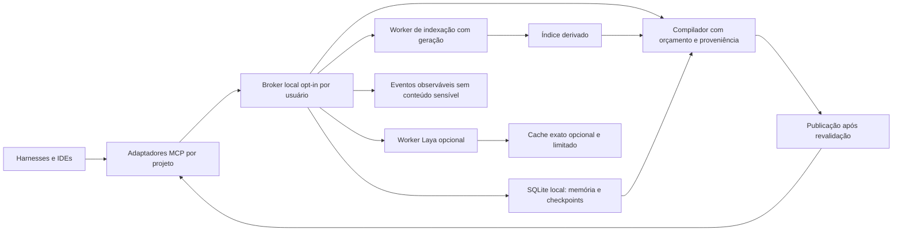

# BBrainX — auditoria técnica integral, arquitetura e programa de evolução

**Data:** 6 de outubro de 2026, America/Sao_Paulo. **Natureza:** investigação de código, leitura documental integral do diretório solicitado, consultas autenticadas somente leitura ao GitHub, medições com runtime real e propostas de engenharia. **Código do produto:** 0.4.0, developer preview. **Revisão principal:** `a9636e9402e3fa673ae05b3489202da1048aef5e`. **PR aberta:** #6, head `2c87f61c3d6355adf61e8675e2f3ee96c5cb2489`.

## 1. Escopo, precisão e procedência

Esta investigação analisa o BBrainX em `/Users/alexandrebelo/Projetos/BBrainX/repo`, os seis documentos de `/Users/alexandrebelo/Projetos/BBrainX/pesquisa/news/`, documentação atual e histórica relacionada, perfil Laya e PR #6. A pasta pai `BBrainX` não é um repositório Git. A versão local da `main` coincide com a versão remota examinada. O hash Git é o vínculo entre código, documentação e evidência; o nome X99 não é versão de runtime.

As afirmações deste documento têm quatro classes: **observação de código**, **reprodução executada**, **hipótese ainda sem reprodução** e **contrato proposto**. O texto das seções anexas usa essas distinções. Uma proposta não passa a ser funcionalidade porque está desenhada no Atlas, possui benchmark Python independente ou apareceu em um dossiê.

A bancada utilizou clones temporários, fixtures próprias em diretórios temporários, SQLite real, filesystem real, processos Node reais, Chromium existente e inferência do modelo Laya já instalado. Os pesos foram copiados antes da inferência. Não foi instalado pacote ou modelo; não foram configurados hooks, habilitados serviços, alteradas aprovações de harness, feitas chamadas a provedores de IA, merges ou publicações. O produto original permaneceu sem alteração de arquivos rastreados. Os testes existentes incluem fixtures controladas de componentes opcionais; seu resultado não é apresentado como inferência neural ou certificação de aplicação nativa. A inferência neural desta auditoria possui registro separado.

Os metadados de GitHub entregues foram reduzidos aos campos necessários. Não distribuir respostas brutas de APIs autenticadas: elas podem conter credenciais transitórias que não fazem parte da evidência técnica.

### 1.1 Inventário verificável do produto

| Propriedade | Observação atual | Consequência |
|---|---|---|
| GitHub | privado; zero estrelas; zero forks; sem descrição e topics no instante consultado | Ainda não há distribuição pública comparável a um lançamento OSS; não mudar visibilidade sem decisão do proprietário. |
| Histórico local | 27 commits; 110 arquivos rastreados; atividade entre 4 e 5 de outubro | Histórico curto não demonstra estabilidade de operação ou manutenção prolongada. |
| Autoria | um autor humano e bot de CI; 21 commits humanos incluindo merges, 6 do bot | Bus factor humano observado é 1. O bot não amplia capacidade de manutenção. |
| Dependências | cinco diretas de produção; 25 pacotes de produção transitivos; 161 pacotes no lock principal | O estudo de 37 itens não significa 37 plataformas instaladas. Remotion e Python têm superfícies separadas. |
| Persistência | SQLite local, schema v2, WAL, synchronous FULL, CAS e histórico | Boa base para uma autoridade local; não é replicação de estado entre máquinas. |
| Recuperação | FTS5, palavras/radicais/glossário, chunks por 60 linhas | O índice não possui a semântica de LSP nem garante localizar todas as dependências dinâmicas. |
| Memória | proposta/aprovação/revogação; `always` e `relevant` | Aprovação é destinada ao humano via CLI confiado; não há atestado criptográfico de presença humana. Revogação impede novas seleções, sem recolher bytes já entregues. |
| Portabilidade | seis ferramentas MCP e geradores de configuração | Compatibilidade de protocolo, configuração e experiência nativa são provas diferentes. |
| Laya | Laya 0.3.26 em Python, pesos multilingual fixados, opt-in | Não reordena o contexto padrão. Não gera código ou texto como um LLM. |
| Watcher/daemon/LSP/sync | ausentes no runtime examinado | Devem permanecer classificados como proposta ou perfil futuro. |

Evidência: `evidence/recon-current.json`, `evidence/github-repository.json`, `evidence/github-main.json`, `evidence/github-pr6.json`; [código principal fixado](https://github.com/oalexandrebelo/BBrainX/tree/a9636e9402e3fa673ae05b3489202da1048aef5e).

## 2. Funcionamento que precisa ser preservado

O harness inicia um processo MCP stdio configurado pelo host com um projeto permitido. O motor valida os argumentos, valida o principal lógico emitido pelo host e consulta a allowlist de projetos. O índice persistido encontra candidatos. O compilador verifica o conteúdo dos arquivos selecionados, incorpora memórias aprovadas e checkpoint e respeita um orçamento textual medido pelo `o200k_base`. O pacote informa caminhos, linhas e hashes, mas não conhece o histórico privado do cliente, o contexto oculto do provedor, seu cache ou a cobrança real.

Um checkpoint usa `expectedVersion` para impedir sobrescrita concorrente. Sua chave de idempotência possui fingerprint do pedido; repetir a mesma operação devolve a resposta persistida, enquanto reutilizar a chave com conteúdo diferente é conflito. Checkpoint, histórico, resposta idempotente e evento são gravados em uma transação. A reindexação preparatória de `saveCheckpoint` é outra transação; não afirmar que indexação, observação do Git e checkpoint formam uma única fotografia atômica.

Há dados autoritativos e dados derivados. Memórias aprovadas, seus estados, checkpoints e eventos críticos devem sobreviver a reinícios. Chunks, FTS, seleções de contexto e caches podem ser reconstruídos. Um resultado do modelo, do índice ou do Atlas não concede permissão. Esta separação evita promover uma conclusão probabilística a regra de segurança e evita transformar um cache em fonte de verdade.

O núcleo atual já tem valor concreto: armazenamento local sem provedor obrigatório, memória com aprovação explícita, transporte MCP delimitado, recuperação lexical rápida e checkpoints duráveis. Sua evolução deve preservar esses contratos antes de adicionar uma camada inteligente ou distribuída.

## 3. Reprodução local dos achados centrais

### 3.1 Substituição da raiz autorizada: P1 de integridade de escopo local

O script `reproduce/audit-runtime.mjs` cria raiz A, registra o projeto e indexa um arquivo. Renomeia A para A-original e coloca um symlink no caminho A apontando para uma raiz B fora do projeto. O bootstrap percebe alteração no arquivo selecionado, atualiza o índice e entrega o marcador de B. O relatório retorna simultaneamente `observed: true` e `selectedFilesVerified: true`.

A verificação atual aplica `lstat` a componentes abaixo da raiz; não revalida a própria raiz armazenada. Um hash correto de conteúdo não prova que o conteúdo veio da raiz originalmente autorizada. A prova usa somente duas pastas artificiais, sem ler outro projeto real. O ataque requer capacidade de modificar o filesystem relevante; não foi demonstrada exploração remota, escalada de UID ou acesso a uma pasta protegida pelo sistema operacional.

**Correção mínima proposta:** rejeitar uma raiz que passou a ser symlink e conferir sua identidade canônica antes de indexar, atualizar e publicar contexto. Se o projeto permite mover a raiz, exigir atualização explícita do registro pelo host. Revalidar o caminho antes/depois da leitura reduz a janela, mas não elimina todo TOCTOU de diretórios concorrentes. Não vender esse patch como sandbox resistente a um processo malicioso com o mesmo UID. Esse objetivo exige handles relativos seguros/isolamento de processo e testes específicos em cada SO.

**Aceite:** raiz estável funciona; rename+symlink e junction/reparse point Windows não são aceitos como o projeto anterior; não há evento de sucesso ou entrega de bytes da raiz substituta; mensagens identificam conflito de raiz sem expor o conteúdo externo. A race de `register` permanece hipótese de interleaving até reprodução adicional, embora o check-then-insert esteja visível no código.

### 3.2 Compactação descarta decisões e bloqueadores: P1 de continuidade

Com um checkpoint contendo 40 itens concluídos, uma decisão e um bloqueador explícitos, o bootstrap de orçamento 1.000 produziu 241 tokens e `checkpointTrimmed: true`. As strings de decisão e bloqueador não estavam no pacote; o banco continuava com ambas. O problema é perda na projeção, não apagamento do checkpoint.

O mecanismo atual preserva objetivo, próxima ação, status, snapshot e carimbo do host; substitui as demais listas por contagens e uma orientação para chamar `session_get`. Essa orientação é útil, mas o próximo agente pode agir antes de consultar a ferramenta. Memórias `always` já têm comportamento mais forte: se não couberem, o compilador recusa o pacote.

**Correção mínima proposta:** tratar decisões e bloqueadores como obrigatórios no contrato de handoff; compactar primeiro itens concluídos, detalhes de evidências e arquivos tocados. Se o conjunto obrigatório não couber, devolver erro explícito ou um bootstrap que exija a recuperação completa antes de agir, sem representar continuidade completa. O agente não deve poder transformar uma instrução arbitrária extraída do repositório em memória aprovada; os campos de checkpoint continuam declarações da sessão, com proveniência e autoridade limitada.

**Aceite:** regressão usa marcador em decisão/bloqueio com listas longas; conteúdo obrigatório é preservado ou a chamada falha explicitamente. Orçamento final é contado sobre o texto completo; contagens de listas não substituem a semântica de segurança. Testar 256, 1.000, 4.000 e 16.000 tokens e checkpoints de outro snapshot.

### 3.3 Concorrência e crash: garantias confirmadas, com escopo limitado

Dois processos reais tentaram criar a mesma tarefa com versão esperada 0 e chaves diferentes: um gravou versão 1, o outro recebeu `VERSION_CONFLICT`; houve um único evento `checkpoint.created`. Repetindo com mesma chave e mesmo conteúdo, ambos receberam versão 1, novamente com um único evento. Esta prova exercita escritores concorrentes em SQLite; os testes MCP anteriores de dois clientes sequenciais provavam retomada entre processos, não simultaneidade.

Outro processo iniciou uma transação, inseriu um evento e foi morto com `SIGKILL` antes de commit. Ao reabrir o banco, o evento inexistia e `PRAGMA integrity_check` retornou `ok`. Isso confirma rollback nesse crash de processo. Não prova integridade sob perda de energia, falha física de armazenamento, disco cheio, erro de I/O, restauração de backup ou corrupção maliciosa. Esses testes permanecem gates distintos.

Evidência conjunta: `evidence/runtime-audit.json` e script completo de reprodução. O `events` atual é um journal transacional local; não há consumer/ACK/retry para justificar entrega exactly-once de efeitos externos.

## 4. Medições de desempenho e suas populações

### 4.1 Compatibilidade e builds

| Execução | Resultado | Limite da prova |
|---|---|---|
| Main, Node 24.18.0, macOS arm64 | 96/96, 2,731 s | Suíte existente; não 96 jornadas nativas ou inferências. |
| Main, Node 22.23.2, macOS arm64 | 93/96, 3,886 s | Três testes de fio falham por `ExperimentalWarning` em stderr; runtime suportado não tem suíte totalmente verde. |
| Main, Vite 8.3.2 | exit 0, 116 ms | Avisos de `@import url('')` e diretiva `use client`; não é render da UI em todas as plataformas. |
| PR #6, unit | 10/10, 35,8 ms | Validação do dataset/exportação documental. |
| PR #6, navegador | 6/6, 3,266 s, Chromium | Desktop/mobile 390 px, filtros, deep link e downloads; não auditoria completa de acessibilidade. |
| PR #6, estático adicional | build/pacote/browser concluídos | Sem request `/api/` e sem page error no percurso observado; Enter do canvas falha. |

O aviso SQLite do Node 22 é descrito na [documentação da versão executada](https://nodejs.org/download/release/v22.23.2/docs/api/sqlite.html). Não houve evidência de contaminação de stdout pelo aviso; a falha vem de tratar stderr como vazio ou como JSON puro. Não suprimir globalmente todos os avisos para fabricar uma suite verde. Ajustar o teste/expectativa ao suporte declarado, preservando detecção de vazamento e de erro operacional.

### 4.2 Escala artificial do motor real

Host observado: `Mac17,9`, macOS 26.6.2, arm64, 24 GiB RAM, 15 CPUs lógicas informadas. O nome comercial do processador não foi inferido. Cem consultas por tamanho, funções curtas distintas e orçamento 1.500. São workloads gerados, com sistema de arquivos e BPE aquecidos e tamanhos executados em ordem. As três conexões SQLite permaneceram abertas até o fim; RSS da tabela não é o custo isolado de um projeto. Amostras de p99 com n=100 são exploratórias.

| Arquivos | Bytes fonte | Índice inicial | Índice sem mudanças | Search p50 / p95 | Bootstrap p50 / p95 | Atualização selecionada | RSS do processo |
|---:|---:|---:|---:|---:|---:|---:|---:|
| 60 | 7.310 | 16,11 ms | 9,76 ms | 0,059 / 0,101 ms | 0,214 / 0,340 ms | 0,780 ms | 130,72 MiB |
| 1.000 | 122.890 | 52,35 ms | 26,40 ms | 0,071 / 0,092 ms | 0,214 / 0,266 ms | 1,551 ms | 150,83 MiB |
| 5.000 | 618.890 | 203,23 ms | 93,63 ms | 0,060 / 0,114 ms | 0,167 / 0,291 ms | 3,933 ms | 157,23 MiB |

Cada tamanho encontrou 100/100 marcadores. Os bancos após checkpoint WAL mediram 208.896, 921.600 e 3.907.584 bytes. Encontrar funções nomeadas nesta amostra não prova cobertura de tarefa em um monorepo de dezenas de MiB. Nenhum ensaio saturou o limite atual de 20.000 arquivos ou 256 MiB; não extrapolar a tabela linearmente até esse limite.

O benchmark existente, separado, indexou 60 documentos de 26.280 tokens: 16,29 ms inicial, 9,99 ms sem mudanças, 9,40 ms para uma alteração, bootstrap p50 0,601 ms e p95 3,842 ms em dez consultas. O `testedRevision` desse script original é null quando não há `GITHUB_SHA`; o manifesto desta auditoria vincula a execução ao clone a9636e9. Não apresentar null como se o script tivesse registrado a SHA internamente.

**Conclusão restrita:** a recuperação lexical em corpus pequeno/curto já é rápida. O trabalho de maior valor é preservar a informação correta, limitar o pior caso e reduzir releitura/alocação. Não foi observado gargalo que justifique trocar todo o núcleo por Rust, um cluster ou um grafo remoto.

### 4.3 Tokenização: pior caso medido

`encode(text).length` cria o vetor final de tokens. `countTokens` existe na dependência instalada e evita esse vetor final, mas continua usando BPE. Houve igualdade em 105 entradas, incluindo Unicode, tokens especiais literais e entradas longas. Em 100 amostras quentes, p50 `encodeLength` 0,2745 ms e `countTokens` 0,2803 ms; p95 0,3040 e 0,2936 ms. A ordem não foi randomizada e o cache já estava aquecido: **não há ganho de velocidade comprovado**. A troca é uma oportunidade de reduzir alocação, condicionada a profiling e paridade mais ampla.

| Um único pretoken alfanumérico | Tempo do contador real | Resultado |
|---:|---:|---|
| 8 KiB | 19,52 ms | Concluído |
| 16 KiB | 52,83 ms | Concluído |
| 32 KiB | 173,90 ms | Concluído |
| 64 KiB | 735,42 ms | Concluído |
| 128 KiB | 2.870,09 ms | Concluído |
| 256 KiB | Tempo total acima do watchdog de 3 s | Processo interrompido externamente; tempo integral não medido |

Cada caso foi processo novo, com old-space V8 limitado a 512 MiB. A forma da entrada é adversarial artificial, mas seu tamanho máximo coincide com o limite default por arquivo. Chunks por 60 linhas não limitam uma linha de 256 KiB. Esse contador é parte do caminho de bootstrap; a reprodução mede o primitivo, não o deadline integral da capability. Não reportar 256 KiB como duração exata de 3 segundos: foi um limite externo do ensaio.

**Contrato proposto:** limitar chunks por bytes e fronteiras válidas de texto além de linhas; manter hashes/proveniência; contar sobre o payload final exato; executar trabalho potencialmente longo fora do event loop que atende MCP; deadline operacional deve interromper/aposentar o worker e proibir publicação tardia. Uma checagem antecipada de orçamento só ajuda após alcançar a próxima fronteira de tokenização; não assumir que `isWithinTokenLimit` preempta a construção interna de um único pretoken enorme. Não somar contagens de seções como se BPE fosse aditivo nas fronteiras.

### 4.4 Laya real: desempenho, memória e erro

O perfil existente foi usado sem instalar ou atualizar bibliotecas. Cinco arquivos tiveram tamanho e SHA-256 conferidos antes da execução; os pesos/copias e o tokenizer estavam em pasta temporária. Modelo `multilingual`, Laya 0.3.26, Torch 2.14.1, MPS; carga 4.155 ms; execução completa medida pelo wrapper 4.976 ms. Peak RSS do Python amostrado a cada 250 ms: 1.925.664 KiB, aproximadamente **1,84 GiB**. Peak RSS do CLI: 54.544 KiB. RSS não mede toda memória de GPU ou energia; o wrapper de hash e a amostragem adicionam custo à bancada.

Os 64 pares existentes são sintéticos, rotulados à mão, com 19 positivos e 45 negativos. Não constituem holdout independente nem comparação de tarefas completas.

| Método | Acurácia | Precisão | Recall | F1 | TP / FP / FN / TN |
|---|---:|---:|---:|---:|---|
| Classe majoritária | 0,703 | — | — | — | Baseline de desbalanceamento |
| Regra lexical | 0,734 | 0,667 | 0,211 | 0,320 | 4 / 2 / 15 / 43 |
| Laya `noul` | 0,563 | 0,333 | 0,474 | 0,391 | 9 / 18 / 10 / 27 |
| Laya `choice` | 0,516 | 0,357 | 0,789 | 0,492 | 15 / 27 / 4 / 18 |

O F1 maior do Laya corresponde a mais verdadeiros positivos acompanhados de muitos falsos positivos. Acurácia isolada favorece negar quase tudo em uma população majoritariamente negativa. Nenhuma das métricas autoriza omitir uma política obrigatória: o lexical deixou escapar 15 de 19 positivos e `noul` deixou 10. A política `always` deve continuar determinística. Classificação só pode selecionar contexto opcional, com fallback, abstenção e critério de risco.

O p50 de 6,2 ms é **por par amortizado em batch de até 16**, não latência de uma requisição isolada. Confidence ≥0,9 cobriu 25% com acurácia 0,688; ≥0,95 cobriu 15,6% com acurácia 0,5. Não foi demonstrada calibração suficiente nem redução confiável de erro por um limiar alto.

**Decisão:** manter o perfil opcional fora do ranking padrão. Um processo residente compartilhado pode amortizar carga e evitar várias cópias do modelo, mas agrega autoridade e superfície operacional. Antes de adotá-lo, medir quantos harnesses realmente carregam Laya ao mesmo tempo; atualmente o caminho MCP padrão não precisa dele. Modelo residente sem consultas é consumo evitável.

## 5. Arquitetura-alvo local, com contratos de falha

### 5.1 Memória única significa autoridade única, não contexto universal

O resultado desejado é recuperar objetivo, decisões, restrições, evidências, pendências e proveniência ao trocar de harness. Não é copiar todo o histórico privado do IDE, trocar permissões de execução, transportar credenciais ou reutilizar tensores KV entre modelos diferentes. Um banco local comum já permite consultar registros do mesmo projeto; cada processo stdio continua tendo suas próprias filas, caches e eventual worker.

A autoridade futura deve separar `projectId`, `workspaceId`, `taskId`, `snapshotId` e `principal/grant`. O projeto representa a base de conhecimento; workspace representa um checkout com raiz autorizada; tarefa é um objetivo/versionamento; snapshot identifica o conjunto efetivamente observado. Mesmo remoto Git ou SHA não tornam duas worktrees equivalentes. Conteúdo aprovado de projeto e evidência transitória de workspace devem ter escopos explícitos.

Memória global do usuário deve ser uma categoria aprovada separada, com indicação dos projetos em que pode aparecer. Não selecionar conteúdo de outro projeto porque embeddings ou um classificador o consideraram parecido. Um catálogo global pode listar metadados permitidos; a busca de corpos deve continuar vinculada a grants.

### 5.2 Implantação incremental

**Etapa A — corrigir o processo atual:** integridade da raiz, política de checkpoint, limites de chunks/frames, deadline efetivo e geração de nomes MCP por projeto. Melhorar contagem/leitura sem dependência nova. Preservar CLI simples e ausência de daemon obrigatório.

**Etapa B — autoridade local opt-in:** adaptadores stdio pequenos por harness encaminham chamadas a um broker por usuário por socket Unix ou named pipe. O broker verifica identidade do peer, concede capacidades e projetos fixados pelo host e mantém uma fila limitada. UID identifica o usuário, não o aplicativo; grants são emitidos pelo host, não por autoidentificação do cliente, e não se promete isolamento entre processos maliciosos do mesmo UID. Estado crítico fica em SQLite local. Indexação e modelo são workers supervisionados; o processo de controle permanece capaz de atender cancelamento e health. O uso dessa topologia exige migração, lifecycle e prova de recuperação; não existe na versão examinada.

**Etapa C — perfis especializados:** Laya para decisões estreitas calibradas, análise estrutural ou LSP apenas em roots autorizadas, ingestão documental por coleção e ferramentas de pesquisa acionadas sob demanda. Projetos upstream oferecem mecanismos; não carregar seus runtimes como biblioteca universal de inteligência.

**Etapa D — intercâmbio entre máquinas:** começar com export/import explícito, versionado e validado de dados aprovados; banco SQLite ativo nunca vai para pasta sincronizada. Sincronização automática só após definir autoridade, conflitos, revogação, retenção e autenticação. Não exigir servidor distribuído para o primeiro usuário local.

O desenho é proposta. Há um caminho determinístico sem Laya. O mascote observa eventos; não possui seta de autoridade para alterar permissões, aprovar memória ou declarar tarefa validada.

### 5.3 Concorrência e publicação

SQLite WAL continua adequado à autoridade em um host. Seus limites físicos e semânticos não desaparecem com workers. Há um escritor de cada vez; leitores longos podem reter WAL; `busy_timeout=5000` espera por lock e não implementa deadline de tarefa. O store usa `DatabaseSync`, portanto suas chamadas bloqueiam a thread que as executa. [SQLite WAL](https://sqlite.org/wal.html), [API síncrona Node](https://nodejs.org/download/release/v22.23.2/docs/api/sqlite.html).

Tirar leitura de arquivos de `BEGIN IMMEDIATE` exige staging e validação, não mover linhas ingenuamente. Ler/normalizar conteúdo fora do writer lock; registrar geração-base; preparar delta; abrir transação curta; confirmar que geração-base ainda é vigente; publicar delta e nova geração ou repetir a preparação. Arquivo modificado durante a preparação deve ser detectado segundo contrato explícito. Índice derivado pode usar banco/generações separados; só introduzir essa separação após provar que o writer lock atual afeta memória/checkpoints em carga real.

Uma compilação precisa de revisão coerente das memórias, do checkpoint, do índice e das políticas. Leituras isoladas de count/list/project não são snapshot transacional comum. Capturar revisões no início e revalidar no ponto de liberação. Falha na revalidação invalida o resultado; resultado antigo não passa a valer porque o modelo terminou depois. Um generation/fencing token só protege se o destino também rejeita gerações antigas.

Definir o ponto de linearização da autorização como admissão do frame de resposta na fila de saída sob revisão vigente. Revogação impede admissões posteriores a esse ponto; bytes previamente liberados não podem ser recolhidos. Não prometer que uma mudança de política desfaz leitura histórica ou garante que todo pacote continua atual no instante em que o humano o abrir. Exibir digest/revisão/hora de verificação e o limite de cobertura.

### 5.4 Queue, deadline e recursos

Valores abaixo são **pontos de partida de contrato**, não medições de capacidade ou configuração aplicada. Validar contra workloads normais, stress e hardware mínimo antes da adoção: fila local 64 pedidos e 8 MiB de payload agregado; uma inferência Laya em execução; até quatro slots de controle curtos; fila por projeto/cliente com fairness; uma indexação por workspace; workers de tokenização com deadline externo; idle unload de modelo após 120 s, salvo preferência explícita de residência. Limites por bytes prevalecem sobre contagem quando atingidos antes.

Estados de pedido: `ADMITTED → QUEUED → RUNNING → COMPLETED`; saídas `REFUSED`, `CANCELLED`, `TIMED_OUT`, `FAILED` e `OUTCOME_UNKNOWN` para efeito cuja confirmação foi perdida. A fila cheia recusa antes de alocar buffers/modelo. Cancelamento de um consumidor de singleflight não cancela outro consumidor; quando nenhum subscritor resta, trabalho cancelável é interrompido. Worker morto é aposentado; sua resposta atrasada é rejeitada pela geração. Não devolver timeout e depois confirmar sucesso invisível da mesma operação.

Em modelo ocupado, orçamento de espera precisa incluir tempo de fila. Um deadline iniciado somente depois de `start()` não limita a experiência completa: o broker atual pode esperar 90 s de carga antes do prazo de decisão. Separar load timeout, queue timeout e execution timeout, todos dentro de um deadline total.

Orçamentos propostos para uma rodada de homologação: core carregado ≤256 MiB RSS em corpus de 5.000 arquivos/50 MiB com p95 bootstrap ≤50 ms e p99 ≤200 ms; resposta de controle/cancelamento p95 ≤50 ms durante indexação; Laya opcional residente alvo ≤2,25 GiB RSS em batch pequeno. Essas cifras são metas para falhar/passarem no ensaio, não SLA já entregue. Memória de GPU, page cache e outros harnesses são contabilizados separadamente. Se qualquer meta exigir descartar memória obrigatória, a meta de recursos perde para integridade.

## 6. Caches: custos, chaves e invalidadores

### 6.1 Aplicar o cache na ordem certa

1. **Reuso efêmero por arquivo na mesma rodada:** agrupar candidatos por path e verificar uma vez o arquivo para todos seus chunks. Não usar apenas `mtime/size` como prova de conteúdo. Se houver refresh, descartar os resultados daquela rodada e recalcular.
2. **Contagem exata por corpo/digest/encoding:** TTL/LRU limitado por bytes de chave e resultado; chave inclui versão do tokenizer/encoding e opções de tokens especiais. Contagem final do pacote completo permanece exata, pois fronteiras alteram merges.
3. **Resultados de busca:** chave inclui projeto/workspace, revisão completa do índice, query normalizada conforme contrato, limite, scorer/glossário/kind weights. Cache guarda IDs/pontuações e busca corpos sob geração validada. Efeito de estatística global FTS deve ser considerado; um projeto novo pode alterar BM25 global sem modificar outro projeto.
4. **Pacote inteiro:** adiar até haver contrato coerente de revisão e autorização. Mesmo hit precisa verificar grant vigente, revogação e validade dos arquivos selecionados. Reutilizar bytes não elimina a obrigação de limitar a entrega.
5. **Decisão Laya exata:** somente em perfil calibrado e autorizado. O candidato X99 de 128 entradas/2 MiB/5 min permanece candidato. Não ligar por inferência de que toda decisão repetirá.

### 6.2 Identidade de cache Laya

Compor uma identidade estruturada, sem concatenação ambígua: versão de schema/cache/worker, principal/escopo permitido, projeto e workspace, revisão de autorização/política/memória, snapshot de conteúdo, texto exato dos estados, instrução, tipo de pergunta, ordem explícita das opções, critérios, maxLen/truncamento, digest do tokenizer/configuração/pesos e backend/precisão se alterarem decisão. JSON canônico ordena chaves, mas opções ordenadas e sua posição no modelo não podem ser apagadas pela normalização. Não assumir que labels A/B diferentes são semanticamente idênticos.

Validação e autorização ocorrem antes do lookup e antes da liberação. O hit não pode devolver resultado de outro projeto, modelo, geração, política ou conjunto de critérios. Cachear apenas resposta bem-sucedida e validada; não guardar timeout, fila cheia, erro de parse ou resultado de geração aposentada. Limitar também filas, buffers de stdout, payload de entrada e escrita no pipe; um cache pequeno não impede OOM em um produtor ilimitado.

TTL usa relógio monotônico para duração; revisões invalidam imediatamente sem aguardar TTL. Snapshot antigo não é autorizado pela idade curta da entrada. Persistência do cache deve ser off por padrão; corpos e embeddings também podem conter dados privados. Telemetria de hit/miss não inclui query ou texto. Métricas devem diferenciar miss, evict, expired, invalidated e coalesced; pooling de pedidos não é hit persistente.

### 6.3 Quando a otimização se paga

Se `D` é custo de uma decisão sem cache, `H` custo de validar e servir hit, `M` sobrecusto de miss e `r` hit rate, custo médio é `r×H + (1-r)×(D+M)`. Há ganho de latência apenas quando `r > M/(D+M-H)`, para denominador positivo. Custos de invalidação, hashing, memória e falso resultado não desaparecem da equação; medir D/H/M no workload.

Para um worker residente, comparar custo de carga repetida e RSS de N workers com custo do daemon, filas, idle e um worker compartilhado. Os 4,155 s de carga tornam amortização plausível quando há reuso; não justificam 1,84 GiB permanente se há poucas consultas. Para decisões de microsegundos resolvidas por regra determinística, um modelo de milissegundos agrega custo; só pode vencer se produzir melhoria de tarefa mensurável.

## 7. Falhas catastróficas e limites distribuídos

| Falha | Comportamento exigido | Prova atual / gate restante |
|---|---|---|
| Processo morto antes do commit | Não publicar estado parcial | Reproduzido para evento transacional; não todas as operações. |
| Commit realizado, ACK perdido | Repetir chave/fingerprint, devolver estado persistido | Idempotência concorrente provada; injeção de perda de ACK pós-commit ainda gate. |
| Disco cheio/I/O interrompido | Recusar escrita, manter erro original, não anunciar sucesso | Não executado; testar em volume/limite isolado, não enchendo disco do usuário. |
| Corrupção do DB | Quarentena/diagnóstico e restore verificável; índice pode ser reconstruído | Abertura v2 não é detector integral; integrity/restore completo ainda gate. |
| Worker neural trava/morre | Determinístico opcional ou erro explícito; aposentadoria de geração | Circuit breaker parcial na base; preempção/frame/queue candidato. |
| stdout sem newline/JSON enorme | Buffer limitado, encerramento limpo e no late result | MCP possui limite de linha; broker Laya atual não tem limite equivalente. |
| Indexação longa | Controle e cancelamento continuam responsivos | Main synchronous blocking; worker/staging ainda proposta. |
| Revogação concorrente | Proibir publicação sob revisão velha | Falta selo/revalidação comum antes da liberação. |
| Evento diagnóstico lento | Nunca bloquear commit; fila limitada/drop observável | Callback é isolado quanto a erro; retenção/sampling/quotas precisam contrato. |
| Restore rollback de versão | Nova epoch não permite confundir cache com estado anterior | Epoch/revisões/reconciliação ainda proposta. |
| Suspend/resume/clock jump | Deadline e lease por monotônico/generation; sem respostas velhas | Não homologado como lifecycle desktop. |
| Reboot durante instalação do modelo | Modelo publicado só após validação e rename; não partial reutilizado | Hash/rename presentes; locks/fsync/recovery parcial precisam hardening. |
| Credencial/repo com texto hostil | Não virar instrução/autoridade; não imprimir segredo | Guardas/regex e contratos existentes; não detector universal de segredo. |
| Outro projeto altera corpus global | Nenhuma linha cruza escopo; medir mudanças de ranking/latência | SQL filtra projeto; estatística BM25 global demanda avaliação. |
| SQLite em NFS/iCloud/sync | Não operar banco vivo assim | Documentado; guardas de detecção precisam ser proporcionais e não prometer detecção de todo mount. |
| Partição entre máquinas | Sem segundo writer autoritativo improvisado | Não há sync atual. Arquitetura distribuída deve definir autoridade e conflitos primeiro. |

A lista detalhada de 28 cenários do protocolo e suas 28 falhas relatadas do anexo Rust está na auditoria documental integrada. Não transformar porcentagens de interleavings de um modelo finito em taxa de falha de produção.

Se houver expansão distribuída, escolher uma autoridade por projeto/workspace ou uma autoridade remota com identidade/grants/revisões; não replicar o SQLite vivo. Uma máquina desconectada pode manter rascunhos locais identificados como não autoritativos. Para conciliar duas propostas de memória, conservar proveniência e solicitar resolução de conflito; `last-write-wins` não pode revogar/reativar silenciosamente política. Epoch de restore e fencing tornam resultado velho detectável, mas o destino precisa fiscalizar a epoch.

Orçamento financeiro global estrito exige reservas/direitos com conservação: nunca liberar uma reserva de operação cujo efeito é desconhecido só porque passou TTL. Um contador eventual ou GCRA por réplica não fornece teto global linearizável. Esse tema não deve virar serviço obrigatório agora: a execução desta auditoria teve zero chamadas cobradas a provedores. A técnica do protocolo só será adotada quando existir executor/custo real a controlar.

## 8. Interoperabilidade e qualificação por plataforma

Protocolo MCP validado, gerador de configuração, chamada pontual em cliente e tarefa concluída após handoff são quatro degraus distintos. CI Linux/macOS/Windows mede os mesmos testes de núcleo nessas plataformas; não certifica VS Code, Claude Code, Codex App, Antigravity ou todos os respectivos releases. Os relatos históricos de Claude Code/Codex CLI estão identificados na seção de ecossistema; não foram reexecutados nesta auditoria.

Matriz de homologação proposta: macOS arm64 e Windows x64 em hosts reais; para cada harness registrar versão, Node, release BBrainX, raíz/workspace e método de configuração. Percurso obrigatório: A registra/checkpoint com evidência; B recupera e encontra decisões/bloqueadores; A/B disputam versão; memória proposta não aparece como aprovada; humano aprova/revoga; B recupera revisão atual; reiniciar processo; trocar workspace; cancelar trabalho em andamento; concluir tarefa com teste/revisão. Corpus e credenciais são locais, sem exportar logs privados de harness por conveniência.

Não transportar configurações absolutas do Mac para Windows. Geradores devem usar paths locais, escapar formatos, produzir nomes por projeto e fazer validação de colisão. Antigravity não está entre os cinco geradores atuais; suporte requer formato/versão oficial verificados e teste nativo, não copiar um exemplo de outro aplicativo. Usuário escolhe escopo global ou workspace; BBrainX imprime o diff/configuração e preserva aprovação nativa. Nenhuma expansão de autorização vem de arquivo recuperado.

## 9. Programa de execução e critérios de aceite

O backlog abaixo é proposto e não foi publicado como issue. Cada unidade deve nascer como issue/branch/PR focada no repositório BBrainX, com teste que reproduz o defeito, critério de pronto e rollback. Não reutilizar automaticamente regras de deploy/infra do DoneFitt para outro produto. Os contratos locais do BBrainX prevalecem no seu código.

| Ordem / ID | Trabalho e escopo | Dependências | Aceite mínimo e medição |
|---|---|---|---|
| 1 / BX-01 | Revalidar raiz registrada em leitura/index/refresh | Nenhuma | Reprodução de symlink deixa de entregar B; Windows junction/reparse testado; limitações TOCTOU explícitas. |
| 2 / BX-02 | Preservar decisões/bloqueios no handoff e budget fail-closed | Nenhuma | Teste de compactação vermelho antes; obrigação preservada ou erro explícito em todos os budgets suportados. |
| 3 / BX-03 | Corrigir pipeline de Atlas e keyboard selection | PR #6 | `shell: bash`/pipefail; failure real não gera success; Enter/Space/roving tabs comprovados; testes estáticos e MPA preservados. |
| 4 / BX-04 | Qualificar Node 22 suportado sem esconder warnings | Nenhuma | 96/96 nas versões declaradas; trace parse separa warnings esperados de eventos; stdout continua MCP puro. |
| 5 / BX-05 | Byte-bound chunking e tokenização com cancelamento real | BX-01/02 | Long pretoken não monopoliza controle; orçamento exato e hashes preservados; Unicode, linha gigante e arquivo limítrofe. |
| 6 / BX-06 | Harden broker Laya: frames, queue, deadline total e geração | Nenhuma para perfil opt-in | Bounds antes de parsing/alocação; respostas tipadas/finita; kill/timeout rejeitam respostas velhas; inferência real além de teste de processo. |
| 7 / BX-07 | Micro-otimizações do núcleo sem dependência nova | BX-01/02/05 | Uma leitura/path/rodada; paridade count; replay antes do Git sem perder guardas; ablação cold/warm com cache bytes. |
| 8 / BX-08 | Revisões e snapshot coerente de memória/contexto | BX-01/02 | Revogação/index/checkpoint concorrentes não publicam selo velho; ponto de linearização documentado. |
| 9 / BX-09 | Contrato de retenção, backup e restore | BX-08 | Backup restaurado com memórias/checkpoints/eventos; quota e pruning preservam CAS/replay dentro da janela declarada; fora da janela, erro definido. |
| 10 / BX-10 | Nome/config por projeto e matriz de harnesses | BX-01/02/04 | Dois projetos não colidem; handoff nativo Mac/Win; Antigravity explicitamente qualificado antes de divulgar suporte. |
| 11 / BX-11 | Corpus holdout e avaliação de tarefa aceita | BX-10 | Tarefas/aceite/modelos/custos fixados antes; pareamento, ablação, correlação e IC; nada de billing inferido do payload. |
| 12 / BX-12 | Autoridade local compartilhada opt-in | BX-06/08/09/10 e duplicação medida | IPC por usuário, grants por adapter, worker único supervisionado, fairness, idle, upgrade/rollback/owner collision. |
| 13 / BX-13 | Perfil símbolos/LSP e Laya estreito calibrado | BX-11 | Ganho de tarefa supera CPU/RSS/instalação; treinocalibraçãoholdout separados; sem alterar políticas obrigatórias. |
| 14 / BX-14 | Release OSS verificável e experiência de onboarding | BX-01..11 prioritários | Release/tag, source package, segurança/licenças/SBOM, instalação e demo externas; decisão explícita de publicar. |
| 15 / BX-15 | Mascote original e demonstração | Sem dependência do núcleo para vídeo | Prompt entregue; render depois; estado visual só reflete evento; personagem próprio, assets/sons originais. |

BX-07 não deve preceder correção de integridade. BX-12 não é requisito para corrigir o processo stdio. Caso não se observe duplicação do Laya/serviço, manter uma instalação local simples; não implementar daemon por prestígio arquitetural.

## 10. Engenharia para reputação OSS

“Top 1 em estrelas” é uma ambição de mercado, não critério de aceitação técnica nem resultado prometível. O produto está privado no snapshot examinado. Antes de lançamento, o proprietário precisa decidir visibilidade e licenças/publicação; a auditoria não fez essa mudança.

Proposta de reputação: uma instalação curta e verificável, sem conta de IA obrigatória, tarefa iniciada em um harness e concluída em outro com decisões preservadas, política revogada que não reaparece, conflito de versão visível e custo medido. Uma demonstração deve exibir a SHA e distinguir cache/savings/tarefa aceita. Essa experiência é mais defensável que “uma mente com todos os repositórios” sem curadoria ou evidência.

Primeiro publicar documentação de instalação em inglês e pt-BR, exemplos sem segredos, threat model, SECURITY disclosure, CONTRIBUTING com issue/PR e critérios, matriz de suporte, release notes e limitações, fontes/licenças de perfis e scripts de avaliação. Criar tags/versionamento e um source package que não incorpore `.env`, bancos, recibos locais ou upstreams sem licença revisada. `private: true` no package principal impede publicação npm direta; alterar packaging só quando houver decisão de distribuição e pacote testado. O core não precisa incluir o mascote/video ou peso neural.

Priorizar manutenção e reprodução por contribuidores externos. Abrir critérios de benchmark e casos holdout sem vazar soluções antes da avaliação. Medir instalação bem-sucedida, primeira retomada, retenção operacional, issues reproduzíveis, regressões, tempo de resposta/manutenção e contribuições independentes. Não incentivar estrelas artificiais, atribuir acurácia de competidores ao BBrainX ou anunciar suportes nativos somente porque o gerador imprime JSON/TOML.

A “mente cheia de repositórios” deve ser um catálogo curado com commits/licenças, técnicas e quando consultar, em coleções selecionadas. Limitar ingestão por projeto, bytes, tamanho de arquivo, linguagem e necessidade; deduplicar conteúdo por hash com escopo/proveniência preservados; distinguir cópia upstream de implementação local. Regras derivadas de pesquisa precisam aprovação e prova antes de virar constraint do runtime. Nenhuma biblioteca de conhecimento compensa falta de invalidação, raiz segura ou checkpoint completo.

## 11. Entrega e reprodução

O dossiê principal incorpora integralmente auditoria documental, análise de performance, consistência/segurança, PR, ecossistema e prompt do mascote. `evidence/` reúne logs/JSON e screenshots; `reproduce/` guarda scripts completos usados na bancada. `MANIFEST.json` contém SHA-256/bytes dos artefatos, revisões e scope. Não inclui os assets do perfil de aproximadamente 647 MiB, venv, banco real, node_modules, clones de pesquisa ou arquivo de autenticação.

Para repetir, usar checkout isolado da revisão fixada e suas dependências existentes/resolvidas pelo lock revisado, copiar scripts de reprodução para `scripts/`, trocar os caminhos de evidência/home definidos no cabeçalho e usar Node 24 recomendado. Os ensaios criam/removem seus próprios fixtures; o script Laya exige pesos já instalados e copiados com hashes conferidos. Não apontar `BBRAINX_HOME` para o banco operacional em uma bancada de crash, symlink, migração ou concorrência. Os comandos exatos e códigos de saída constam em `REPRODUCAO.md`.

Medições, diagnóstico e propostas não alteraram o produto. O próximo trabalho concreto é BX-01/BX-02, acompanhado de BX-03 na PR documental. Corrigir o que é servido e sob qual autoridade antecede ampliar o volume do que o sistema conhece.
