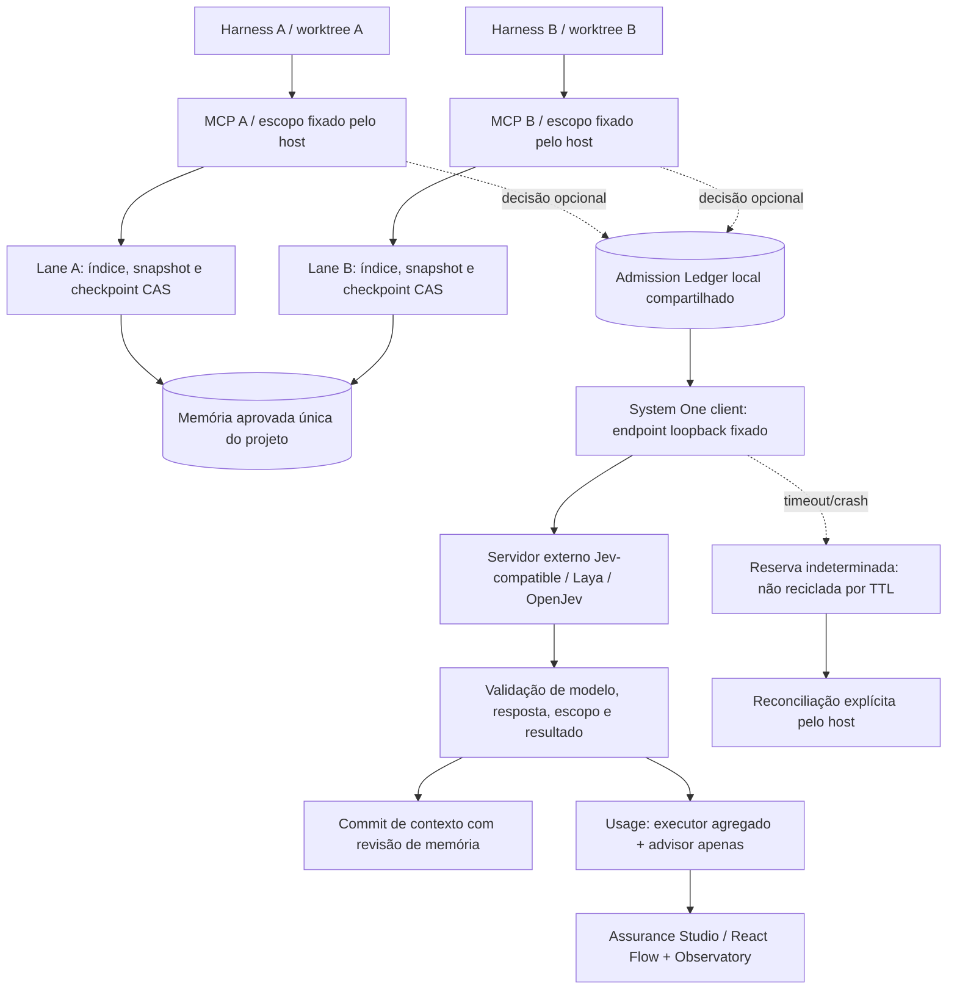

# State Commit 02 — arquitetura, invariantes e protocolo experimental

Predecessor: State Commit 01 `639ce3c3985123ec2cbef6363b72f68501e79888`. Sua CI dedicada concluiu baseline e build em `37847257612`. As hipóteses abaixo ficam fixadas antes da implementação e da comparação. Não são resultados antecipados.

## Blueprint lógico

As linhas de decisão são opt-in. O caminho lexical não chama modelo. O admission ledger limita apenas consumidores que o usam; não impede uma IDE de chamar diretamente outro servidor. Worktrees isolam alterações de arquivos, não processos hostis, rede ou bancos da aplicação. A UI é leitora de métricas, não autoridade.

## Novo contrato: SharedAdmission

Arquivo separado no mesmo BBRAINX_HOME local. Não modifica brain.sqlite ou o schema de lanes. Uma autoridade por usuário do SO, não autenticação multiusuário. O operador escolhe um resourceId comum para clientes que competem pelo mesmo recurso físico; o modelo não escolhe esse ID.

Tabelas propostas:

- resources: id, slots, byteLimit, heldSlots, heldBytes. Configuração igual em todas as conexões; divergência recusa startup/registro.
- reservations: geração monotônica persistida, resourceId, tokenHash, scopeDigest, requestDigest, bytes, state, revision, evidenceId.

Tokens de ownership são opacos e gerados pelo host, não IDs de processo. Não guardar prompts, respostas, chaves de provedor ou transcripts nesse ledger. O limite de bytes contabiliza a reserva de buffers declarada, não RSS nem VRAM do modelo.

Estados: `running → released` ao observar conclusão; `running → unknown` diante de incerteza; `unknown → released` apenas por reconciliação host-owned com revisão esperada e evidência. Crash pode deixar running: a semântica operacional continua sendo recurso possivelmente ocupado. Close de conexão, wall clock e TTL não liberam a reserva. Gerações não são reaproveitadas.

Acquire, contabilização e inserção da reserva pertencem a uma única transação BEGIN IMMEDIATE. Release decrementa os mesmos contadores e altera a mesma reserva em uma transação. Não manter transação enquanto espera HTTP, modelo, leitura de arquivo ou usuário. Busy timeout é limite de espera SQLite síncrona, não hard real-time do processo inteiro.

### Invariantes

I1: 0 <= heldSlots <= slots; 0 <= heldBytes <= byteLimit.

I2: heldSlots e heldBytes equivalem à soma das reservas running/unknown daquele recurso.

I3: nenhum cliente publica release com token de outra reserva; callbacks antigos não liberam uma geração nova.

I4: timeout não equivale a término remoto. Sem confirmação, permanece indisponibilidade conservadora. A ausência de resposta não autoriza retry automático ou fallback para nuvem.

I5: autoridade de memória continua única; proposta do modelo nunca equivale a aprovação. Revisão da memória e snapshot de cada lane permanecem no commit de contexto.

I6: um recibo de teste refere-se à revisão realmente executada. Hash não autentica o produtor, teste finito não prova todos os schedules e JSON válido não demonstra decisão correta.

## Contratos adicionais recuperados

SystemOneLocalClient: somente /v1/systemone em IP literal loopback; sem redirect, autenticação herdada, download, retry ou cloud fallback. Modelo de resposta deve corresponder ao declarado. Truncamento e passagens físicas ficam desconhecidos se o servidor não os informa. Integração ao novo ledger será um wrapper explícito, não mudança silenciosa dos harnesses.

Anthropic: uso terminal é decomposto em agregado executor + advisor_message; message iterations só reconciliam agregado. Memory tool é um handler client-side e não ganha acesso de escrita ao conjunto aprovado. Advisor é consultivo, não autorização. Server tools pendentes e pause_turn exigem retomada limitada, preservando estado; esta rodada não implementa um executor de chamadas proprietário.

MCP: ring de timestamps preserva semântica da janela (t-period,t]; chamadas recusadas não consomem quota. IDs duplicados em voo devem ser recusados para preservar cancelamento. Quota por conexão não deve ser anunciada como quota global.

## Protocolo de teste predefinido

A. Oráculos de contrato: strings UTF-8 fragmentadas, resposta grande, tipo incorreto, distribuição inválida, modelo divergente, unknown usage, cancelamento e referência de tarefa incorreta. Modelo não é substituído por um fixture para medir inteligência: o fixture é identificado como produtor de falhas de transporte.

B. Concorrência: dois e oito processos reais, mesmo arquivo SQLite e recurso; barreira IPC antes de acquire. Exigir máximo observado dentro do teto, soma coerente e retorno correto das vagas após término conhecido. Mesmo task/idempotencyKey em lanes diferentes não se sobrescrevem.

C. Crash: matar apenas filhos iniciados pelo teste, com handle ChildProcess, depois de observar aquisição. Nova conexão deve continuar recusando se o recurso pode permanecer ocupado; reconciliação explícita permite retomada. Não simula falha elétrica, disco defeituoso, partição multi-host ou malware.

D. Validade: alteração de memory revision antes de publicar recusa pacote; evidência de outro commit recusa promoção; alteração do token ou revisão de reserva recusa liberação. Abrir com schema futuro ou limite divergente recusa.

E. Performance: sete pares alternados shift/ring, warmup fora da amostra, mesmos timestamps e aceites. Publicar todos os pares, mediana e escopo. Medir operações reais do ledger com amostras suficientes para quantis empíricos; não converter máximo de teste curto em SLA. Comparação de tarefa/modelo e billing permanece null até ensaio apropriado.

F. SDD: contraprovas mínimas reprodutíveis de pós-condição inalcançável, assert removido por otimização, execução top-level no suposto módulo isolado, invariância do hash estrutural apenas ao layout e conflito de escritores. Não executar o anexo inteiro sobre projetos pessoais. O substituto da rodada será verificação/evidência, não um compilador que proclama preservar qualquer semântica Python.

G. Distribuição: core sem rede/modelos, Docker rootless sem rede por padrão para stdio, volumes de workspace somente leitura e estado separado; projeto privado não vira artefato público. Build e teste de navegador no painel. Exibir sempre ambiente, revisão e ausências.

## Portas, protocolos e SDK

MCP é JSON-RPC sobre stdio, não uma API HTTP declarada por OpenAPI. O kit terá contratos TypeScript para a API JavaScript e exportação OpenAPI somente do cliente /v1/systemone que de fato usa HTTP. O docker de stdio não precisa publicar portas. A documentação não confundirá OpenAPI gerado com servidor de inferência incluído.

## Gate de lançamento

A bateria 5 deve entregar manifesto, blueprint, código, fontes científicas, métricas e reproduções, quickstart, Docker/Compose, CI, SDK/contratos e governança. Presença dos artefatos pode ser concluída sem fingir validação não executada. Launch readiness requer observar gates obrigatórios da configuração escolhida. Homologação Mac MEDIUM com IDEs/modelos reais e validação externa não serão inferidas de CI Linux. O estado final pode ser release candidate para o núcleo cooperativo e não pronto para todo perfil experimental.
